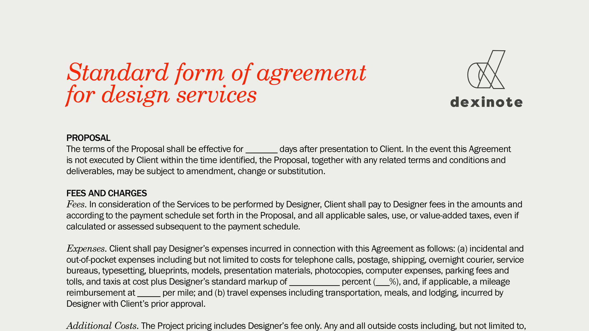
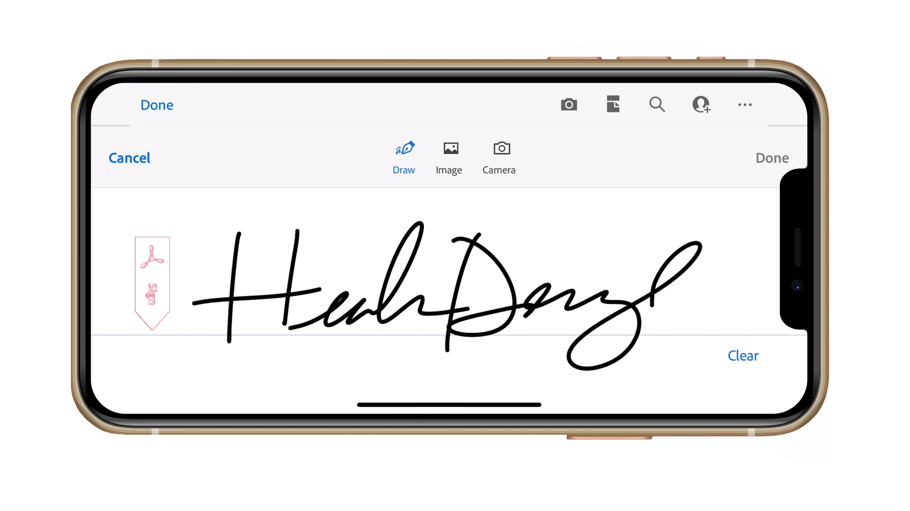

# Présentation d’Acrobat en 60 secondes

Acrobat de 60 secondes vous propose des tutoriels rapides pour vous aider à apprendre une nouvelle astuce dans Acrobat en une minute ou moins. Ces conseils axés sur des tâches vous aident à acquérir de nouvelles compétences pour travailler avec des fichiers de PDF en déverrouillant certains joyaux cachés d’Acrobat. Vous pouvez en regarder une pour obtenir une réponse rapide, ou cinq pour améliorer la productivité de votre document, tout en ayant le temps de profiter de votre pause-café.

## Tutoriels Acrobat de 60 secondes

## Modifier

<table style="table-layout:fixed">
<tr>
   <td>
    
    

    <a href="edit.md"><strong>Modifier le PDF avec Acrobat Web</strong></a>
    

    Découvrez comment modifier du contenu dans Acrobat web
     
  </td>
  <td>
    
    

    <a href="textrecognition.md"><strong>Reconnaître le texte dans un fichier de PDF numérisé</strong></a>
    

    Apprenez à reconnaître le texte d’une image numérisée
     
  </td>
  <td>
    
    

    <a href="combine-to-one-pdf.md"><strong>Combiner les fichiers dans un seul PDF</strong></a>
    

    Découvrez à quelle vitesse combiner des fichiers dans un seul PDF
     
  </td>
   <td>
    
    

    <a href="organize.md"><strong>Organiser les pages en un clin d'œil</strong></a>
    

    Découvrez comment organiser rapidement les pages dans un PDF
     
  </td>
</tr>
<tr>
  <td>
    
    

    <a href="editphoto.md"><strong>Modifier une photo dans votre PDF</strong></a>
    

    Découvrez comment modifier une photo dans votre PDF
  </td>
  <td>
    
    

    <a href="editgraphic.md"><strong>Modifier un graphique dans votre PDF</strong></a>
    

    Découvrez comment modifier un graphique dans votre PDF
  </td>
  <td>
      
        

         
  </td>
  <td>
      
        

         
  </td>
</tr>
</table>

## Convertir

<table style="table-layout:fixed">
<tr>
  <td>
    
    

    <a href="convert-pdf-word.md"><strong>Convertir un PDF au format Word</strong></a>
    

    Découvrez comment convertir un PDF au format Word
  </td>
 <td>
    
    

    <a href="convert-pdf-excel.md"><strong>Convertir un PDF en Excel</strong></a>
    

    Découvrez comment convertir un PDF au format Excel
  </td>
  <td>
    
    

    <a href="convert-pdf-powerpoint.md"><strong>Convertir un PDF en PowerPoint</strong></a>
    

    Découvrez comment convertir un PDF au format PowerPoint
  </td>
  <td>
    
    

    <a href="exportwordphone.md"><strong>Export PDF de Word à partir de votre téléphone</strong></a>
    

    Découvrez comment exporter un PDF vers Word à partir de votre téléphone
  </td>
</tr>
</table>

## Créer

<table style="table-layout:fixed">
<tr>
  <td>
    
    

    <a href="word-to-pdf.md"><strong>Créer un PDF à partir de Microsoft Word</strong></a>
    

    Découvrez comment créer un PDF directement à partir de Word
  </td>
  <td>
    
    

    <a href="create-from-acrobat.md"><strong>Créer des mots de PDF à partir d'Acrobat</strong></a>
    

    Apprenez à créer des mots de PDF depuis Acrobat
  <td>
    
    

    <a href="wordform.md"><strong>Convertir Word en PDF, y compris les champs de formulaire</strong></a>
    

    Conversion d’un fichier Word en PDF et génération automatique des champs de formulaire
  </td>
  <td>
    
    

    <a href="photo.md"><strong>Créez un PDF de photos en un instant</strong></a>
    

    Création d’un PDF de plusieurs photos
  </td>
</tr>
<tr>
  <td>
    
    

    <a href="phone.md"><strong>Convertir un fichier PPT en PDF sur votre téléphone</strong></a>
    

    Conversion d’un fichier PowerPoint en PDF sur votre téléphone
  </td>
  <td>
    
    

    <a href="optimize.md"><strong>Créez des fichiers de PDF plus efficaces en un clin d'œil</strong></a>
    

    Optimisation des fichiers de votre PDF en un clin d’œil
  </td>
  <td>
      
        

         
  </td>
  <td>
      
        

         
  </td>
</tr>
</table>

## Signer

<table style="table-layout:fixed">
<tr>
  <td>
    
    

    <a href="sign.md"><strong>Signer électroniquement un document papier</strong></a>
    

    Apprenez à signer électroniquement un document papier
  </td>
  <td>
      
        

         
  </td>
  <td>
      
        

         
  </td>
  <td>
      
        

         
  </td>
</tr>
</table>

## Protéger

<table style="table-layout:fixed">
<tr>
  <td>
    
    

    <a href="protect.md"><strong>Protect de vos fichiers de mot de PDF avec un mot de passe</strong></a>
    

    Découvrez comment sécuriser votre PDF avec un mot de passe
  </td>
  <td>
    
    

    <a href="redaction.md"><strong>Biffure : la bonne méthode</strong></a>
    

    Découvrez comment biffer correctement les informations sensibles dans votre PDF
  </td>
  <td>
      
        

         
  </td>
  <td>
      
        

         
  </td>
</tr>
</table>

## Partage et révision

<table style="table-layout:fixed">
<tr>
  <td>
    
    

    <a href="share-comment.md"><strong>Partage d'un PDF pour commentaires</strong></a>
    

    Découvrez comment partager un PDF pour que d’autres personnes puissent le commenter
  </td>
  <td>
    
    

    <a href="share-comment-teams.md"><strong>Partager et commenter des fichiers de PDF dans Teams</strong></a>
    

    Partage et commentaire d’un fichier de PDF dans Microsoft Teams
  </td>
  <td>
    
    

    <a href="summarize-comments.md"><strong>Résoudre les problèmes liés aux commentaires du PDF avec le résumé</strong></a>
    

    Résumez tous vos commentaires dans un seul PDF
  </td>
   <td>
    
    

    <a href="indesign.md"><strong>Charger les commentaires du PDF dans l'InDesign</strong></a>
    

    Découvrez comment mettre en InDesign tous les commentaires de votre PDF
  </td>
</tr>
</table>

## Préparer

<table style="table-layout:fixed">
<tr>
  <td>
    
    

    <a href="accessible.md"><strong>Laissez Acrobat vous aider à rendre les mots de PDF accessibles</strong></a>
    

    Découvrez comment rendre votre PDF universellement accessible
  </td>
 <td>
    
    

    <a href="conform.md"><strong>Conformer un PDF à un format standard</strong></a>
    

    Apprenez à conformer un PDF à une norme spécifique
  </td>
  <td>
      
        

         
  </td>
  <td>
      
        

         
  </td>
</tr>
</table>

## Rubriques supplémentaires

<table style="table-layout:fixed">
<tr>
  <td>
    
    

    <a href="compare.md"><strong>Repérez les différences avec la comparaison par PDF</strong></a>
    

    Découvrez comment comparer rapidement la différence entre deux PDF
  </td>
 <td>
    
    

    <a href="search.md"><strong>Rechercher dans plusieurs fichiers de PDF à la fois</strong></a>
    

    Découvrez comment effectuer une recherche dans plusieurs fichiers de PDF
  </td>
  <td>
      
        

         
  </td>
  <td>
      
        

         
  </td>
</tr>
</table>