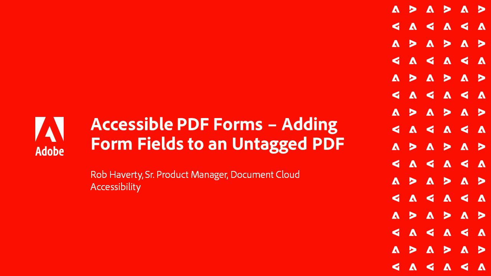

# Série Accessibilité d’Acrobat

Dans cette série de webinaires à la demande en six parties, passez des principes de base de l’accessibilité au balisage des fichiers de votre PDF. Chaque session comprend des fichiers d&#39;exemple à suivre.

<table style="table-layout:fixed">
<tr>
  <td>
    
    

    <a href="accessibilitysession1.md"><strong>Introduction à l’accessibilité des PDF</strong></a>
    

    <em>Dans cette session à la demande, découvrez ce que signifie rendre un PDF accessible, comment configurer Acrobat Pro pour qu’il fonctionne sur les PDF en matière d’accessibilité et le processus de conversion d’un document source en PDF</em>
     
  </td>
  <td>
    
    

    <a href="accessibilitysession2.md"><strong>Correction d’un PDF inaccessible</strong></a>
    

    <em>Dans cette session à la demande, découvrez le flux de travaux pour convertir un document Word et résoudre certains problèmes de balisage de base à l’aide des outils Acrobat Pro présentés dans le webinaire d’introduction</em>
     
  </td>  
  <td>
    
    

    <a href="accessibilitysession3.md"><strong>Tableaux complexes</strong></a>
    

    <em>Cette session à la demande aborde l’un des problèmes les plus courants et les plus difficiles dans la résolution d’un PDF pour l’accessibilité : les tableaux complexes</em>
     
  </td>
</tr>
<tr>
  <td>
    
    

    <a href="accessibilitysession4.md"><strong>Documents numérisés et listes complexes</strong></a>
    

    <em>Cette session à la demande aborde les problèmes plus complexes auxquels les utilisateurs sont souvent confrontés, tels que les documents numérisés et les listes complexes</em>
     
  </td>
  <td>
    
    

    <a href="accessibilitysession5.md"><strong>Ajout de champs de formulaire à un PDF balisé</strong></a>
    

    <em>Cette session à la demande se concentre sur l’ajout de champs de formulaire à un PDF précédemment balisé</em>
     
  </td>  
  <td>
    
    

    <a href="accessibilitysession6.md"><strong>Ajout de champs de formulaire à un PDF sans balise</strong></a>
    

    <em>Cet atelier à la demande approfondit la création de champs de formulaire manuels et de propriétés de champs de formulaire supplémentaires</em>
     
  </td> 
</tr>
</table>
