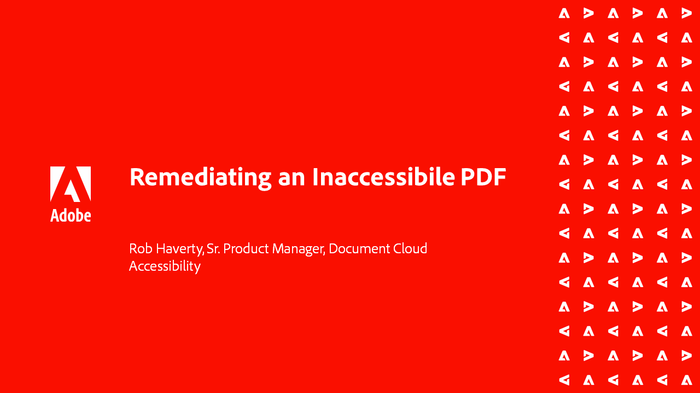

# Série sur l’accessibilité d’Acrobat

Dans cette série de webinaires à la demande en six parties, passez des bases de l’accessibilité à un examen approfondi du balisage de vos fichiers de PDF. Chaque session comprend des fichiers d’exemple à suivre.

<table style="table-layout:fixed">
<tr>
  <td>
    
    

    <a href="accessibilitysession1.md"><strong>Introduction à l’accessibilité des PDF</strong></a>
    

    <em>Au cours de cette session à la demande, découvrez ce que signifie rendre un PDF accessible, comment configurer Acrobat Pro (Premium ou Studio) pour travailler sur les PDF en matière d'accessibilité et le processus de conversion d'un document source en PDF</em>
     
  </td>
  <td>
    
    

    <a href="accessibilitysession2.md"><strong>Correction d'un PDF inaccessible</strong></a>
    

    <em>Au cours de cette session à la demande, découvrez le workflow permettant de convertir un document Word et de résoudre certains problèmes de balisage de base à l’aide des outils Acrobat Pro (Premium ou Studio) présentés dans le webinaire d’introduction</em>
     
  </td>  
  <td>
    
    

    <a href="accessibilitysession3.md"><strong>Tableaux complexes</strong></a>
    

    <em>Cette session à la demande résout l’un des problèmes les plus courants et les plus difficiles de la résolution d’un PDF d’accessibilité : les tableaux complexes</em>
     
  </td>
</tr>
<tr>
  <td>
    
    

    <a href="accessibilitysession4.md"><strong>Documents numérisés et listes complexes</strong></a>
    

    <em>Cette session à la demande aborde les problèmes les plus complexes que les utilisateurs rencontrent fréquemment, tels que les documents numérisés et les listes complexes</em>
     
  </td>
  <td>
    
    

    <a href="accessibilitysession5.md"><strong>Ajout de champs de formulaire à un PDF balisé</strong></a>
    

    <em>Cette session à la demande se concentre sur l’ajout de champs de formulaire à un PDF précédemment balisé</em>
     
  </td>  
  <td>
    
    

    <a href="accessibilitysession6.md"><strong>Ajout de champs de formulaire à un PDF sans balise</strong></a>
    

    <em>Cette session à la demande approfondit la création de champs de formulaire manuels et de propriétés de champs de formulaire supplémentaires</em>
     
  </td> 
</tr>
</table>
