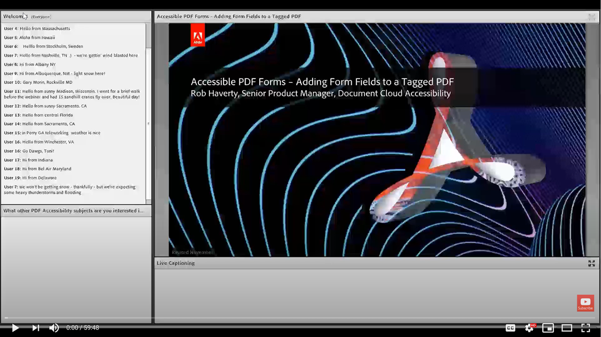

# Ajout de champs de formulaire à un PDF balisé

Cette session à la demande se concentre sur l’ajout de champs de formulaire à un PDF précédemment balisé.

Cliquez [ici](../assets/accessibilitysession5.zip) pour télécharger un fichier zip des fichiers pratiques de cette session.

Sélectionnez l’image pour afficher la vidéo dans un onglet de navigateur distinct.

{target="_blank"}
