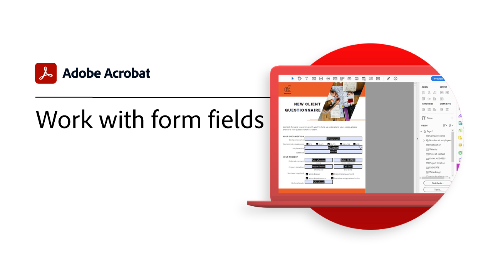
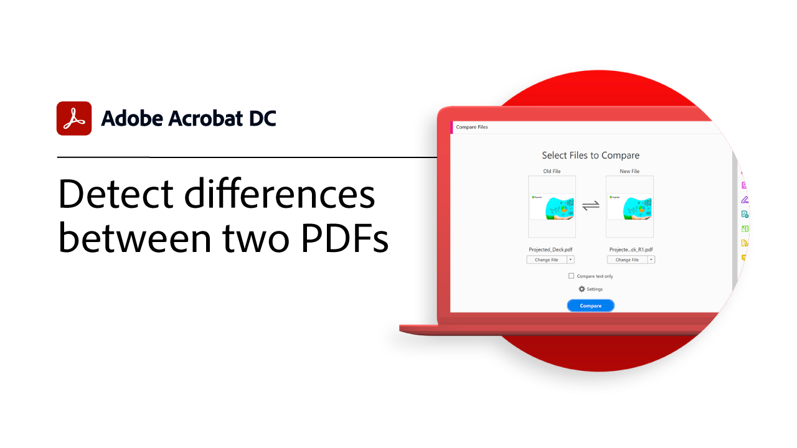

# Présentation des tâches avancées

Allez au-delà des fondamentaux avec ces outils avancés dans Acrobat. Découvrez comment créer une action pour répéter des tâches banales, supprimer des informations sensibles, réduire et optimiser des fichiers volumineux, recueillir rapidement des données de formulaire et créer des fichiers de PDF accessibles à tous.

## Nouveautés

* [Utilisation d’Acrobat sur le web](optimizeseo.md)
Découvrez comment optimiser un PDF pour améliorer sa visibilité et améliorer le classement des moteurs de recherche sur le web

## Tutoriels sur les tâches avancées

<table style="table-layout:fixed">
<tr>
  <td>
    
    

    <a href="bookmarks.md"><strong>Ajout de signets et d’hyperliens</strong></a>
    

    <em>Découvrez comment ajouter des signets et des hyperliens pour une meilleure navigation et une meilleure interaction</em>
     
  </td>
  <td>
    
    

    <a href="optimizescan.md"><strong>Optimisation des documents numérisés</strong></a>
    

    <em>Découvrez comment améliorer les documents numérisés pour optimiser l’expérience de recherche et d’affichage des PDF</em>
     
  </td>
  <td>
    
    

    <a href="custom.md"><strong>Commandes et outils personnalisés</strong></a>
    

    <em>Améliorez la productivité des workflows documentaires en utilisant des commandes et des outils personnalisés</em>
     
  </td>
  <td>
    
    

    <a href="advancedforms.md"><strong>Champs de formulaire avancés</strong></a>
    

    <em>Apprenez des techniques avancées pour créer des PDF forms professionnels</em>
     
  </td>
</tr>
<tr>
 <td>
    
    

    <a href="optimizeseo.md"><strong>Optimize PDF pour SEO (Search Engine Optimization)</strong></a>
    

    <em>Optimisation d'un PDF pour une meilleure visibilité et un meilleur référencement sur le web</em>
     
  </td>
  <td>
    
    

    <a href="workforms.md"><strong>Utilisation des champs de formulaire</strong></a>
    

    <em>Ajoutez différents types de champs de formulaire, définissez leurs propriétés et ajoutez des options de sécurité pour créer des formulaires professionnels de qualité</em>
     
  </td>
  <td>
    
    

    <a href="enhance.md"><strong>Amélioration de votre PDF</strong></a>
    

    <em>Transformez votre PDF en y ajoutant des améliorations graphiques et une numérotation automatique</em>
     
  </td>
 <td>
    
    

    <a href="compare.md"><strong>Détecter les différences entre deux PDF</strong></a>
    

    <em>Détectez rapidement et précisément les différences entre deux fichiers PDF</em>
     
  </td>
</tr>
<tr>
  <td>
    
    

    <a href="action.md"><strong>Action Wizard</strong></a>
    

    <em>Gagnez du temps et économisez des frappes de touches en utilisant une action pour appliquer automatiquement un ensemble de commandes à un ou plusieurs fichiers</em>
     
  </td>
  <td>
    
    

    <a href="redact.md"><strong>Biffer et assainir</strong></a>
    

    <em>Supprimer définitivement des informations privées ou sensibles de votre PDF</em>
     
  </td>
 <td>
    
    

    <a href="reduce.md"><strong>Réduire la taille des fichiers et optimiser</strong></a>
    

    <em>Réduisez les fichiers volumineux et optimisez vos PDF sans compromettre la qualité du partage, de la publication ou de l’archivage</em>
     
  </td>
  <td>
    
    

    <a href="formdata.md"><strong>Utilisation des données de formulaire</strong></a>
    

    <em>Compiler les données de formulaire dans une seule feuille de calcul</em>
     
  </td>
</tr>
<tr>
 <td>
    
    

    <a href="accessibility.md"><strong>Vérifier l’accessibilité du PDF</strong></a>
    

    <em>Vérifiez si votre PDF est universellement accessible aux personnes handicapées</em>
     
  </td>
 <td>
    
    

    <a href="accessibility-series.md"><strong>Série Accessibilité d’Acrobat</strong></a>
    

    <em>Dans cette série de webinaires à la demande en six parties, passez des principes de base de l’accessibilité au balisage profond de vos fichiers de PDF</em>
     
  </td>
  <td>
   
    

     
  </td> 
  <td>
   
    

     
  </td>  
</tr>
</table>
