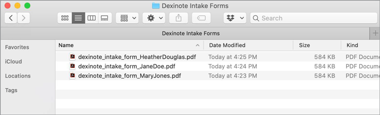

# Utilisation des données de formulaire

Si vous disposez d’un ensemble de formulaires remplis et que vous devez compiler les données, vous pouvez utiliser Acrobat pour fusionner les réponses dans une seule feuille de calcul.

1. Commencez par placer tous vos PDF forms dans un dossier sur votre ordinateur.

   

1. Ouvrez l’un des fichiers de formulaire remplis, puis sélectionnez **[!UICONTROL Prepare Form]** depuis le centre d’outils ou le volet droit.

   

1. Sélectionner **[!UICONTROL Plus]** **>** **[!UICONTROL Fusionner les fichiers de données dans une feuille de calcul]** dans le volet de droite.

   

1. Sélectionnez le dossier que vous avez créé avec les formulaires remplis.

   Acrobat extrait les données de chaque formulaire et crée une feuille de calcul de toutes les données.

   
