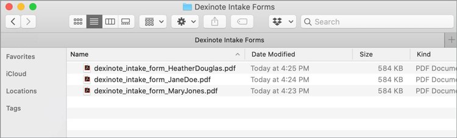

# Utilisation des données de formulaire

Si vous disposez d’un ensemble de formulaires remplis et que vous devez compiler les données, vous pouvez utiliser Acrobat pour fusionner les réponses dans une seule feuille de calcul.

1. Commencez par placer tous vos mots de PDF forms terminés dans un dossier sur votre ordinateur.

    Des Données De Formulaire

1. Ouvrez l&#39;un des fichiers de formulaire remplis, puis sélectionnez **[!UICONTROL Prepare Form]** dans le centre d&#39;outils ou le volet de droite.

    Des Données De Formulaire

1. Sélectionnez **[!UICONTROL Plus]** **>** **[!UICONTROL Fusionner les fichiers de données dans une feuille de calcul]** dans le volet de droite.

    Des Données De Formulaire

1. Sélectionnez le dossier que vous avez créé avec les formulaires remplis.

   Acrobat extrait les données de chaque formulaire et crée une feuille de calcul contenant toutes les données.

    Des Données De Formulaire
