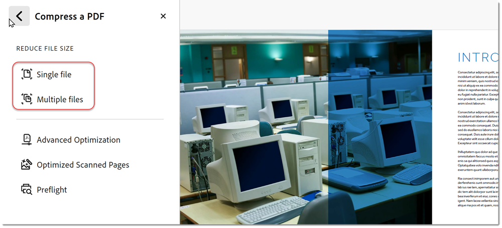
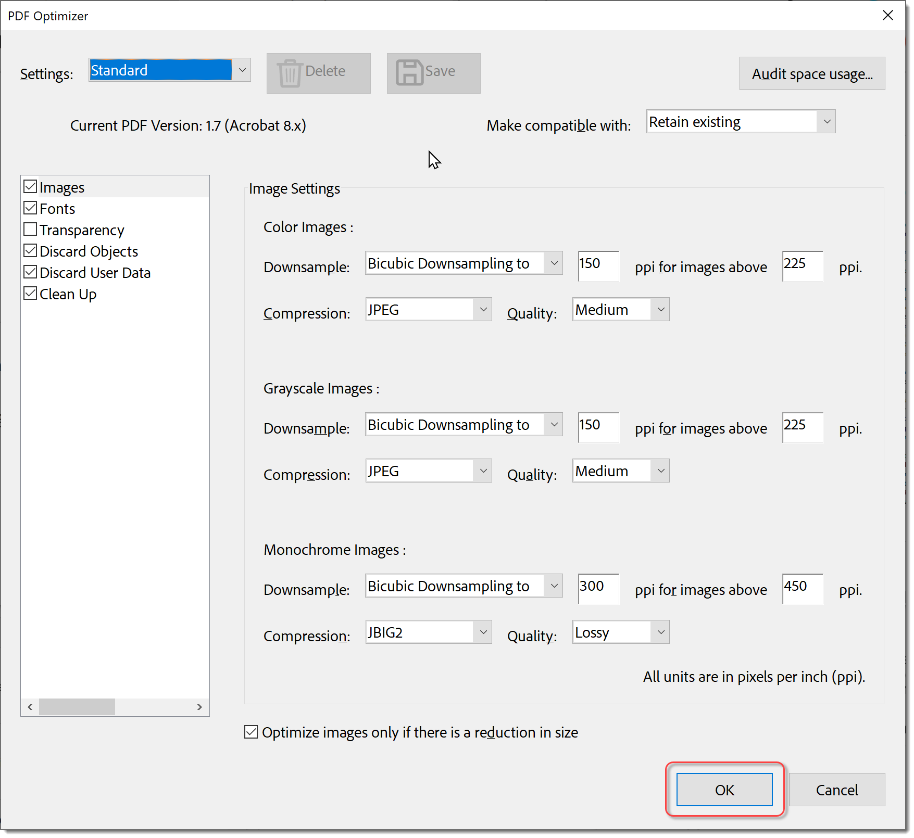

# Compression et optimisation d’un PDF

Découvrez comment compresser et optimiser la taille d’un fichier de PDF. La compression d’un PDF facilite le partage par e-mail ou le chargement sur des sites Web avec des limitations de taille de fichier. Vous pouvez également améliorer l’expérience de visionnage et économiser sur les coûts de stockage en optimisant votre PDF.

## Compression d’un PDF dans Acrobat sur le bureau

1. Ouvrez un fichier et sélectionnez **[!UICONTROL Tous les outils]** dans la barre d&#39;outils, puis choisissez **[!UICONTROL Compresser un PDF]**.

   

1. Sélectionnez **[!UICONTROL Fichier unique]** ou **[!UICONTROL Fichiers multiples]** dans le panneau **[!UICONTROL Compresser un PDF]**.

   

1. Sélectionnez **[!UICONTROL Enregistrer]**.

   

   Le fichier est réduit à la taille la plus petite possible tout en conservant la qualité du document.

## Compression d’un PDF dans Acrobat sur le web

1. Connectez-vous à [acrobat.adobe.com](https://acrobat.adobe.com/fr/fr/) dans un navigateur.

1. Sélectionnez **[!UICONTROL Convertir > Compresser un PDF]** dans le menu supérieur.

   

1. Sélectionnez **[!UICONTROL Sélectionner des fichiers]**, sélectionnez vos fichiers, puis choisissez **[!UICONTROL Ouvrir]**.

   

1. Sélectionnez un niveau de compression et choisissez **[!UICONTROL Compresser]**.

   

## Optimisation d’un PDF dans Acrobat sur ordinateur

>[!NOTE]
>
>L’optimisation d’un PDF n’est disponible que dans Acrobat Pro sur ordinateur.

1. Ouvrez un fichier et sélectionnez **[!UICONTROL Tous les outils]** dans la barre d&#39;outils, puis choisissez **[!UICONTROL Compresser un PDF]**.

   

1. Sélectionnez **[!UICONTROL Optimisation avancée]** dans le panneau **[!UICONTROL Compresser un PDF]**.

   

1. Dans la liste déroulante **Rendre compatible avec**, choisissez **Conserver l&#39;existant** pour conserver la version actuelle du PDF, ou choisissez une version d&#39;Acrobat. Activez la case à cocher en regard d&#39;un panneau (par exemple, Images, Polices, Transparence), sélectionnez les options de ce panneau, choisissez **[!UICONTROL OK]**, puis enregistrez le fichier.

   

   Par défaut, **Standard** est sélectionné dans le menu **Paramètres**. Si vous modifiez des paramètres dans la boîte de dialogue Optimisation du PDF, le menu **Paramètres** passe automatiquement à **Personnalisé**. Pour empêcher l’exécution de toutes les options d’un panneau lors de l’optimisation, désactivez la case à cocher de ce panneau.

1. (Facultatif) Pour enregistrer vos paramètres personnalisés, sélectionnez **[!UICONTROL Enregistrer]** et nommez les paramètres. Pour supprimer un paramètre enregistré, sélectionnez-le dans la liste déroulante **Paramètres** et sélectionnez **[!UICONTROL Supprimer]**.

   

>[!TIP]
>
>Pour optimiser plusieurs fichiers de PDF, utilisez l&#39;[Action Wizard](../advanced-tasks/action.md).