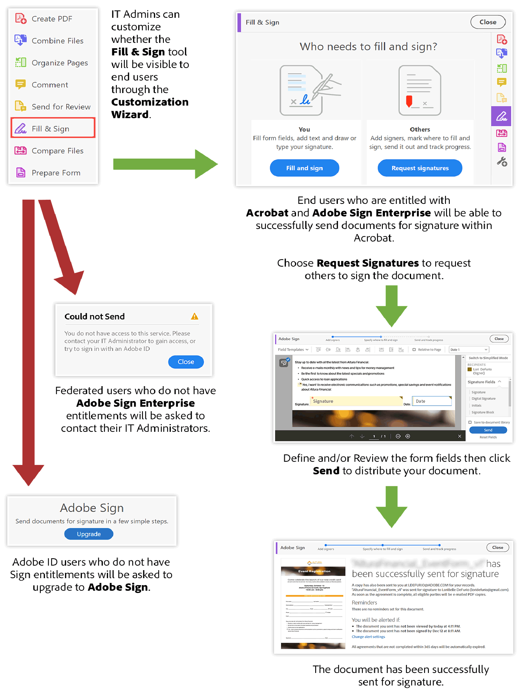

# Mises à jour importantes du produit Acrobat DC pour les clients ETLA

[!DNL Adobe Sign Individual] (également connu sous le nom d’Adobe Sign Pro) ne sera plus provisionné à partir de tous les droits Acrobat DC inclus dans les offres ETLA (Enterprise Term License Agreement) qu’à partir d’août 2020 et ce jusqu’au 20 novembre 2020. [!DNL Adobe Sign Individual] ne fournit pas de fonctionnalité de niveau entreprise et doit être remplacé par Adobe Sign Enterprise pour les clients Entreprise. Cela inclut Acrobat DC sous licence en tant qu’application autonome et Acrobat DC sous licence dans le cadre de Creative Cloud abonnement Entreprise - Toutes les applications.

L&#39;accès à [!DNL Adobe Sign Individual] est disponible dans Acrobat via l&#39;outil **Adobe Sign** ou **Fill &amp; Sign** ([Demander des signatures](https://www.adobe.com/fr/acrobat/online/request-signature.html){target="_blank"}).

Accès à ![[!DNL Adobe Sign Individual] dans Acrobat DC](../assets/Deploy_SignEntitle1.png)

Si vous n’avez pas mis à jour Acrobat DC vers la dernière version, l’outil peut être étiqueté « Send for Signature ».

## Pourquoi déprovisionnons-nous ce système?

[En octobre 2018, nous avons publié un tout nouvel Acrobat DC](https://news.adobe.com/news/news-details/2018/Adobe-Redefines-What-Is-Possible-With-PDF-With-All-New-Acrobat-DC). Cette dernière version comprend de nouveaux outils et fonctionnalités permettant de mieux travailler avec les PDF sur les appareils mobiles, le Web et les ordinateurs, ainsi que de tout nouveaux outils de collaboration. En tant qu’abonné Acrobat DC, vous devriez déjà disposer de ces fonctionnalités exceptionnelles. Une autre mise à jour majeure que nous avons publiée concerne notre solution de signature électronique Adobe Sign.

Avant la version d&#39;octobre 2018, les utilisateurs d&#39;Acrobat DC pouvaient envoyer des documents pour signature électronique à l&#39;aide d&#39;outils d&#39;Acrobat étiquetés « Fill &amp; Sign » (ou « Adobe Sign » ou « Send for Signature ») qui étaient dotés d&#39;un droit d&#39;accès [!DNL Adobe Sign Individual].

Bien que cette option ait fourni un excellent moyen de capturer les signatures électroniques, nous déprovisionnons [!DNL Adobe Sign Individual], car elle ne fournit pas les fonctionnalités de niveau Entreprise disponibles via Adobe Sign Enterprise, telles que :

* Possibilité de gérer de manière centralisée les utilisateurs autorisés à envoyer des accords ou à signer
* Autorisation des administrateurs à gérer les accords envoyés et utilisés dans l’organisation
* Gestion granulaire des signatures électroniques au sein de l’entreprise

En outre, Adobe Sign Enterprise offre davantage de fonctionnalités que ce qui était disponible dans le droit d&#39;accès [!DNL Adobe Sign Individual], notamment :

* Administration
   * Authentification unique
   * Délégation de compte
* Intégrations
   * Intégrations d’entreprise prédéfinies avec Dropbox, Salesforce, Workday, etc.
   * Adobe Sign est la solution de signature électronique préférée dans la gamme d&#39;entreprises [Microsoft](https://acrobat.adobe.com/us/en/business/integrations/microsoft.html), y compris Office 365, SharePoint, Dynamics, Teams et Flow
* Personnalisation et optimisation
   * Amélioration de l’authentification de signature électronique, vérification avancée de l’identité des signataires basée sur un ID, concepteur de workflow, prise en charge linguistique avancée, etc.

Adobe Sign est la solution mondialement reconnue de référence pour la capture de signatures conformes à la loi. Adobe Sign est intégralement conçu pour répondre aux besoins de signature électronique de votre organisation, avec des outils conviviaux pour les administrateurs informatiques qui vous garantissent, à vous et à vos utilisateurs, une utilisation des signatures électroniques entièrement conforme aux diverses réglementations régionales et sectorielles en matière de signatures électroniques. Rendez-vous [ici](https://helpx.adobe.com/fr/enterprise/using/adobe-sign-for-enterprise.html) pour plus d’informations sur la gestion de Sign via [Adobe Admin Console](https://helpx.adobe.com/fr/enterprise/using/admin-console.html).

Contactez votre contact d’Adobe pour savoir comment vous pouvez continuer à fournir les fonctionnalités de signature électronique de votre organisation via notre plateforme de documents numériques élargie qui inclut Acrobat DC et Adobe Sign Enterprise.

## Accès aux accords existants

Les utilisateurs pourront toujours accéder à tous les accords envoyés avant cette action via Adobe Document Cloud en se connectant avec leur Adobe ID à l’adresse https://documentcloud.adobe.com. Si la migration de cet utilisateur vers Sign Enterprise est planifiée, il devra suivre ces [instructions](https://helpx.adobe.com/fr/sign/kb/how-to-download-signed-documents---adobe-sign.html).

## Expérience Acrobat DC sans droit [!DNL Sign Individual]

Les utilisateurs disposant de droits Adobe Sign Enterprise pourront envoyer des accords dans Acrobat à l’aide d’Adobe Sign ou de l’outil [!UICONTROL Fill &amp; Sign] (Demander des signatures).
Les utilisateurs qui ne disposent pas de droits Adobe Sign Enterprise ne pourront pas envoyer de nouveaux accords et recevront un message d’erreur. Le graphique ci-dessous présente les résultats possibles.

## Expérience web Adobe Document Cloud sans droit d’accès individuel à Sign

Les utilisateurs pourront se connecter à https://documentcloud.adobe.com/ pour accéder et télécharger tous les accords qui ont été envoyés avant le déprovisionnement des droits d’Adobe Sign Individual.

## Pour plus d’informations, consultez les pages ci-dessous :

* [Connexion à Adobe Document Cloud](https://helpx.adobe.com/document-cloud/help/sign-in.html)
* [Gestion des fichiers (Où sont mes fichiers ?)](https://helpx.adobe.com/document-cloud/help/manage-files.html)
* [Utilisation de [!UICONTROL Acrobat Customization Wizard] pour la configuration](https://www.adobe.com/fr/devnet-docs/acrobatetk/tools/Wizard/WizardDC/index.html)
* [Présentation du [!UICONTROL Admin Console]](https://helpx.adobe.com/fr/enterprise/using/admin-console.html)
* [Gestion d’Adobe Sign sur le [!UICONTROL Admin Console]](https://helpx.adobe.com/fr/enterprise/using/adobe-sign-for-enterprise.html)

**Révisions** 20 mai 2020 ; publication d’origine - août 2019
