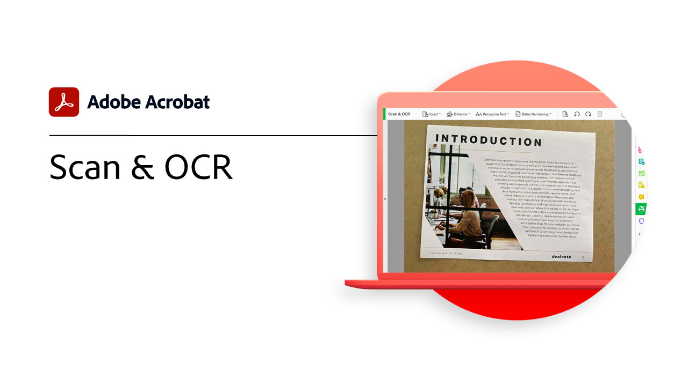
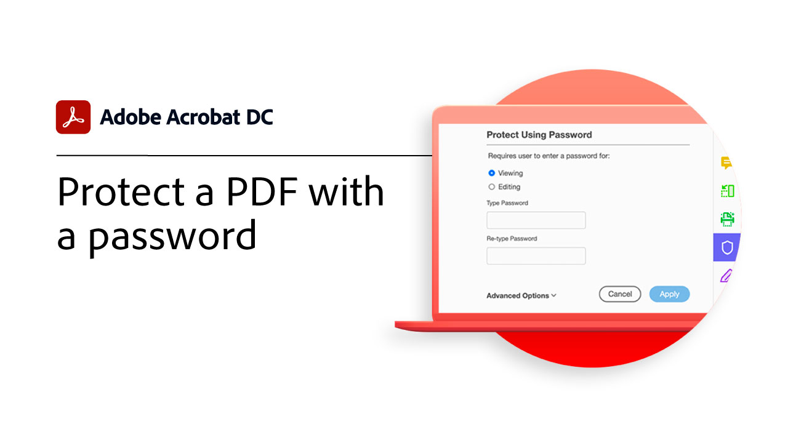

# Présentation de la prise en main

Apprenez à utiliser Adobe Acrobat à l’aide de ces tutoriels détaillés. De la création d’un document à la protection ou [modification des fichiers de votre PDF](https://www.adobe.com/fr/acrobat/online/pdf-editor.html){target="_blank"}, ce contenu est conçu pour vous faciliter l’accès aux workflows PDF.

## Nouveautés

* [Modification de texte dans un PDF](edit-pdf.md)
Découvrez comment modifier des mots, des expressions ou même des pages entières dans votre PDF

* [Création d’un PDF](create-pdf.md)
Apprenez à créer des mots de PDF à partir de tous les types de documents

## Tutoriels de prise en main

<table style="table-layout:fixed">
<tr>
  <td>
    
    

    <a href="get-to-know-the-acrobat-dc-interface.md"><strong>Principes de base de l’espace de travail</strong></a>
    

    <em>Découvrez comment l’espace de travail d’Acrobat facilite l’accès aux fichiers et aux outils sur ordinateur, web et mobile</em>
     
  </td>
  <td>
    
    

    <a href="new-workspace.md"><strong>Nouvelle expérience de l’espace de travail</strong></a>
    

    <em>Découvrez le nouvel espace de travail que vous pouvez activer dans Acrobat</em>
     
  </td>
  <td>
    
    

    <a href="acrobatweb.md"><strong>Travaillez n’importe où avec Acrobat Web</strong></a>
    

    <em>Découvrez comment gérer les demandes de documents professionnels où que vous soyez à l’aide des outils web Acrobat de votre navigateur</em>
     
  </td>
  <td>
    
    

     <a href="productivity.md"><strong>Productivité mobile</strong></a>
    

    <em>Allez plus loin directement depuis votre tablette ou votre téléphone mobile avec l’application mobile Acrobat Reader</em>
     
  </td>
</tr>
<tr>
    <td>
      
      

      <a href="../integrate/integrate-overview.md#microsoft"><strong>Utilisation de Microsoft 365</strong></a>
      

      <em>Augmentez la productivité et les workflows de documents professionnels avec Acrobat et [!DNL Microsoft 365]</em>
       
    </td>
    <td>
      
      

      <a href="where-do-pdfs-come-from.md"><strong>D'où viennent les PDF ?</strong></a>
      

      <em>Comprendre d’où viennent les PDF et leurs utilisations</em>
       
    </td>
    <td>
    
      

       
    </td>
    <td>
    
      

       
    </td>
  </tr>
  </table>

## Création, combinaison et organisation de tutoriels

<table style="table-layout:fixed">
  <tr>
    <td>
      
      

      <a href="create-pdf.md"><strong>Création d’un PDF</strong></a>
      

      <em>Création de mots de PDF à partir de différents types de documents</em>
       
    </td>
    <td>
      
      

      <a href="combine-to-pdf.md"><strong>Combiner des fichiers dans des PDF</strong></a>
      

      <em>Combiner de nombreux types de fichiers dans un seul PDF</em>
       
    </td>
    <td>
      
      

      <a href="organize.md"><strong>Organiser les pages</strong></a>
      

      <em>Ajouter, remplacer, extraire, faire pivoter, supprimer et réorganiser des pages dans votre PDF</em>
       
    </td>
    <td>
      
      

      <a href="add-custom-page.md"><strong>Ajouter une page personnalisée</strong></a>
      

      <em>Découvrez comment ajouter des pages personnalisées à votre PDF à l’aide de l’application Adobe Express intégrée</em>
       
    </td>
  </tr>
  </table>

## Modification et exportation de tutoriels

<table style="table-layout:fixed">
  <tr>
    <td>
      
      

      <a href="edit-pdf.md"><strong>Modification de texte dans un PDF</strong></a>
      

      <em>Découvrez comment modifier le texte dans un PDF</em>
       
    </td>
    <td>
      
      

      <a href="stylize-this-PDF.md"><strong>Styliser ce PDF</strong></a>
      

      <em>Découvrez le nouveau mode de modification qui ajuste automatiquement le contenu</em>
       
    </td>
   <td>
      
      

      <a href="auto-adjust-layout.md"><strong>Ajustement automatique de la mise en page</strong></a>
      

      <em>Découvrez le nouveau mode de modification qui ajuste automatiquement le contenu</em>
       
    </td>
    <td>
      
      

      <a href="export-pdf.md"><strong>Exportation d’un PDF vers des formats modifiables</strong></a>
      

      <em>Découvrez comment exporter vos fichiers de PDF dans des formats modifiables</em>
       
    </td>
  </tr>
  </table>

## Tutoriels de collaboration

<table style="table-layout:fixed">
  <tr>
    <td>
      
      

      <a href="collaborate.md"><strong>Collaborez en temps réel</strong></a>
      

      <em>Faites avancer vos projets en collectant des commentaires, en collaborant sur les réponses et en suivant l’avancement de vos documents, le tout en temps réel, où que vous soyez</em>
       
    </td>
    <td>
      
      

      <a href="comment-on-pdf-files.md"><strong>Commenter un PDF</strong></a>
      

      <em>Ajouter des commentaires à un fichier de PDF, puis le partager avec d’autres personnes</em>
       
    </td>
    <td>
    
      

       
    </td>
    <td>
    
      

       
    </td>
</tr>
</table>

## Tutoriels supplémentaires

<table style="table-layout:fixed">
<tr>
  <td>
    
    

    <a href="create-fillable-forms.md"><strong>Création de formulaires à remplir</strong></a>
    

    <em>Transformer un document créé dans une autre application en formulaire de PDF à remplir</em>
     
  </td>
  <td>
    
    

    <a href="fill-and-sign.md"><strong>Fill &amp; Sign PDF forms</strong></a>
    

    <em>Remplir et signer rapidement un formulaire de PDF</em>
     
  </td>
  <td>
    
    

    <a href="scan-and-ocr.md"><strong>Numérisation et ROC</strong></a>
    

    <em>Réduisez la taille des fichiers et optimisez vos PDF sans compromettre la qualité du partage, de la publication ou de l’archivage</em>
     
  </td>
  <td>
    
    

    <a href="password-protect.md"><strong>Protect d’un fichier de mot de PDF avec un mot de passe</strong></a>
    

    <em>Ajoutez un mot de PDF pour empêcher les autres utilisateurs d’ouvrir ou de modifier le fichier</em>
     
  </td>
</tr>
<tr>
  <td>
    
    

    <a href="signatures.md"><strong>Obtenir des signatures</strong></a>
    

    <em>Faites bouger votre entreprise en collectant des signatures électroniques juridiquement contraignantes auprès de tiers, où que vous soyez</em>
     
  </td>
  <td>
    
    

    <a href="track.md"><strong>Suivi de vos documents</strong></a>
    

    <em>Toujours savoir quels fichiers sont en attente de signature et lesquels ont été signés</em>
     
  </td>
  <td>
   
    

     
  </td>
  <td>
   
    

     
  </td>
</tr>
</table>
