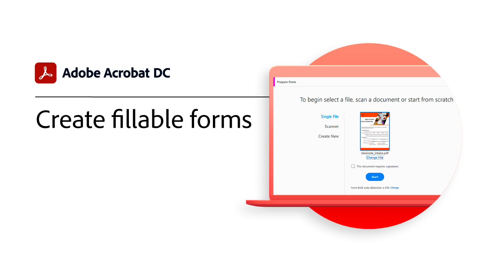

# Présentation de la prise en main

Découvrez comment commencer à utiliser Adobe Acrobat à l’aide de ces didacticiels détaillés (1 à 2 minutes). De la création d’un document à la protection de vos fichiers PDF, ce contenu est conçu pour vous faciliter la tâche dans les flux de travaux des PDF.

## Tutoriels Acrobat

<table style="table-layout:fixed">
<tr>
  <td>
    
    

    <a href="get-to-know-the-acrobat-dc-interface.md"><strong>Espace de travail – Principes de base</strong></a>
    

    <em>Découvrez comment l’interface d’Adobe Acrobat DC facilite l’accès aux fichiers et outils sur les postes de travail, le web et les terminaux mobiles.</em>
     
  </td>
  <td>
    
    

    <a href="acrobatweb.md"><strong>Utilisation de Acrobat Web n’importe où</strong></a>
    

    <em>Découvrez comment traiter les demandes de documents d'entreprise en tout lieu à l'aide des outils web Acrobat dans votre navigateur.</em>
     
  </td>
  <td>
    
    

     <a href="../integrate/integrate-overview.md#microsoft"><strong>Utilisation de Microsoft 365</strong></a>
    

    <em>Augmenter la productivité et les workflows de documents professionnels avec Acrobat et [!DNL Microsoft 365]</em>
     
  </td>
</tr>
<tr>
   <td>
    
    

     <a href="collaborate.md"><strong>Collaboration en temps réel</strong></a>
    

    <em>Faites avancer vos projets en collectant des commentaires, en collaborant sur les réponses et en suivant l’avancement de vos documents en temps réel, où que vous soyez</em>
     
  </td>
  <td>
    
    

     <a href="combine-to-pdf.md"><strong>Combinaison de fichiers en PDF</strong></a>
    

    <em>Combinaison de nombreux types de fichiers dans un seul PDF</em>
     
  </td>
  <td>
    
    

    <a href="create-pdf.md"><strong>Création d’un fichier PDF </strong></a>
    

    <em>Création de PDF à partir de différents types de documents</em>
     
  </td>
</tr>
<tr>
  <td>
    
    

    <a href="comment-on-pdf-files.md"><strong>Commentaire sur un PDF</strong></a>
    

    <em>Ajout de commentaires à un fichier PDF, puis partage avec d’autres personnes</em>
     
  </td>
  <td>
    
    

    <a href="edit-pdf.md"><strong>Modifier un fichier PDF</strong></a>
    

    <em>Modification de texte et d’images dans des fichiers PDF</em>
     
  </td>
   <td>
    
    

    <a href="export-pdf.md"><strong>Exportation d’un PDF vers des formats modifiables</strong></a>
    

    <em>Découvrez comment exporter vos fichiers PDF vers des formats modifiables.</em>
     
  </td>
</tr>
<tr>
  <td>
    
    

    <a href="create-fillable-forms.md"><strong>Création de formulaires à remplir</strong></a>
    

    <em>Transformation d’un document créé dans une autre application en formulaire PDF à remplir</em>
     
  </td>
  <td>
    
    

    <a href="scan-and-ocr.md"><strong>Numérisation et OCR</strong></a>
    

    <em>Réduisez les fichiers volumineux et optimisez vos PDF sans compromettre la qualité du partage, de la publication ou de l’archivage.</em>
     
  </td>
  <td>
    
    

    <a href="organize.md"><strong>Organisation des pages</strong></a>
    

    <em>Ajout, remplacement, extraction, rotation, suppression et déplacement de pages dans votre PDF</em>
     
  </td>
</tr>
<tr>
  <td>
    
    

    <a href="password-protect.md"><strong>Protect d’un fichier PDF avec un mot de passe</strong></a>
    

    <em>Ajouter un mot de passe à votre PDF pour empêcher d’autres utilisateurs d’ouvrir ou de modifier le fichier</em>
     
  </td>
  <td>
    
    

    <a href="fill-and-sign.md"><strong>Remplissage et signature de formulaires PDF</strong></a>
    

    <em>Remplissage et signature rapides d’un formulaire PDF</em>
     
  </td>
  <td>
    
    

    <a href="where-do-pdfs-come-from.md"><strong>D'où viennent les PDF ?</strong></a>
    

    <em>Comprendre d'où viennent les PDF et leur utilisation</em>
     
  </td>
</tr>
</table>
