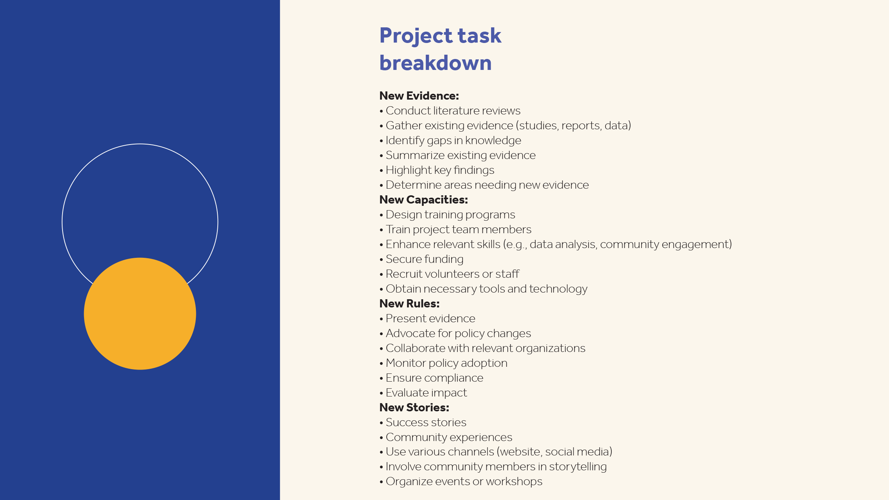

# Présentation de la prise en main

Apprenez à utiliser Adobe Acrobat à l’aide de ces tutoriels détaillés. De la création d&#39;un document à la protection ou à la [modification de vos fichiers de PDF](https://www.adobe.com/fr/acrobat/online/pdf-editor.html){target="_blank"}, ce contenu est conçu pour vous faciliter l&#39;accès aux workflows de PDF.

## Nouveautés

* [Nouvelle expérience de l&#39;espace de travail](new-workspace.md)
Découvrez le nouvel espace de travail d’Acrobat qui vous permet de découvrir rapidement les outils et d’effectuer efficacement les tâches de votre PDF
* [Découvrir les informations du PDF avec l’assistant AI](ai-assistant.md)
Découvrez comment obtenir des informations à partir de vos fichiers de PDF à l’aide de l’assistant AI
* [Convertir le PDF en différents formats de fichiers](export-pdf.md)
Découvrez comment convertir vos fichiers PDF dans différents formats de fichiers, tels que Microsoft Word, Excel ou PowerPoint
* [Modifier le texte dans un PDF](edit-pdf.md)
Découvrez comment modifier des mots, des expressions ou même des pages entières dans votre PDF

## Tutoriels de prise en main

<table style="table-layout:fixed">
<tr>
  <td>
    
  </td>
  <td>
    
  </td>
  <td>
    
  </td>
  <td>
    
  </td>
</tr>
<tr>
  <td>
    <a href="productivity.md">
      
  </td>
    <td>
      <a href="../integrate/integrate-overview.md#microsoft">
        
    </td>
    <td>
      
    </td>
    <td>
    
      

       
    </td>
  </tr>
  </table>

## Création, combinaison et organisation de tutoriels

<table style="table-layout:fixed">
  <tr>
    <td>
      
    </td>
    <td>
      <a href="combine-to-pdf.md">
        
    </td>
    <td>
      
    </td>
    <td>
      
    </td>
  </tr>
  </table>

## Modification et exportation de tutoriels

<table style="table-layout:fixed">
  <tr>
    <td>
      
    </td>
    <td>
      
    </td>
   <td>
      
    </td>
    <td>
      
    </td>
  </tr>
  </table>

## Tutoriels de collaboration

<table style="table-layout:fixed">
  <tr>
    <td>
      
      

      <a href="collaborate.md"><strong>Collaborez en temps réel</strong></a>
      

      <em>Faites avancer vos projets en collectant des commentaires, en collaborant sur les réponses et en suivant la progression de vos documents, le tout en temps réel, où que vous soyez</em>
       
    </td>
    <td>
      
      

      <a href="comment-on-pdf-files.md"><strong>Commenter un PDF</strong></a>
      

      <em>Ajoutez des commentaires à un fichier de PDF, puis partagez-le avec d'autres</em>
       
    </td>
    <td>
    
      

       
    </td>
    <td>
    
      

       
    </td>
</tr>
</table>

## Tutoriels supplémentaires

<table style="table-layout:fixed">
<tr>
  <td>
    
    

    <a href="create-fillable-forms.md"><strong>Créer des formulaires à remplir</strong></a>
    

    <em>Convertir un document créé dans une autre application en formulaire de PDF à remplir</em>
     
  </td>
  <td>
    
    

    <a href="fill-and-sign.md"><strong>Fill &amp; Sign PDF forms</strong></a>
    

    <em>Remplissez et signez rapidement un PDF</em>
     
  </td>
  <td>
    
    

    <a href="scan-and-ocr.md"><strong>Numérisation et ROC</strong></a>
    

    <em>Réduisez les fichiers volumineux et optimisez vos PDF sans compromettre la qualité du partage, de la publication ou de l'archivage</em>
     
  </td>
  <td>
    
    

    <a href="password-protect.md"><strong>Protect d'un fichier de mot de PDF avec un mot de passe</strong></a>
    

    <em>Ajoutez un mot de PDF à votre mot de passe pour empêcher l'ouverture ou la modification du fichier</em>
     
  </td>
</tr>
<tr>
  <td>
    
    

    <a href="signatures.md"><strong>Obtenir des signatures</strong></a>
    

    <em>Faites bouger les affaires en collectant des signatures électroniques juridiquement contraignantes auprès d’autres personnes, où qu’elles se trouvent</em>
     
  </td>
  <td>
    
    

    <a href="track.md"><strong>Suivi de vos documents</strong></a>
    

    <em>Sachez toujours quels fichiers sont en attente de signature et lesquels ont été signés</em>
     
  </td>
  <td>
   
    

     
  </td>
  <td>
   
    

     
  </td>
</tr>
</table>
