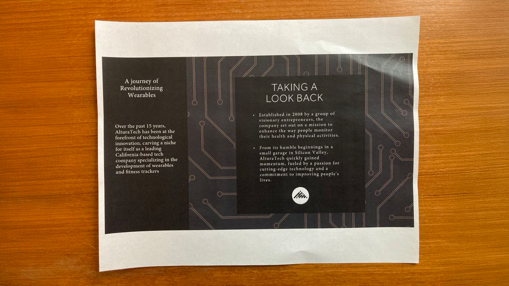

# Présentation de la prise en main

Apprenez à utiliser Adobe Acrobat à l’aide de ces tutoriels détaillés. De la création d&#39;un document à la protection ou à la [modification de vos fichiers de PDF](https://www.adobe.com/fr/acrobat/online/pdf-editor.html){target="_blank"}, ce contenu est conçu pour vous faciliter l&#39;accès aux workflows de PDF. Consultez cette [liste de lecture](https://experienceleague.adobe.com/en/playlists/acrobat-get-started-business-users) soigneusement sélectionnée pour commencer à utiliser Acrobat.

## Nouveautés

>[!BEGINTABS]

>[!TAB Collaborez en temps réel]

Découvrez comment créer un [processus de révision](collaborate.md) de document qui améliore non seulement l&#39;efficacité, mais également la qualité du contenu.

>[!TAB Créer une nouvelle page]

Apprenez à [créer une page d&#39;aspect professionnel](add-custom-page.md) dans votre PDF à l&#39;aide d&#39;Adobe Express.

>[!TAB Modifier des graphiques dans un PDF]

Découvrez comment [créer, modifier et améliorer des graphiques](edit-graphics.md) dans votre PDF.

>[!TAB Nouvelle expérience de l&#39;espace de travail]

Découvrez le [nouvel espace de travail](new-workspace.md) d&#39;Acrobat qui vous permet de découvrir rapidement les outils et d&#39;effectuer efficacement les tâches de votre PDF.

>[!ENDTABS]

## Tutoriels de prise en main

## Création, combinaison et organisation de tutoriels

<!-- START CARDS HTML - DO NOT MODIFY BY HAND -->

    

        

            

                <figure class="image x-is-16by9">
                    
                </figure>
            

            

                

                    

                        <a href="https://experienceleague.adobe.com/en/docs/document-cloud-learn/acrobat-learning/getting-started/create-pdf" target="_blank" rel="referrer" title="Création de fichiers de PDF">Création de fichiers PDF</a>
                    

                    
Création de PDF à partir de tous les types de documents

                

                <a href="https://experienceleague.adobe.com/en/docs/document-cloud-learn/acrobat-learning/getting-started/create-pdf" target="_blank" rel="referrer" class="spectrum-Button spectrum-Button--outline spectrum-Button--primary spectrum-Button--sizeM" style="align-self: flex-start; margin-top: 1rem;">
                    Regarder
                </a>
            

        

    

    

        

            

                <figure class="image x-is-16by9">
                    
                </figure>
            

            

                

                    

                        <a href="https://experienceleague.adobe.com/en/docs/document-cloud-learn/acrobat-learning/getting-started/combine-to-pdf" target="_blank" rel="referrer" title="Combiner des fichiers dans un seul PDF">Combiner des fichiers dans un seul PDF</a>
                    

                    
Combinez facilement de nombreux types de fichiers dans un seul PDF

                

                <a href="https://experienceleague.adobe.com/en/docs/document-cloud-learn/acrobat-learning/getting-started/combine-to-pdf" target="_blank" rel="referrer" class="spectrum-Button spectrum-Button--outline spectrum-Button--primary spectrum-Button--sizeM" style="align-self: flex-start; margin-top: 1rem;">
                    Regarder
                </a>
            

        

    

    

        

            

                <figure class="image x-is-16by9">
                    
                </figure>
            

            

                

                    

                        <a href="https://experienceleague.adobe.com/en/docs/document-cloud-learn/acrobat-learning/getting-started/organize" target="_blank" rel="referrer" title="Organiser des pages">Organiser les pages</a>
                    

                    
Découvrez comment réorganiser les pages à votre guise

                

                <a href="https://experienceleague.adobe.com/en/docs/document-cloud-learn/acrobat-learning/getting-started/organize" target="_blank" rel="referrer" class="spectrum-Button spectrum-Button--outline spectrum-Button--primary spectrum-Button--sizeM" style="align-self: flex-start; margin-top: 1rem;">
                    Regarder
                </a>
            

        

    

    

        

            

                <figure class="image x-is-16by9">
                    
                </figure>
            

            

                

                    

                        <a href="https://experienceleague.adobe.com/en/docs/document-cloud-learn/acrobat-learning/getting-started/add-custom-page" target="_blank" rel="referrer" title="Créer une nouvelle page">Créer une nouvelle page</a>
                    

                    
Découvrez comment créer une page d’aspect professionnel dans votre PDF

                

                <a href="https://experienceleague.adobe.com/en/docs/document-cloud-learn/acrobat-learning/getting-started/add-custom-page" target="_blank" rel="referrer" class="spectrum-Button spectrum-Button--outline spectrum-Button--primary spectrum-Button--sizeM" style="align-self: flex-start; margin-top: 1rem;">
                    Regarder
                </a>
            

        

    

<!-- END CARDS HTML - DO NOT MODIFY BY HAND -->

## Modification et exportation de tutoriels

<table style="table-layout:fixed">
  <tr>
    <td>
      
      

      <a href="edit-pdf.md"><strong>Modifier le texte dans un PDF</strong></a>
      

      Modifier des mots, des expressions ou même des pages entières dans votre PDF
       
    </td>
    <td>
      
      

      <a href="edit-graphics.md"><strong>Modifier des graphiques dans un PDF</strong></a>
      

      Apprenez à créer, modifier et améliorer des images dans votre PDF
       
    </td>
    <td>
      
      

      <a href="stylize-this-pdf.md"><strong>Styliser ce PDF</strong></a>
      

      Apprenez à créer des mots de PDF de qualité professionnelle
       
    </td>
   <td>
      
      

      <a href="auto-adjust-layout.md"><strong>Ajustement automatique de la mise en page</strong></a>
      

      Découvrez le nouveau mode de modification qui redistribue le contenu
       
    </td>
  </tr>
    <td>
      
      

      <a href="export-pdf.md"><strong>Convertir le PDF en différents formats de fichiers</strong></a>
      

      Conversion des fichiers de votre PDF dans différents formats de fichier
       
    </td>
    <td>
   
    

     
  </td>
  <td>
   
    

     
  </td>
   <td>
   
    

     
  </td>
</tr>
</table>

## Tutoriels de collaboration

<table style="table-layout:fixed">
  <tr>
    <td>
      
      

      <a href="collaborate.md"><strong>Collaborez en temps réel</strong></a>
      

      Faites avancer vos projets en collaborant en temps réel
    </td>
    <td>
      
      

      <a href="comment-on-pdf-files.md"><strong>Commenter un PDF</strong></a>
      

      Ajouter des commentaires, puis partager votre PDF avec d’autres personnes
       
    </td>
    <td>
    
      

       
    </td>
    <td>
    
      

       
    </td>
</tr>
</table>

## Tutoriels supplémentaires

<table style="table-layout:fixed">
<tr>
  <td>
    
    

      <a href="create-fillable-forms.md"><strong>Créer des formulaires à remplir</strong></a>
      

      Transformer un papier numérisé en formulaire à remplir
       
  </td>
  <td>
    
    

    <a href="fill-and-sign.md"><strong>Fill &amp; Sign d'un formulaire de PDF</strong></a>
    

    Découvrez comment remplir et signer rapidement et facilement un formulaire de PDF
     
  </td>
  <td>
    
    

    <a href="scan-and-ocr.md"><strong>Numérisation et ROC</strong></a>
    

    Convertir des numérisations ou des images en fichiers de PDF consultables et modifiables
     
  </td>
  <td>
    
    

    <a href="password-protect.md"><strong>Protect d'un fichier de mot de PDF avec un mot de passe</strong></a>
    

    Découvrez comment ajouter un mot de PDF
     
  </td>
</tr>
<tr>
  <td>
    
    

    <a href="signatures.md"><strong>Obtenir des signatures</strong></a>
    

    Découvrez comment collecter des signatures électroniques juridiquement contraignantes
     
  </td>
  <td>
    
    

    <a href="track.md"><strong>Suivi de vos documents</strong></a>
    

    Suivi et gestion des documents pour signature électronique
     
  </td>
  <td>
      
      

      <a href="where-do-pdfs-come-from.md"><strong>D'où viennent les PDF ?</strong></a>
      

      Découvrez d’où viennent les PDF et comment les utiliser
       
  </td>
  <td>
   
    

     
  </td>
</tr>
</table>
