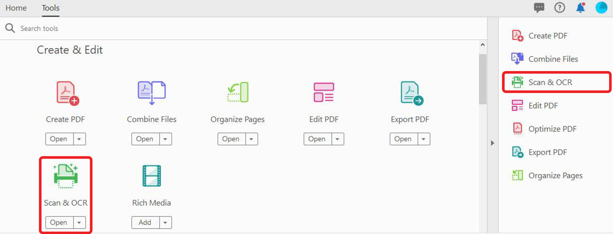
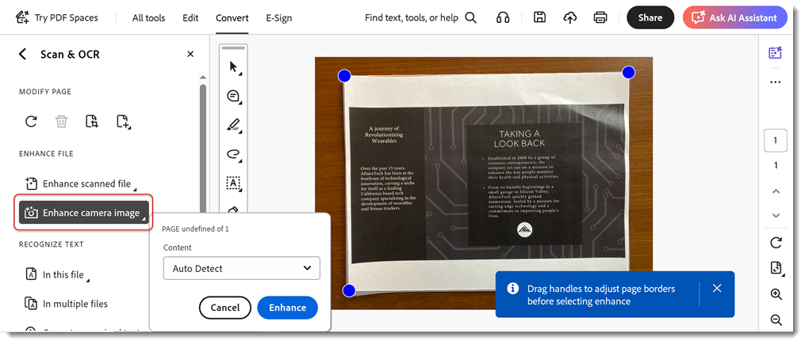

# Numérisation et OCR

Poursuivez votre activité en convertissant des numérisations ou des images de documents en documents indexables. [fichiers de PDF modifiables](https://www.adobe.com/fr/acrobat/online/pdf-editor.html){target="_blank"}.

>[!TIP]
>
>Pour OCR plusieurs fichiers de PDF, essayez d’utiliser le [Action Wizard](../advanced-tasks/action.md).

1. Sélectionner **[!UICONTROL Numérisation et OCR]** dans le [!UICONTROL Outils] au centre ou à droite.

   

1. Sélection d’un fichier.

   Il peut s’agir de la photo d’un document ou d’un fichier déjà numérisé créé à l’aide d’un scanner ou de l’application mobile Adobe Scan. Vous pouvez également numériser un document pour créer un nouveau fichier à l’aide d’un scanner connecté.

   

1. Choisissez **[!UICONTROL Document numérisé]** ou **[!UICONTROL Image de caméra]** pour améliorer le document.

1. Sélectionner **[!UICONTROL Accentuer]** pour nettoyer l’image.

   

   Acrobat reconnaît automatiquement le texte des documents numérisés.

1. Sélectionner **[!UICONTROL Reconnaître le texte]** pour reconnaître manuellement le texte sur les fichiers image.

   

Le fichier est désormais un fichier de PDF indexable et modifiable.

>[!TIP]
>
>Cette vidéo fait partie du cours [Gagnez en efficacité avec Acrobat DC et Microsoft 365](https://experienceleague.adobe.com/?recommended=Acrobat-U-1-2021.microsoft365) qui est disponible gratuitement sur Experience League !
