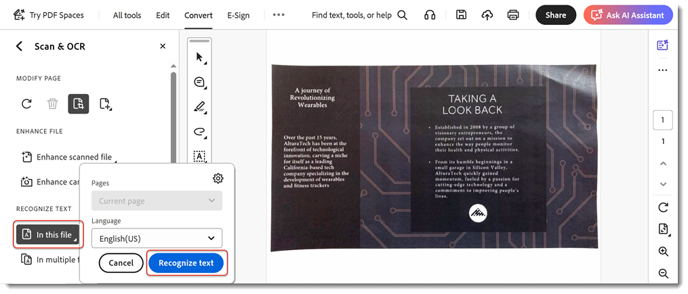

# Numérisation et ROC

Continuez à avancer en convertissant des numérisations ou des images de documents en [fichiers de PDF modifiables](https://www.adobe.com/fr/acrobat/online/pdf-editor.html){target="_blank"} consultables.

>[!TIP]
>
>Pour effectuer la ROC sur plusieurs fichiers de PDF, utilisez l&#39;[Action Wizard](../advanced-tasks/action.md).

1. Sélectionnez **[!UICONTROL Numérisation et OCR]** dans le centre ou le volet droit des [!UICONTROL outils].

   

1. Sélectionnez un fichier.

   Il peut s’agir de la photo d’un document ou d’un fichier déjà numérisé à l’aide d’un scanner ou de l’application mobile Adobe Scan. Vous pouvez également numériser un document pour créer un fichier à l’aide d’un scanner connecté.

   

1. Choisissez **[!UICONTROL Document numérisé]** ou **[!UICONTROL Image de la caméra]** pour améliorer le document.

1. Sélectionnez **[!UICONTROL Améliorer]** pour nettoyer l&#39;image.

   

   Acrobat reconnaît automatiquement le texte des documents numérisés.

1. Sélectionnez **[!UICONTROL Reconnaître le texte]** pour reconnaître manuellement le texte sur les fichiers image.

   

Le fichier est désormais un fichier de PDF consultable et modifiable.

>[!TIP]
>
>Cette vidéo fait partie du cours [Travailler plus intelligemment avec Acrobat DC et Microsoft 365](https://experienceleague.adobe.com/?recommended=Acrobat-U-1-2021.microsoft365) qui est disponible gratuitement sur Experience League !
