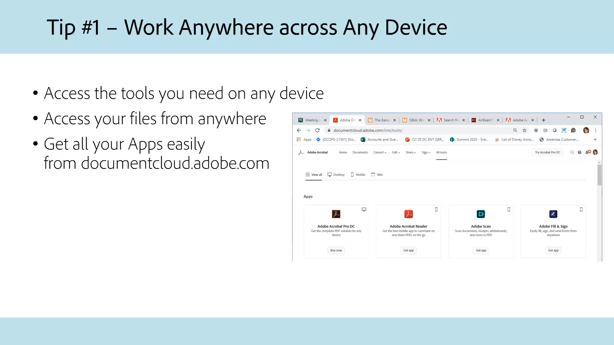
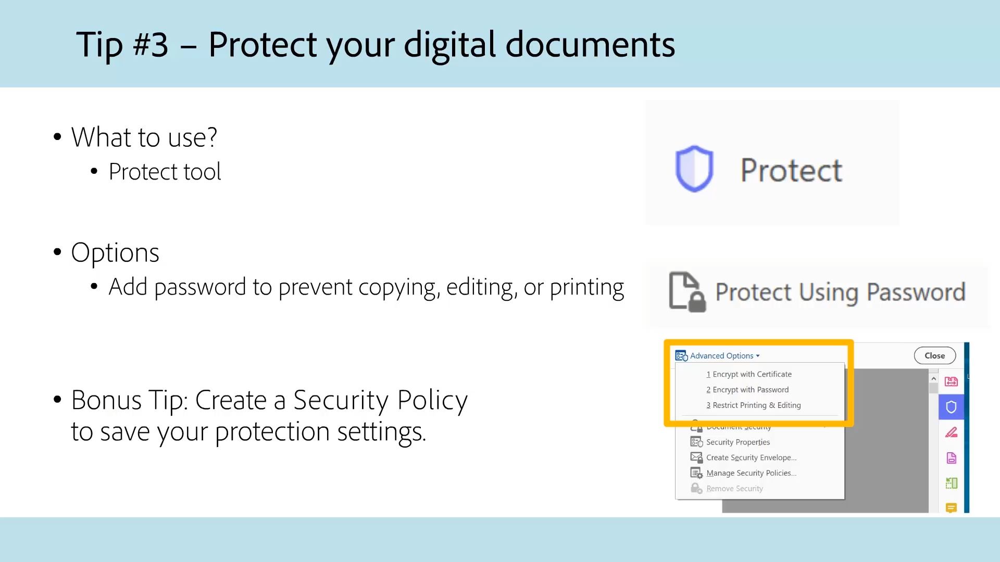

# Acrobat pour l’administration

Explorez nos tutoriels Acrobat spécialement conçus pour les administrations et les collectivités locales.

## Cinq conseils pour travailler en tout lieu avec Acrobat

<table style="table-layout:fixed">
<tr>
  <td>
    
    

    <a href="5-tips-for-working-anywhere-with-acrobat-dc-for-government.md"><strong>Cinq conseils pour travailler en tout lieu avec Acrobat (15:12, disponible en anglais uniquement)</strong></a>
    

    <em>Découvrez comment vous procurer et utiliser les outils d’Acrobat et des applications mobiles qui l’accompagnent pour travailler où que vous soyez</em>
     
  </td>
  <td>
    
    

    <a href="get-your-tools.md"><strong>Conseil 1 : Téléchargez vos outils</strong></a>
    

    <em>La première étape pour commencer à travailler où que vous soyez est d’obtenir vos outils Acrobat et les applications mobiles correspondantes</em>
     
  </td>  
  <td>
    
    

    <a href="collaborate-on-documents.md"><strong>Conseil 2 : Collaboration sur des documents</strong></a>
    

    <em>Créez des workflows simples et faciles pour collaborer sur des documents</em>
     
  </td>
  <td>
    
    

    <a href="protect-digital-documents.md"><strong>Conseil 3 : Documents numériques Protect</strong></a>
    

    <em>Ajoutez un mot de PDF pour empêcher toute copie, modification ou impression</em>
     
  </td>
</tr>
  <td>
    
    

    <a href="work-with-forms-and-signatures.md"><strong>Conseil 4 : Utilisation de formulaires et de signatures</strong></a>
    

    <em>Comment rester digital lors du remplissage de formulaires</em>
     
  </td>
  <td>
    
    

    <a href="scan-and-edit-on-mobile.md"><strong>Conseil 5 : Numérisez et montez du contenu sur mobile</strong></a>
    

    <em>Découvrez comment travailler avec Adobe Scan et les applications mobiles Acrobat Reader, où que vous soyez</em>
     
  </td>
  <td>
   
    

     
  </td>
  <td>
   
    

     
  </td>
</tr>
</table>

## Accessibilité

<table>
<tr>
  <td>
    
    

    <a href="making-pdfs-accessible.md"><strong>Accessibilité du PDF (Complet 14:11)</strong></a>
    

    <em>Découvrez le workflow optimal pour la création de fichiers de PDF accessibles</em>
     
  </td>
  <td>
    
    

    <a href="understanding-accessibility.md"><strong>Accessibilité des PDF : Comprendre l’accessibilité</strong></a>
    

    <em>Découvrez ce que signifie rendre un PDF accessible aux personnes handicapées</em>
     
  </td>  
  <td>
    
    

    <a href="collaborate-on-documents.md"><strong>Accessibilité des PDF : Création dans Word</strong></a>
    

    <em>Découvrez les bonnes pratiques de création de fichiers de PDF créés dans [!DNL Microsoft Word]</em>
     
  </td>
   <td>
    
    

    <a href="finishing-in-acrobat.md"><strong>Accessibilité des PDF : Finition dans Acrobat</strong></a>
    

    <em>Découvrez comment finaliser l’accessibilité de votre fichier de PDF à l’aide des outils d’Acrobat Pro</em>
     
  </td>
</tr>
<tr>
  <td>
    
    

    <a href="making-pdf-ballots-accessible.md"><strong>Rendre les bulletins de vote PDF plus accessibles</strong></a>
    

    <em>Ce webinaire couvre les principaux aspects de l'accessibilité des PDF nécessaires pour permettre aux utilisateurs de technologies d'assistance, telles que les lecteurs d'écran, de lire et de compléter leurs bulletins de vote</em>
     
  </td>  
  <td>
   
    

     
  </td>
  <td>
   
    

     
  </td>
  <td>
   
    

     
  </td>
</tr>
</table>
