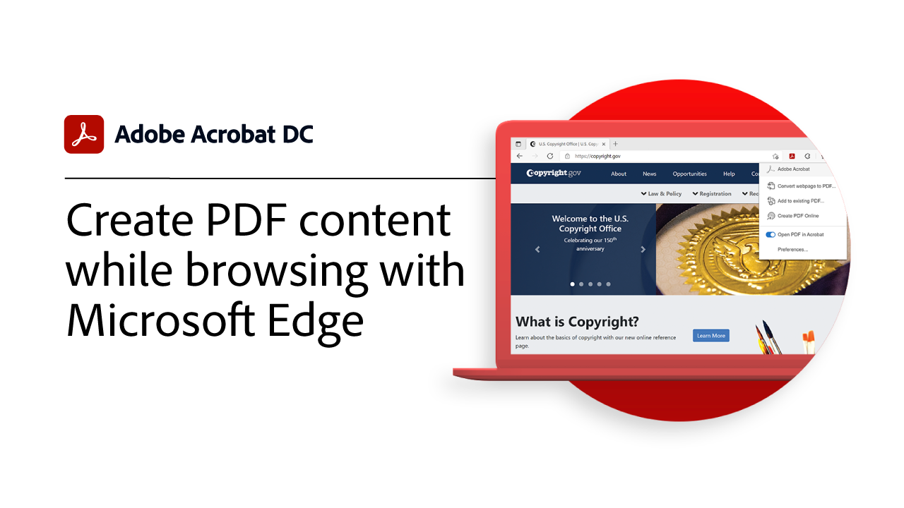

# Présentation des intégrations

Intégrez Acrobat à [!DNL Box], [!DNL Dropbox], [!DNL Google Drive], [!DNL OneDrive], et [!DNL Microsoft] des applications.

## Microsoft

Découvrez comment tous les membres de votre équipe peuvent manipuler sans problème des fichiers de PDF directement dans le cloud [Microsoft 365](https://www.adobe.com/documentcloud/integrations/microsoft-office-365.html).

<table style="table-layout:fixed">
<tr>
  <td>
    
    

    <a href="createfromword.md"><strong>Création de fichiers PDF à partir de [!DNL Microsoft Word]</strong></a>
    

    <em>Créez des fichiers de PDF complets et complets à l'aide d'une table des matières avec hyperlien, de références croisées, de signets et même de pièces jointes, directement depuis [!DNL Microsoft Word]</em>
     
  </td>
  <td>
    
    

    <a href="createofficeweb.md"><strong>Création de PDF dans [!DNL Office] pour le web</strong></a>
    

    <em>Apprenez à créer des fichiers PDF sans jamais quitter votre [!DNL Microsoft Office] pour les applications web</em>
     
  </td> 
  <td>
    
    

    <a href="acrobatandsp.md"><strong>Travaillez avec votre [!DNL SharePoint] fichiers</strong></a>
    

    <em>Simplifiez les workflows documentaires avec [!DNL SharePoint] et Acrobat</em>
     
  </td>
  <td>
    
    

    <a href="acrobatandteams.md"><strong>Collaboration PDF dans [!DNL Microsoft Teams]</strong></a>
    

    <em>Collaborez et collaborez avec des collègues en consultant, annotant et révisant des PDF sans jamais quitter le système [!DNL Microsoft Teams]</em>
     
  </td>
</tr>
<tr>
  <td>
    
    

    <a href="outlook.md"><strong>Convertir les e-mails et les pièces jointes en PDF dans [!DNL Outlook]</strong></a>
    

    <em>Apprenez à fournir des informations de manière plus professionnelle et plus sécurisée dans [!DNL Outlook]</em>
     
  </td>
  <td>
    
    

    <a href="edge.md"><strong>Création de contenu PDF lors de la navigation avec [!DNL Microsoft Edge]</strong></a>
    

    <em>Découvrez comment archiver des pages web dans un PDF à la volée avec l’extension Adobe Acrobat pour [!DNL Microsoft Edge]</em>
     
  </td>
  <td>
   
    

     
  </td>
  <td>
   
    

     
  </td>
</tr>
</table>

## Google Drive

Gagnez en efficacité en un temps record en intégrant les principaux outils de PDF et de signature électronique [!DNL Google Drive].

<table style="table-layout:fixed">
<tr>
  <td>
    
    

    <a href="acrobatandgoogle.md"><strong>Adobe Acrobat pour [!DNL Google Drive]</strong></a>
    

    <em>Accédez à des outils de PDF qui vous font gagner du temps et à des workflows de signature électronique directement depuis le [!DNL Google Drive] application</em>
     
  </td>
  <td>
   
    

     
  </td>
  <td>
   
    

     
  </td>
  <td>
   
    

     
  </td>
</tr>
</table>

## Dropbox

Découvrez à quel point il est facile d’accéder aux fichiers stockés dans [!DNL Dropbox].

<table style="table-layout:fixed">
<tr>
  <td>
    
    

    <a href="acrobat-dropbox.md"><strong>Utilisation de fichiers provenant de [!DNL Dropbox]</strong></a>
    

    <em>Découvrez comment ouvrir, créer, modifier, signer et enregistrer les modifications apportées à votre [!DNL Dropbox] fichiers depuis Acrobat</em>
     
  </td>
  <td>
   
    

     
  </td>
  <td>
   
    

     
  </td>
  <td>
   
    

     
  </td>
</tr>
</table>

## Box

Découvrez comment Acrobat et [Box](https://www.adobe.com/documentcloud/integrations/box.html){target=&quot;_blank&quot;} simplifiez la tâche de tous les membres de votre entreprise.
