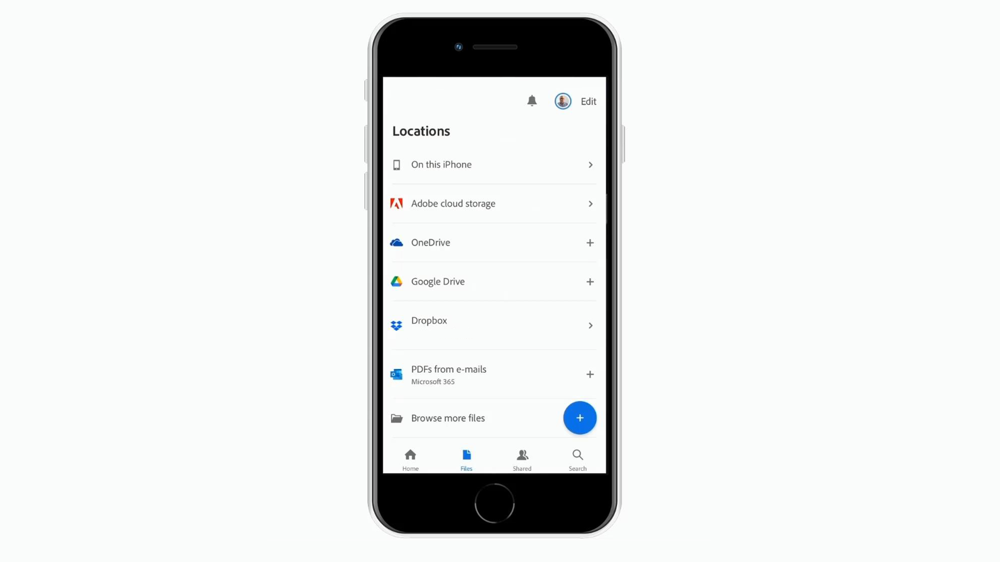

# Présentation des intégrations

Intégrez Acrobat avec les applications [!DNL Box], [!DNL Dropbox], [!DNL Google Drive], [!DNL OneDrive] et [!DNL Microsoft].

## Microsoft

Découvrez comment tous les membres de votre équipe peuvent travailler en toute transparence avec les fichiers de PDF, directement dans [Microsoft 365](https://www.adobe.com/documentcloud/integrations/microsoft-office-365.html). Consultez cette [liste de lecture](https://experienceleague.adobe.com/en/playlists/acrobat-integrate-microsoft-365) soigneusement sélectionnée dans les intégrations Acrobat et Microsoft 365.

<table style="table-layout:fixed">
<tr>
  <td>
    
    

    <a href="createfromword.md"><strong>Créer des fichiers de PDF à partir de Microsoft Word</strong></a>
    

    Apprenez à créer des fichiers de PDF riches et robustes directement à partir de Microsoft Word
     
  </td>
  <td>
    
    

    <a href="createofficeweb.md"><strong>Créer des mots de PDF dans [!DNL Office] pour le web</strong></a>
    

    Découvrez comment créer des fichiers de PDF sans jamais quitter votre [!DNL Microsoft Office] pour les applications web
     
  </td> 
  <td>
    
    

    <a href="acrobatandsp.md"><strong>Travailler avec vos [!DNL SharePoint] fichiers</strong></a>
    

    Rationaliser les workflows de documents avec [!DNL SharePoint] et Acrobat
     
  </td>
  <td>
    
    

    <a href="acrobatandteams.md"><strong>Collaboration PDF dans [!DNL Microsoft Teams]</strong></a>
    

    Collaborer et réviser des PDF sans jamais quitter [!DNL Microsoft Teams]
     
  </td>
</tr>
<tr>
  <td>
    
    

    <a href="outlook.md"><strong>Convertir les messages électroniques et les pièces jointes en PDF dans Outlook</strong></a>
    

    Découvrez comment fournir des informations de manière plus professionnelle et plus sécurisée dans [!DNL Outlook]
     
  </td>
  <td>
    
    

    <a href="edge.md"><strong>Créer du contenu de PDF lors de la navigation avec [!DNL Microsoft Edge]</strong></a>
    

    Découvrez comment transformer des pages web en PDF avec l’extension Adobe Acrobat pour [!DNL Microsoft Edge]
     
  </td>
  <td>
    
    

    <a href="microsoftsensitivitylabels.md"><strong>Mots de PDF Protect utilisant [!DNL Microsoft Purview Information] étiquettes de sensibilité</strong></a>
    

    Découvrez comment protéger les mots de PDF avec les étiquettes de sensibilité Microsoft Purview Information directement dans Acrobat
     
  </td>
  <td>
   
    

     
  </td>
</tr>
</table>

## Google Drive

Découvrez comment en faire plus en moins de temps avec les outils essentiels de PDF et de signature électronique dans [!DNL Google Drive].

<table style="table-layout:fixed">
<tr>
  <td>
    
    

    <a href="acrobatandgoogle.md"><strong>Adobe Acrobat pour Google Drive</strong></a>
    

    Découvrez comment accéder aux outils de PDF et aux workflows de signature électronique qui vous feront gagner du temps directement dans l’application [!DNL Google Drive]
     
  </td>
  <td>
   
    

     
  </td>
  <td>
   
    

     
  </td>
  <td>
   
    

     
  </td>
</tr>
</table>

## Dropbox

Découvrez à quel point il est facile d&#39;accéder aux fichiers stockés dans [!DNL Dropbox] et de les utiliser.

<table style="table-layout:fixed">
<tr>
  <td>
    
    

    <a href="acrobat-dropbox.md"><strong>Utilisation des fichiers de [!DNL Dropbox]</strong></a>
    

    Découvrez comment ouvrir, créer, modifier, signer et enregistrer les modifications apportées à vos fichiers [!DNL Dropbox] à partir d’Acrobat
     
  </td>
  <td>
   
    

     
  </td>
  <td>
   
    

     
  </td>
  <td>
   
    

     
  </td>
</tr>
</table>

## Box

Découvrez comment Acrobat et [Box](https://www.adobe.com/documentcloud/integrations/box.html){target="_blank"} permettent à tous les membres de votre organisation de continuer à travailler plus facilement.
