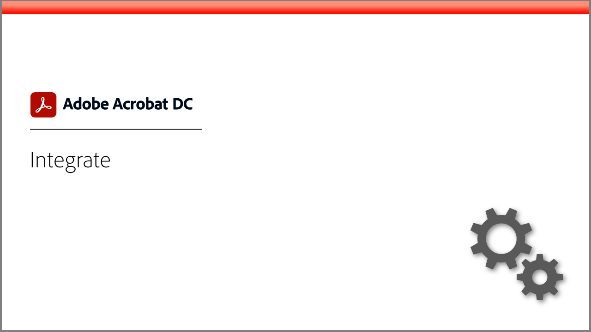
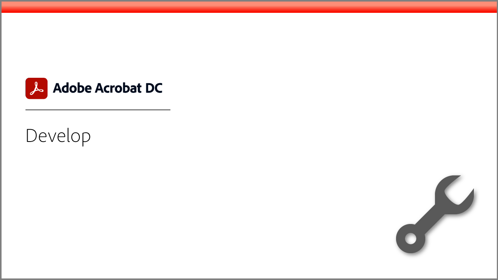

# Tutoriels Acrobat

Adobe Acrobat, solution Adobe Document Cloud, contribue à la continuité de l’activité en convertissant, modifiant, partageant et signant des mots de PDF. Vous y trouverez un large éventail d’expériences d’apprentissage conçues pour permettre aux utilisateurs débutants et chevronnés de se familiariser rapidement avec Adobe Acrobat.

## Cours recommandés

## Pistes de formation

<table style="table-layout:fixed">
<tr>
  <td>
    
  </td>
  <td>
    
  </td>
  <td>
    
  </td>
  <td>
    
  </td>
</tr>
<tr>
  <td>
    
  </td>  
  <td>
    
  </td>
  <td>
  
  </td>
  <td>
    
  </td>
</tr>
</table>
