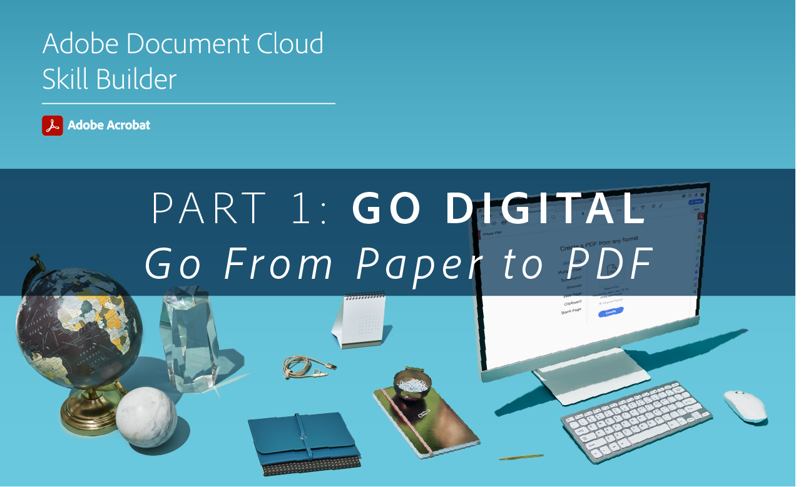

# Acrobat Skill Builders

Soyez rapidement opérationnel sur Acrobat grâce à ces outils de développement de compétences interactifs. Ou bien, rejoignez un [session en direct mensuelle](skill-builder-webinars.md).

## Go Digital

<table style="table-layout:fixed">
<tr>
  <td>
    
    

    <a href="https://doccloud.adobeconnect.com/paperpdf/" target="_blank"><strong>Passer du papier au PDF</strong></a>
    

    <em>Convertissez numériquement en PDF tout document papier</em>
     
  </td>
  <td>
    
    

    <a href="https://doccloud.adobeconnect.com/skillbuilder-sigforms/" target="_blank"><strong>Préparation pour signature</strong></a>
    

    <em>Créer des PDF avec des champs de signature électronique</em>
     
  </td>
  <td>
    
    

     
  </td>
  <td>
    
    

     
  </td>
</tr>
</table>

## Rester numérique

<table style="table-layout:fixed">
<tr>
 <td>
    
    

    <a href="https://doccloud.adobeconnect.com/createpdfs/" target="_blank"><strong>Création et organisation des PDF</strong></a>
    

    <em>Création et organisation de PDF à partir de tout type de fichier</em>
     
  </td>
  <td>
    
    

    <a href="https://doccloud.adobeconnect.com/micro/" target="_blank"><strong>Acrobat et Microsoft 101</strong></a>
    

    <em>Création et gestion de PDF directement dans SharePoint</em>
     
  </td>
  <td>
    
    

    <a href="https://doccloud.adobeconnect.com/editpdf/" target="_blank"><strong>Modification De Vos PDF</strong></a>
    

    <em>Ajouter du texte, des images, des liens et des filigranes dans votre PDF</em>
     
  </td>
  <td>
    
    

    <a href="https://doccloud.adobeconnect.com/sign/" target="_blank"><strong>Signature De Votre Travail</strong></a>
    

    <em>Signature directe de documents dans Microsoft Outlook</em>
     
  </td>
</tr>
<tr>
  <td>
    
    

    <a href="https://doccloud.adobeconnect.com/convertpdfs/" target="_blank"><strong>Convertissez vos PDF</strong></a>
    

    <em>Convertir des PDF aux formats Word, Excel et PowerPoint</em>
     
  </td>
  <td>
    
    

    <a href="https://doccloud.adobeconnect.com/fillsign/" target="_blank"><strong>Remplir et signer en tout lieu</strong></a>
    

    <em>Remplir, signer et envoyer des formulaires par voie électronique sur n'importe quel appareil</em>
     
  </td>
   <td>
    
    

    <a href="https://doccloud.adobeconnect.com/optimizepdfs/" target="_blank"><strong>Optimisation De Vos PDF</strong></a>
    

    <em>Préparation des PDF pour la distribution</em>
     
  </td>
</tr>
</table>

## Terminer le travail

<table style="table-layout:fixed">
<tr>
  <td>
    
    

    <a href="https://doccloud.adobeconnect.com/skillbuilder-share/" target="_blank"><strong>Partage et collecte de commentaires</strong></a>
    

    <em>Rassemblez et recueillez des commentaires sur vos PDF</em>
     
  </td>
  <td>
    
    

    <a href="https://doccloud.adobeconnect.com/securepdfs/" target="_blank"><strong>Sécurisez vos PDF</strong></a>
    

    <em>Biffure et protection des informations confidentielles dans vos PDF</em>
     
  </td>
  <td>
   
    

     
  </td>
  <td>
   
    

     
  </td>
  <td>
   
    

     
  </td>
</tr>
</table>
