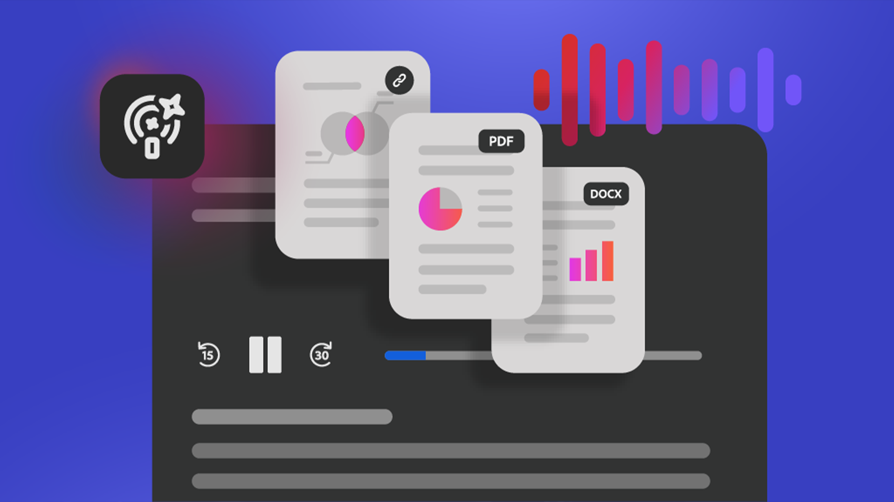

# Présentation des cas d’utilisation

Découvrez comment utiliser Acrobat pour accroître la productivité et transformer les informations en informations exploitables pour votre équipe et votre secteur d’activité.

## Secteur d’activité

Découvrez comment des équipes de différents secteurs d’activité utilisent Acrobat pour relever les défis quotidiens liés aux documents, rationaliser les workflows et prendre en charge les travaux stratégiques de l’entreprise.

## Nouveautés

>[!BEGINTABS]

>[!TAB Activation informatique sans goulot d’étranglement]

Découvrez comment les [équipes informatiques](lob/it/it-enablement.md) utilisent Acrobat Studio pour rationaliser les workflows documentaires, renforcer la sécurité et la conformité, et faire évoluer les programmes de gouvernance dans l’ensemble de l’entreprise

>[!TAB Accélérer le lancement des produits avec Acrobat Studio]

Découvrez comment les équipes marketing utilisent Acrobat Studio pour centraliser les ressources de [lancement de produit](lob/marketing/marketing-product-launch.md), rationaliser les avis des parties prenantes et adapter la préparation organisationnelle, le tout à partir d’un seul espace PDF.

>[!ENDTABS]

<!-- START CARDS HTML - DO NOT MODIFY BY HAND -->

    

        

            

                <figure class="image x-is-16by9">
                    
                </figure>
            

            

                

                    

                        <a href="https://experienceleague.adobe.com/fr/docs/document-cloud-learn/acrobat-learning/use-cases/lob/finance/finance-overview" target="_self" rel="referrer" title="Cas d’utilisation Finance">Cas d’utilisation Finance</a>
                    

                    
Découvrez comment les équipes financières utilisent Acrobat pour créer, gérer, analyser et sécuriser des documents financiers

                

                <a href="https://experienceleague.adobe.com/fr/docs/document-cloud-learn/acrobat-learning/use-cases/lob/finance/finance-overview" target="_self" rel="referrer" class="spectrum-Button spectrum-Button--outline spectrum-Button--primary spectrum-Button--sizeM" style="align-self: flex-start; margin-top: 1rem;">
                    Parcourir les tutoriels
                </a>
            

        

    

    

        

            

                <figure class="image x-is-16by9">
                    
                </figure>
            

            

                

                    

                        <a href="https://experienceleague.adobe.com/fr/docs/document-cloud-learn/acrobat-learning/use-cases/lob/hr/hr-overview" target="_self" rel="referrer" title="Cas d’utilisation des RH">Cas d’utilisation des RH</a>
                    

                    
Découvrez comment les équipes RH utilisent Acrobat pour gérer les documents et les workflows tout au long du cycle de vie des employés

                

                <a href="https://experienceleague.adobe.com/fr/docs/document-cloud-learn/acrobat-learning/use-cases/lob/hr/hr-overview" target="_self" rel="referrer" class="spectrum-Button spectrum-Button--outline spectrum-Button--primary spectrum-Button--sizeM" style="align-self: flex-start; margin-top: 1rem;">
                    Parcourir les tutoriels
                </a>
            

        

    

    

        

            

                <figure class="image x-is-16by9">
                    
                </figure>
            

            

                

                    

                        <a href="https://experienceleague.adobe.com/en/docs/document-cloud-learn/acrobat-learning/use-cases/lob/it/it-overview" target="_self" rel="referrer" title="Cas d’utilisation IT">Cas d’utilisation informatiques</a>
                    

                    
Découvrez comment les équipes informatiques utilisent Acrobat Studio pour rationaliser les workflows documentaires, renforcer la sécurité et la conformité, et faire évoluer les programmes de gouvernance dans l’ensemble de l’entreprise

                

                <a href="https://experienceleague.adobe.com/en/docs/document-cloud-learn/acrobat-learning/use-cases/lob/it/it-overview" target="_self" rel="referrer" class="spectrum-Button spectrum-Button--outline spectrum-Button--primary spectrum-Button--sizeM" style="align-self: flex-start; margin-top: 1rem;">
                    Parcourir les tutoriels
                </a>
            

        

    

    

        

            

                <figure class="image x-is-16by9">
                    
                </figure>
            

            

                

                    

                        <a href="https://experienceleague.adobe.com/fr/docs/document-cloud-learn/acrobat-learning/use-cases/lob/legal/legal-overview" target="_self" rel="referrer" title="Cas d’utilisation légaux">Cas d’utilisation légaux</a>
                    

                    
Découvrez comment les équipes juridiques comprennent rapidement les documents complexes et les risques et changements critiques qui apparaissent

                

                <a href="https://experienceleague.adobe.com/fr/docs/document-cloud-learn/acrobat-learning/use-cases/lob/legal/legal-overview" target="_self" rel="referrer" class="spectrum-Button spectrum-Button--outline spectrum-Button--primary spectrum-Button--sizeM" style="align-self: flex-start; margin-top: 1rem;">
                    Parcourir les tutoriels
                </a>
            

        

    

    

        

            

                <figure class="image x-is-16by9">
                    
                </figure>
            

            

                

                    

                        <a href="https://experienceleague.adobe.com/fr/docs/document-cloud-learn/acrobat-learning/use-cases/lob/marketing/marketing-overview" target="_self" rel="referrer" title="Cas d’utilisation marketing">Cas d’utilisation marketing</a>
                    

                    
Découvrez comment les équipes marketing rationalisent la collaboration, accélèrent les approbations et commercialisent plus rapidement de nouvelles idées

                

                <a href="https://experienceleague.adobe.com/fr/docs/document-cloud-learn/acrobat-learning/use-cases/lob/marketing/marketing-overview" target="_self" rel="referrer" class="spectrum-Button spectrum-Button--outline spectrum-Button--primary spectrum-Button--sizeM" style="align-self: flex-start; margin-top: 1rem;">
                    Parcourir les tutoriels
                </a>
            

        

    

    

        

            

                <figure class="image x-is-16by9">
                    
                </figure>
            

            

                

                    

                        <a href="https://experienceleague.adobe.com/fr/docs/document-cloud-learn/acrobat-learning/use-cases/lob/sales/sales-overview" target="_self" rel="referrer" title="Cas d’utilisation des ventes">Cas d’utilisation commerciaux</a>
                    

                    
Découvrez comment les équipes commerciales passent de l’insight à l’impact avec une collaboration plus intelligente et une création de contenu plus rapide

                

                <a href="https://experienceleague.adobe.com/fr/docs/document-cloud-learn/acrobat-learning/use-cases/lob/sales/sales-overview" target="_self" rel="referrer" class="spectrum-Button spectrum-Button--outline spectrum-Button--primary spectrum-Button--sizeM" style="align-self: flex-start; margin-top: 1rem;">
                    Parcourir les tutoriels
                </a>
            

        

    

<!-- END CARDS HTML - DO NOT MODIFY BY HAND -->

<!-- COMMENT -->

<table style="table-layout:fixed">
  <tr>
    <td>
      
      

      <a href="lob/finance/finance-overview.md"><strong>Cas d’utilisation Finance</strong></a>
      

      <em>Découvrez comment les équipes financières utilisent Acrobat pour créer, gérer, analyser et sécuriser des documents financiers</em>
       
    </td>
    <td>
      
      

      <a href="lob/hr/hr-overview.md"><strong>Cas d’utilisation des RH</strong></a>
      

      <em>Découvrez comment les équipes RH utilisent Acrobat pour gérer les documents et les workflows tout au long du cycle de vie des employés</em>
       
    </td>
    <td>
      
      

      <a href="lob/it/it-overview.md"><strong>Cas d’utilisation informatiques</strong></a>
      

      <em>Découvrez comment les équipes informatiques utilisent Acrobat Studio pour rationaliser les workflows documentaires, renforcer la sécurité et la conformité, et faire évoluer les programmes de gouvernance dans l’ensemble de l’entreprise</em>
       
    </td>
    <td>
      
      

      <a href="lob/legal/legal-overview.md"><strong>Cas d’utilisation légaux</strong></a>
      

      <em>Découvrez comment les équipes juridiques comprennent rapidement les documents complexes et les risques et changements critiques de surface</em>
       
    </td>
  </tr>
  <tr>
    <td>
      
      

      <a href="lob/marketing/marketing-overview.md"><strong>Cas d’utilisation marketing</strong></a>
      

      <em>Découvrez comment les équipes marketing rationalisent la collaboration, accélèrent les approbations et commercialisent plus rapidement de nouvelles idées</em>
       
    </td>
    <td>
      
      

      <a href="lob/sales/sales-overview.md"><strong>Cas d’utilisation commerciaux</strong></a>
      

      <em>Découvrez comment les équipes commerciales passent de l’insight à l’impact grâce à une collaboration plus intelligente et à une création de contenu plus rapide</em>
       
    </td>
    <td>
          
          

           
    </td>
    <td>
          
          

           
    </td>
  </tr>
</table>
<!-- END COMMENT -->

## Administration

<!-- START CARDS HTML - DO NOT MODIFY BY HAND -->

    

        

            

                <figure class="image x-is-16by9">
                    
                </figure>
            

            

                

                    

                        <a href="https://experienceleague.adobe.com/fr/docs/document-cloud-learn/acrobat-learning/use-cases/gov/gov-overview" target="_self" rel="referrer" title="Acrobat pour l’administration">Acrobat pour l’administration</a>
                    

                    
Explorez nos tutoriels Acrobat spécialement conçus pour les administrations fédérales, régionales et locales

                

                <a href="https://experienceleague.adobe.com/fr/docs/document-cloud-learn/acrobat-learning/use-cases/gov/gov-overview" target="_self" rel="referrer" class="spectrum-Button spectrum-Button--outline spectrum-Button--primary spectrum-Button--sizeM" style="align-self: flex-start; margin-top: 1rem;">
                    Parcourir les tutoriels
                </a>
            

        

    

<!-- END CARDS HTML - DO NOT MODIFY BY HAND -->