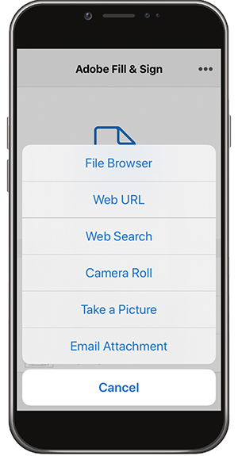

# Remplissage et signature d’un formulaire sur un poste de travail ou un appareil mobile

Remplissez, signez et envoyez rapidement des formulaires depuis votre poste de travail, votre navigateur ou votre application mobile. Adobe Sensei reconnaît et enregistre les données couramment utilisées pour une utilisation dans un formulaire PDF. Créez une signature en dessinant, en important une numérisation ou en saisissant votre nom, puis appliquez-la de manière sécurisée à un document.

Dans cet exercice, vous importerez, remplissez, signez et envoyez un formulaire à partir de votre appareil mobile.

Voici les [fichiers de démonstration](assets/03_FillSignScan.zip) pour cet exercice.

**Étape 1 :** Téléchargez l’ [!DNL Adobe Fill & Sign] application à partir de la  [!DNL Apple App] boutique ou  [!DNL Google Play].

**Étape 2 :** Ouvrez l&#39;application, appuyez sur  **[!UICONTROL Sélectionner un formulaire à remplir]**.

**Étape 3 :** Sélectionnez l’une des options d’importation. Pour cet exercice, nous allons prendre une photo.

**Étape 4 :** Utilisez le bouton blanc pour prendre une photo, puis appuyez sur  **[!UICONTROL Utiliser la photo]**. Appuyez sur **[!UICONTROL Terminé]** dans le coin supérieur droit.

**Étape 5 :** Au bas de l&#39;application, appuyez sur l&#39;outil  **** Recadrage et utilisez les repères pour recadrer l&#39;image. Une fois terminé, appuyez sur **[!UICONTROL Terminé]**.

**Étape 6 :** Utilisez l’outil Baguette magique pour nettoyer l’image si nécessaire. Une fois terminé, appuyez sur **[!UICONTROL Terminé]**.

**Étape 7 :** Appuyez n’importe où sur la page pour créer un champ et ajouter les informations nécessaires à votre document. Sélectionnez l’ellipse pour afficher d’autres options.

**Étape 8 :** Appuyez sur le bouton  **** Signatures au bas de l’application pour ajouter votre signature.

**Étape 9 :** Utilisez un stylet ou votre doigt pour signer le champ de signature. Déplacez et placez le champ de signature.

**Étape 10 :** Appuyez sur le bouton  **** Profil en bas de l’application pour obtenir des valeurs préremplies telles que votre nom et votre date. Il vous suffit de remplir cette information une fois, puis de l’utiliser sur tous les futurs formulaires que vous compléterez avec l’application Fill &amp; Sign.

**Étape 11 :** Une fois le formulaire rempli, appuyez sur le bouton Partager dans le coin inférieur droit pour envoyer un e-mail.

## Récupérer :

* Ouvrez un fichier à partir d’un courrier électronique ou prenez une photo d’un formulaire papier avec l’appareil photo de votre appareil.

* Appuyez sur cette option pour saisir du texte ou des coches dans les champs de formulaire. Pour plus de vitesse, utilisez des entrées de remplissage automatique personnalisées.

* Créez votre signature à l’aide de votre doigt ou de votre stylet. Ensuite, appliquez-la au formulaire ou ajoutez vos initiales là où nécessaire.
