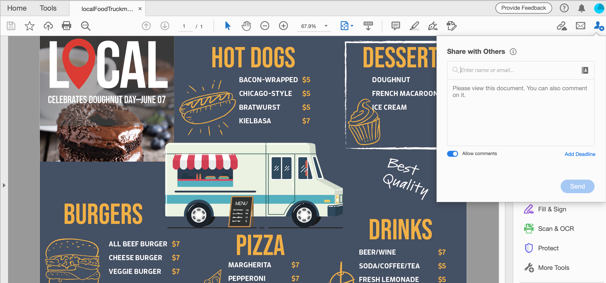
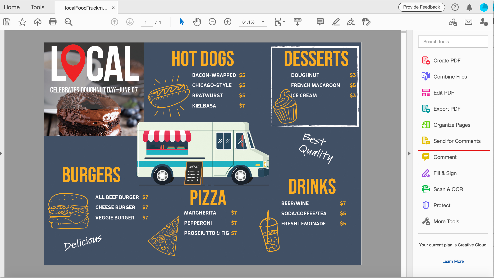

# Partage de fichiers PDF et révision en ligne

Utilisez le service de révision Adobe Document Cloud pour partager facilement des fichiers PDF en révision à partir de l’application de bureau Acrobat DC, du Document Cloud Web ou de l’application mobile Acrobat Reader. Lorsque les réviseurs cliquent sur l’URL dans l’invitation électronique à partir de leur ordinateur, ils peuvent facilement soumettre leurs commentaires dans un navigateur sans avoir à se connecter ou à installer de logiciel supplémentaire.

Dans le cadre de cet exercice, nous examinons comment :

* Envoyer des invitations personnalisées pour commentaires
* Envoyer un lien anonyme ou public dans un courrier électronique

Voici les [fichiers de démonstration](assets/01_Review.zip) pour cet exercice.

## Envoyer des invitations personnalisées pour commentaires

**Étape 1 :** Ouvrez le  `localFoodTruckmenu_start.pdf` fichier dans Adobe Acrobat.

**Étape 2 :** Cliquez sur  **[!UICONTROL Envoyer pour]** commentaires dans le panneau de droite ou sur l’icône d’icône d’icône d’icône  **[!UICONTROL Partager ce fichier avec]**   d’autres commentaires dans le coin supérieur droit.

**Étape 3 :** Saisissez les adresses électroniques des destinataires. Vous pouvez saisir un message aux destinataires ou ajouter une échéance de révision.

Une fois que les destinataires ont consulté votre fichier, vous recevrez un e-mail.

## Expérience du réviseur

Les réviseurs reçoivent une invitation électronique contenant un lien vers le fichier PDF en révision. Lorsqu’ils cliquent sur le lien ou le bouton **[!UICONTROL Révision]** dans l’invitation, le fichier PDF s’ouvre dans un navigateur Web. Ils peuvent utiliser les outils de commentaire pour ajouter des commentaires au fichier PDF. Ils peuvent également utiliser Acrobat Reader DC ou les applications de bureau Acrobat DC pour ajouter des commentaires.

## Envoyer un lien anonyme ou public dans un courrier électronique

**Étape 1 :** Ouvrez le  `localFoodTruckmenu_start.pdf` fichier dans Adobe Acrobat.

**Étape 2 :** Cliquez Sur  **[!UICONTROL Partager Une Icône]** Lien. Le lien partagé est généré instantanément. Vous n’avez pas besoin d’attendre que le fichier soit chargé sur le cloud. Par défaut, le bouton [!UICONTROL Autoriser les commentaires] est activé.

**Étape 3 :** Cliquez sur  **[!UICONTROL Copier le]** lien et partagez le lien avec les destinataires.

## Commentaires

**Étape 1 :** Cliquez sur le  **** commentaire dans le panneau de droite.

**Étape 2 :** Utilisez les outils du ruban supérieur pour annoter le document et/ou saisir un commentaire.

Vos commentaires sont enregistrés automatiquement et visibles par d’autres utilisateurs.

## Importer les commentaires PDF dans un InDesign

InDesign CC 2019 vous permet d’importer des commentaires directement à partir de fichiers PDF. Vous pouvez importer, accepter et appliquer les modifications d’un simple clic. La sélection d’un commentaire dans le nouveau panneau Commentaires PDF permet de localiser et de mettre en surbrillance le commentaire dans votre fichier d’InDesign.

**Étape 1 :** Téléchargez le fichier PDF contenant les commentaires.

**Étape 2 :** Ouvrez votre fichier d&#39;InDesign.

**Étape 3 :** Cliquez sur  **** Fichier dans le menu supérieur.

**Étape 4 :** Cliquez sur  **[!UICONTROL Importer]** des commentaires PDF dans la liste déroulante.

**Étape 5 :** Ouvrez le fichier PDF contenant les commentaires.

Les commentaires s’affichent dans l’interface utilisateur.

## Récupérer :

Passez en revue et partagez des versions de design avec Acrobat. Acrobat vous permet de

* Envoyer un lien vers un fichier PDF pour révision à d’autres utilisateurs.
* Réviser n’importe où : bureau, navigateur, mobile.
* Rassembler dans un seul document.
* Gérez vos commentaires dans un seul endroit organisé.
* Tout ce dont vous avez besoin, c&#39;est d&#39;un navigateur.

Il est facile d’envoyer et de suivre des commentaires, le tout au même endroit. Les destinataires peuvent consulter le fichier même s’ils n’ont pas d’Acrobat ! Vous pouvez inviter quelqu’un à commenter via un navigateur. Gagnez du temps et des efforts.
