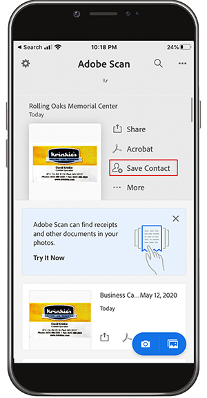
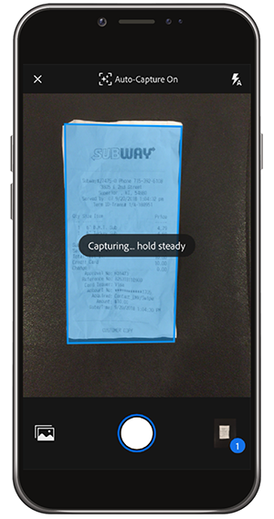

# Passer au numérique avec Adobe Scan

Désencombrez, organisez ou partagez ! Il n&#39;est pas nécessaire de garder des piles de papier sur votre bureau ou de remplir des reçus dans votre portefeuille. L’application mobile Adobe Scan numérise les documents papier directement dans les PDF et reconnaît automatiquement le texte.

Dans cet exercice, vous allez télécharger le contenu d&#39;une carte de visite directement dans vos contacts. Numérisez et stockez un reçu.

Récupérez une carte de visite, un reçu ou tout autre document papier que vous souhaitez utiliser.

## Numériser une carte de visite

**Étape 1:** téléchargez l&#39;application Adobe Scan depuis l&#39;App Store Apple ou Google Play.

**Étape 2:** ouvrez l&#39;application Adobe Scan.

**Étape 3:** à partir de l&#39;application, prenez une photo de la carte de visite contenant les coordonnées que vous souhaitez enregistrer sur votre téléphone.

**Étape 4:** une fois la numérisation terminée, effectuez les réglages pour vous assurer que votre carte se trouve dans le cadre de sélection.

**Étape 5:** Appuyez sur **[!UICONTROL Enregistrer le PDF]** dans le coin supérieur droit. Ensuite, appuyez sur **[!UICONTROL Enregistrer le contact]**.

**Étape 6 :** effectuez les modifications ou ajouts souhaités aux informations de contact avant de les stocker dans votre téléphone. Appuyez à nouveau sur « Enregistrer » pour finaliser l’enregistrement dans les contacts.

## Numériser et stocker un reçu

L’application Adobe Scan peut également être utile pour numériser et stocker un reçu dont vous aurez besoin ultérieurement (par exemple, une note de frais ou un autre remboursement).

**Étape 1:** Une fois l&#39;application Adobe Scan ouverte, prenez une photo du reçu que vous souhaitez stocker.

**Étape 2:** observez, car l&#39;application détecte automatiquement votre reçu et capture son contenu.

**Étape 3:** Appuyez sur **[!UICONTROL Enregistrer le PDF]** dans le coin supérieur droit pour stocker le reçu sur votre téléphone.

## Récapitulatif :

* Numérisez des documents et des formulaires papier vers PDF.
* Convertissez les images JPG PDF.
* Modifiez directement sur votre appareil.
* Ajoutez des informations de carte de visite directement à vos contacts.

Laisse tomber le papier !
