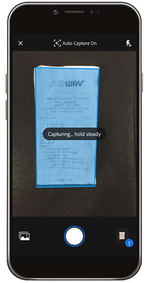

# Go Digital avec Adobe Scan

Décomposez, classez ou partagez ! Il n’est pas nécessaire de garder des piles de papier sur votre bureau ou de placer des reçus dans votre portefeuille. L’application mobile Adobe Scan analyse les documents papier directement dans des fichiers PDF et reconnaît automatiquement le texte.

Dans cet exercice, vous transférez le contenu d’une carte de visite directement dans vos contacts. Numérisez et stockez un reçu.

Collectez une carte de visite, un reçu ou tout autre article papier avec lequel vous souhaitez travailler.

## Numérisation d&#39;une carte de visite

**Étape 1 :** Téléchargez l’application Adobe Scan depuis l’App Store d’Apple ou Google Play.

**Étape 2 :** Ouvrez l&#39;application Adobe Scan.

**Étape 3 :** À partir de l’application, prenez une photo de la carte de visite contenant les coordonnées que vous souhaitez enregistrer sur votre téléphone.

**Étape 4 :** Une fois la numérisation terminée, effectuez les réglages pour vous assurer que votre carte se trouve dans le cadre de sélection.

**Étape 5 :** Appuyez sur  **[!UICONTROL Enregistrer le]** fichier PDF dans le coin supérieur droit. Ensuite, appuyez sur **[!UICONTROL Enregistrer le contact]**.

**Étape 6 :** Apportez les modifications ou ajouts souhaités aux coordonnées de contact avant de les stocker sur votre téléphone. Appuyez de nouveau sur Enregistrer pour finaliser l&#39;enregistrement dans les contacts.

## Numérisation et stockage d’un reçu

L’application Adobe Scan peut également être utile pour numériser et stocker un reçu dont vous aurez besoin ultérieurement (par exemple, un état de dépenses ou un autre remboursement).

**Étape 1 :** Une fois l’application Adobe Scan ouverte, prenez une photo du reçu que vous souhaitez stocker.

**Étape 2 :** Observez que l’application détecte automatiquement votre reçu et capture son contenu.

**Étape 3 :** Appuyez sur  **[!UICONTROL Enregistrer le]** fichier PDF dans le coin supérieur droit pour enregistrer le reçu sur votre téléphone.

## Récupérer :

* Numérisez des documents papier et des formulaires au format PDF.
* Convertissez des images JPG au format PDF.
* Effectuez des retouches directement sur votre appareil.
* Ajoutez des informations de carte de visite directement à vos contacts.

Démangez le papier !
