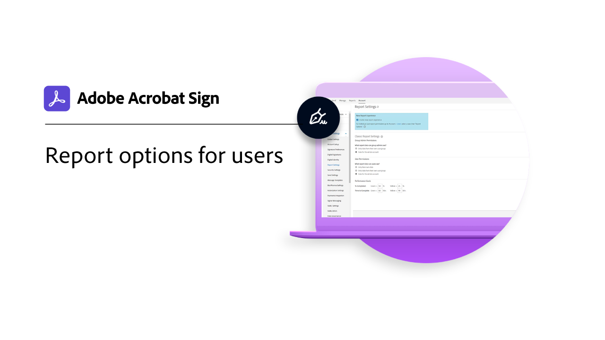
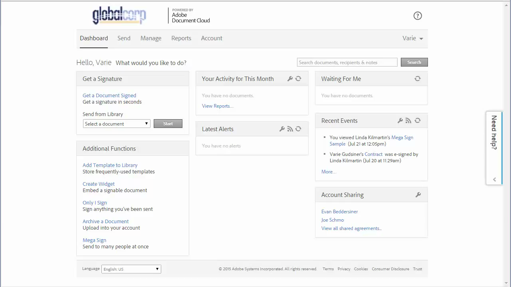

# Présentation des administrateurs

Découvrez comment ajouter des utilisateurs à votre compte, configurer des groupes, partager l’accès et configurer un workflow, une archive externe et partager des événements et des alertes. Ces tutoriels s’adressent aux administrateurs qui ont dépassé la phase d’installation et sont prêts à commencer à administrer Acrobat Sign. Les tâches avancées couvrent des rubriques qui s’étendent au-delà de la configuration de l’administrateur et se déplacent vers la définition des paramètres globaux, l’accès et le partage de compte, et le balisage de texte.

## Nouveautés

* [Options de rapport](report-options.md)
Découvrez comment configurer des options de rapport pour les utilisateurs
* [Ajout d’utilisateurs](add-users-to-your-account.md)
Découvrez comment ajouter et gérer des utilisateurs pour Acrobat Sign

## Prise en main

<table style="table-layout:fixed">
<tr>
  <td>
    
    

    <a href="get-started-admin.md"><strong>Prise en main pour les nouveaux administrateurs</strong></a>
    

    <em>Dans ce guide vidéo complet, découvrez tous les outils nécessaires pour que votre entreprise soit opérationnelle avec Acrobat Sign</em>
     
  </td>
  <td>
    
    

    <a href="up-and-running-admin.md"><strong>Prise en main pour les administrateurs</strong></a>
    

    <em>Présentation de 7 domaines clés permettant aux administrateurs de se familiariser rapidement avec Acrobat Sign</em>
     
  </td>
  <td>
    
    

    <a href="set-up-shared-events-and-alert.md"><strong>Configuration des notifications pour les événements et les alertes</strong></a>
    

    <em>Configurer des notifications pour les événements et les alertes de votre compte</em>
     
  </td>
  <td>
    
    

    <a href="add-users-to-your-account.md"><strong>Ajout d’utilisateurs</strong></a>
    

    <em>Ajout et gestion d’utilisateurs pour Acrobat Sign</em>
     
  </td>
</tr>
<tr>
 <td>
    
    

    <a href="create-and-manage-groups.md"><strong>Création et gestion de groupes</strong></a>
    

    <em>Création de groupes, ajout d’utilisateurs à des groupes et modification des paramètres de groupe</em>
     
  </td>
  <td>
    
    

    <a href="set-up-your-external-archive.md"><strong>Configuration d'une archive externe</strong></a>
    

    <em>Créer une archive externe pour sauvegarder les copies des accords qui ont été signés</em>
     
  </td>
  <td>
    
    

    <a href="../sign-advanced-users/create-a-template.md"><strong>Création d’un modèle de document</strong></a>
    

    <em>Création d'un modèle de document réutilisable pour plus de rapidité et de cohérence</em>
     
  </td>
  <td>
    
    

    <a href="create-a-report.md"><strong>Création d'un graphique de rapport</strong></a>
    

    <em>Découvrez comment créer, enregistrer et gérer vos propres rapports personnalisés et exportations de données</em>
     
  </td>
</tr>
<tr>
  <td>
    
    

    <a href="report-options.md"><strong>Options de rapport pour les utilisateurs</strong></a>
    

    <em>Découvrez comment configurer des options de rapport pour les utilisateurs</em>
     
  </td>
  <td>
    
    

    <a href="../sign-advanced-users/webform.md"><strong>Création d’un formulaire web</strong></a>
    

    <em>Créez un document pouvant être signé électroniquement directement sur votre site web</em>
     
  </td>
  <td>
    
    

    <a href="../sign-advanced-users/modify-webform.md"><strong>Modification d’un formulaire web existant</strong></a>
    

    <em>Découvrez comment désactiver, modifier et réactiver un formulaire web existant.</em>
     
  </td>
  <td>
    
    

    <a href="../sign-advanced-users/megasign.md"><strong>Envoi et collecte simultanée de signatures</strong></a>
    

    <em>Collectez des centaines de signatures à la fois pour tous les documents</em>
     
  </td>
</tr>
<tr>
  <td>
    
    

    <a href="building-a-custom-workflow.md"><strong>Configuration d’un workflow</strong></a>
    

    <em>Automatisez les workflows documentaires pour récupérer rapidement les signatures et données électroniques</em>
     
  </td>
  <td>
    
    

     
  </td>
  <td>
    
    

     
  </td>
  <td>
    
    

     
  </td>
</table>

## Tâches avancées

<table style="table-layout:fixed">
<tr>
  <td>
    
    

    <a href="learn-about-global-settings.md"><strong>Paramètres généraux</strong></a>
    

    <em>Modifier les paramètres de produit de manière globale pour l’ensemble de votre organisation ou pour des groupes spécifiques</em>
     
  </td>
  <td>
      
    

    <a href="share-account-access.md"><strong>Accès au compte de partage</strong></a>
    

    <em>Configuration d’un accès en lecture seule aux transactions dans le compte d’un autre utilisateur</em>
     
  </td>
  <td>
    
    

    <a href="advanced-account-sharing.md"><strong>Partage de compte avancé</strong></a>
    

    <em>Configurer le partage de compte pour permettre aux administrateurs et aux utilisateurs de déléguer leurs autorisations d’envoi, de modification et d’affichage</em>
     
  </td>
  <td>
    
    

    <a href="use-bio-pharma-settings.md"><strong>Utilisation des paramètres Bio-Pharma</strong></a>
    

    <em>Configurez les paramètres Bio-Pharma qui vous permettent de respecter les exigences de la règlementation 21 CFR Part 11 de la FDA</em>
     
  </td> 
</tr>
<tr>
   <td>
     
    

    <a href="../sign-advanced-users/adobe-sign-text-tagging.md"><strong>Balisage de texte Acrobat Sign</strong></a>
    

    <em>Création de champs de formulaire Acrobat Sign par balisage de texte à l’aide d’Adobe Acrobat</em>
     
  </td>
  <td>
    
    

     
  </td>
  <td>
    
    

     
  </td>
  <td>
    
    

     
  </td>
</tr>
</table>
