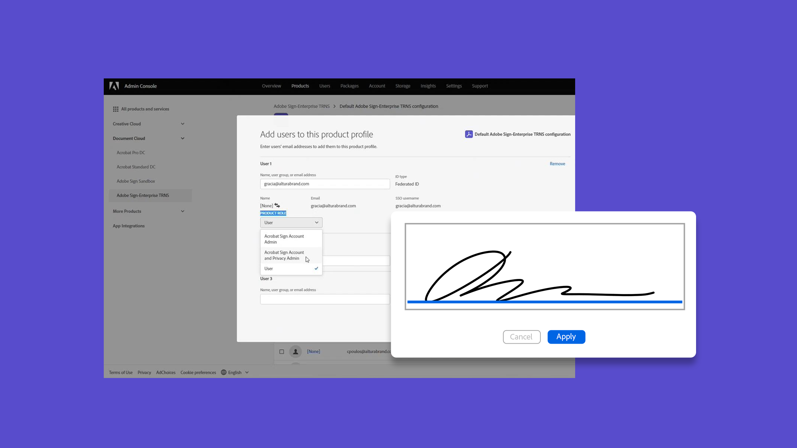
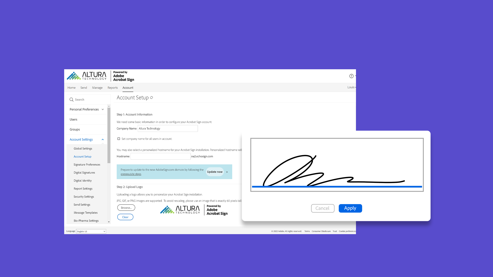
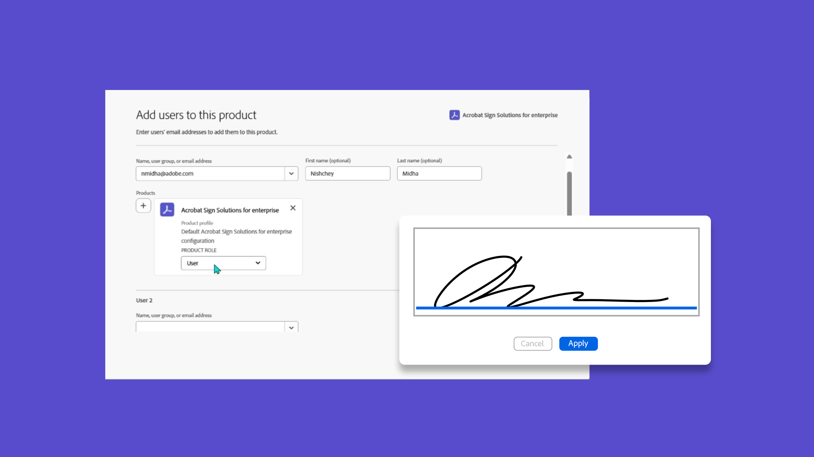
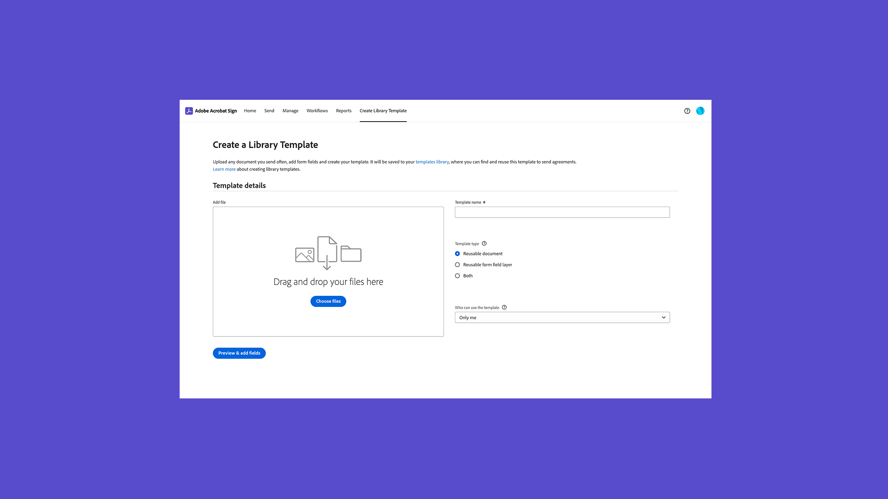
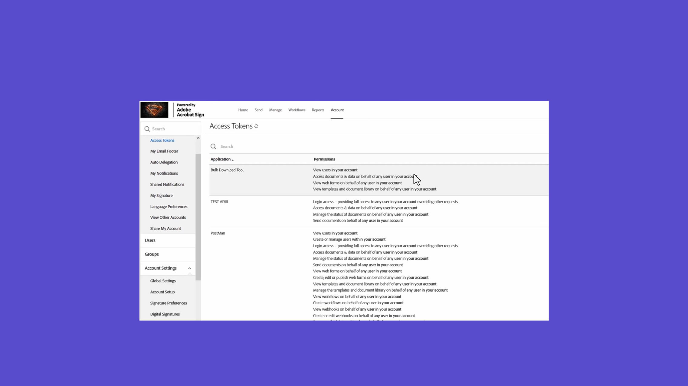
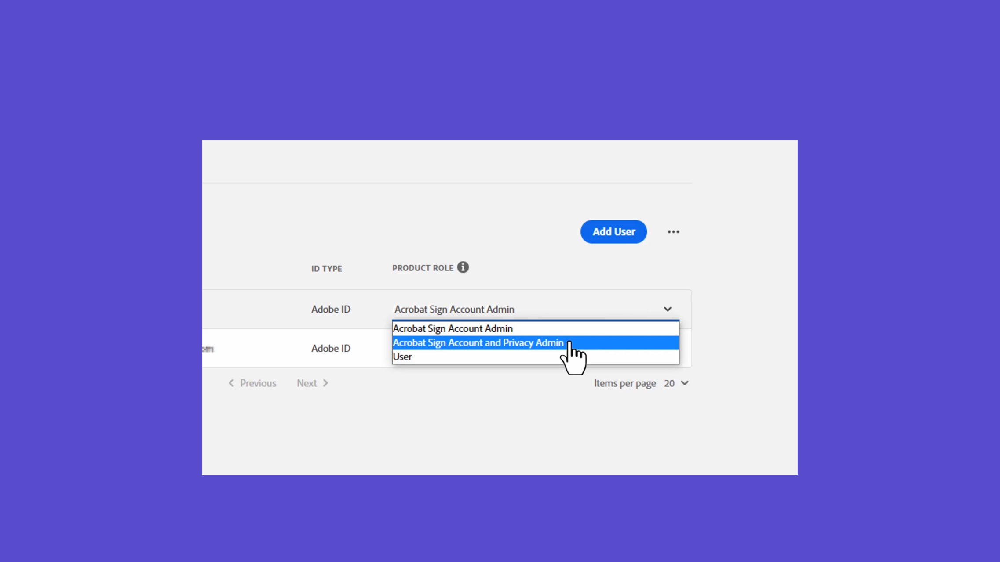

# Présentation des administrateurs

Découvrez comment ajouter des utilisateurs à votre compte, configurer des groupes, partager l’accès et configurer un workflow, une archive externe, ainsi que des événements et alertes partagés. Ces tutoriels sont conçus pour les administrateurs qui ont dépassé la phase d’installation et sont prêts à commencer à administrer Acrobat Sign. Les tâches avancées couvrent des rubriques qui s’étendent au-delà de la configuration de l’administrateur et abordent la définition des paramètres généraux, le partage et l’accès au compte, ainsi que le balisage de texte.

## Nouveautés

>[!BEGINTABS]

>[!TAB Activer les règles d&#39;affectation automatique des utilisateurs]

Découvrez comment configurer des [règles d’affectation automatique](automatic-assignment-rules.md) accordant aux utilisateurs l’accès à Acrobat Sign dans le Admin Console.

>[!TAB Migrer les modèles Docusign]

Découvrez comment [migrer en toute transparence les modèles et les workflows Docusign](docusign-templates.md) en trois étapes simples.

>[!TAB Ajouter un nouvel utilisateur]

Découvrez comment [ajouter de nouveaux utilisateurs à Acrobat Sign](add-users-to-your-account.md).

>[!ENDTABS]

## Prise en main

<table style="table-layout:fixed">
<tr>
  <td>
    
    

    <a href="get-started-admin.md"><strong>Prise en main pour les nouveaux administrateurs</strong></a>
    

    <em>Dans ce guide vidéo complet, découvrez tous les outils nécessaires pour que votre organisation soit opérationnelle avec Acrobat Sign</em>
     
  </td>
  <td>
    
    

    <a href="up-and-running-admin.md"><strong>Prêt à l’emploi pour les administrateurs</strong></a>
    

    <em>Présentation de 7 domaines clés permettant aux administrateurs de se familiariser rapidement avec Acrobat Sign</em>
     
  </td>
  <td>
    
    

    <a href="docusign-templates.md"><strong>Migrer les modèles Docusign</strong></a>
    

    <em>Découvrez comment migrer en toute transparence les modèles et les workflows Docusign</em>
     
  </td>
  <td>
    
    

    <a href="add-users-to-your-account.md"><strong>Ajouter un nouvel utilisateur</strong></a>
    

    <em>Découvrez comment ajouter de nouveaux utilisateurs à Acrobat Sign</em>
     
  </td>
</tr>
<tr>
  <td>
    
    

    <a href="automatic-assignment-rules.md"><strong>Activer les règles d'affectation automatique des utilisateurs</strong></a>
    

    <em>Découvrez comment configurer des règles d’affectation automatique accordant aux utilisateurs l’accès à Acrobat Sign dans le Admin Console</em>
     
  </td>
  <td>
    
    

    <a href="add-admin.md"><strong>Ajouter un administrateur de compte</strong></a>
    

    <em>Découvrez comment créer un utilisateur ou promouvoir un utilisateur existant au rôle d'administrateur Acrobat Sign</em>
     
  </td>
    <td>
      
      

      <a href="promote-admin.md"><strong>Attribuer des rôles d’administrateur de produit et de support</strong></a>
      

      <em>Découvrez comment attribuer un rôle d’administrateur de produit et d’assistance à un utilisateur Acrobat Sign dans le Admin Console</em>
       
    </td>
    <td>
      
      

      <a href="create-and-manage-groups.md"><strong>Création et gestion de groupes</strong></a>
      

      <em>Créer des groupes, ajouter des utilisateurs à des groupes et modifier les paramètres de groupe</em>
       
    </td>
</tr>
<tr>
 <td>
      
      

      <a href="set-up-your-external-archive.md"><strong>Configuration d'une archive externe</strong></a>
      

      <em>Créer une archive externe pour les copies de sauvegarde des accords signés</em>
       
    </td>
  <td>
    
    

    <a href="../sign-advanced-users/create-a-template.md"><strong>Création d'un modèle de document</strong></a>
    

    <em>Créez un modèle de document réutilisable pour plus de vitesse et de cohérence</em>
     
  </td>
  <td>
    
    

    <a href="../sign-advanced-users/creating-a-report.md"><strong>Utilisation des rapports et des transactions</strong></a>
    

    <em>Découvrez comment générer des rapports et suivre l'utilisation des transactions</em>
     
  </td>
  <td>
    
    

    <a href="report-options.md"><strong>Options de rapport pour les utilisateurs</strong></a>
    

    <em>Découvrez comment configurer les options de rapport pour les utilisateurs</em>
     
  </td>
</tr>  
<tr>
   <td>
    
    

    <a href="../sign-advanced-users/webform.md"><strong>Création d’un formulaire web</strong></a>
    

    <em>Créez un document pouvant être signé électroniquement directement sur votre site web</em>
     
  </td>
  <td>
    
    

    <a href="../sign-advanced-users/modify-webform.md"><strong>Modifier un formulaire web existant</strong></a>
    

    <em>Découvrez comment désactiver, modifier et réactiver un formulaire web existant</em>
     
  </td>
  <td>
    
    

    <a href="../sign-advanced-users/megasign.md"><strong>Envoyer en masse</strong></a>
    

    <em>Recueillez des milliers de signatures à la fois pour tout document</em>
     
  </td>
  <td>
    
    

    <a href="building-a-custom-workflow.md"><strong>Configuration d'un workflow</strong></a>
    

    <em>Automatisez les workflows de documents pour obtenir rapidement des signatures électroniques et des données</em>
     
  </td>
</tr>
<tr>
     <td>
    
    

    <a href="audit-reports.md"><strong>Rapports d'audit</strong></a>
    

    <em>Découvrez comment accéder aux rapports d'audit, les utiliser et les configurer</em>
     
    </td>
    <td>
      
      

      <a href="set-up-shared-events-and-alert.md"><strong>Configuration des notifications pour les événements et les alertes</strong></a>
      

      <em>Configurer les notifications d'événements et d'alertes pour votre compte</em>
       
    </td>
    <td>
      
      

       
    </td>
    <td>
      
      

       
    </td>
</tr>    
</table>

## Tâches avancées

<table style="table-layout:fixed">
<tr>
  <td>
    
    

    <a href="learn-about-global-settings.md"><strong>Paramètres généraux</strong></a>
    

    <em>Modifiez les paramètres de produit globalement pour l’ensemble de votre organisation ou pour des groupes spécifiques</em>
     
  </td>
  <td>
      
    

    <a href="share-account-access.md"><strong>Partage d'accès au compte</strong></a>
    

    <em>Configurer l'accès en lecture seule aux transactions du compte d'un autre utilisateur</em>
     
  </td>
  <td>
    
    

    <a href="advanced-account-sharing.md"><strong>Partage de compte avancé</strong></a>
    

    <em>Configurer le partage de compte pour permettre aux administrateurs et aux utilisateurs de déléguer leurs autorisations d’envoi, de modification et d’affichage</em>
     
  </td>
  <td>
    
    

    <a href="bulk-download-tool.md"><strong>Outil de téléchargement massif</strong></a>
    

    <em>Découvrez comment utiliser l’outil de téléchargement massif pour télécharger rapidement tous vos accords signés</em>
     
  </td> 
</tr>
<tr>
   <td>
     
    

    <a href="../sign-advanced-users/adobe-sign-text-tagging.md"><strong>Balisage de texte Acrobat Sign</strong></a>
    

    <em>Création de champs de formulaire Acrobat Sign à l’aide de balises de texte dans Adobe Acrobat</em>
     
  </td>
  <td>
    
    

    <a href="use-bio-pharma-settings.md"><strong>Utilisation des paramètres Bio-Pharma</strong></a>
    

    <em>Configurez les paramètres Bio-Pharma qui vous permettent de répondre aux exigences de la FDA 21 CFR Part 11</em>
     
  </td>
  <td>
    
    

    <a href="privacy.md"><strong>Configuration des administrateurs chargés de la protection des données</strong></a>
    

    <em>Découvrez comment configurer et utiliser les administrateurs chargés de la protection des données</em>
     
  </td>
  <td>
    
    

     
  </td>
</tr>
</table>
