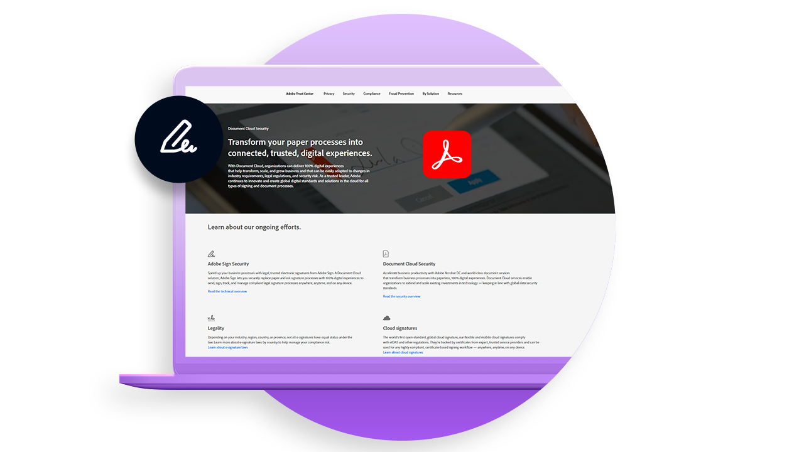
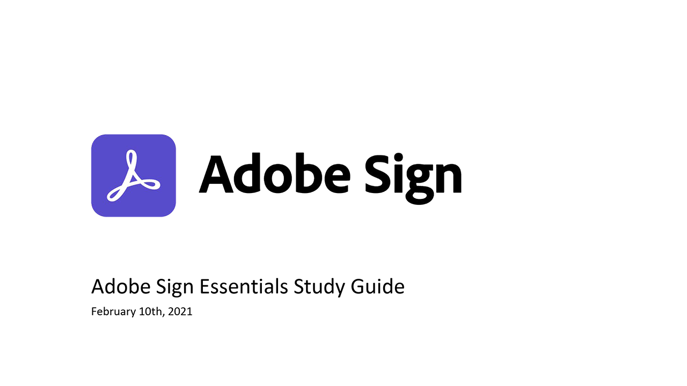

# Présentation du déploiement

Articles sur les bonnes pratiques contenant des informations utiles sur le déploiement d’Adobe Sign au sein de votre entreprise.

<table style="table-layout:fixed">
<tr>
  <td>
    
    

    <a href="https://helpx.adobe.com/enterprise/using/adobe-sign-for-enterprise.html" target="_blank"><strong>Gestion d’Adobe Sign dans le Admin Console</strong></a>
    

    <em>Découvrez comment gérer les utilisateurs et licences Adobe Sign sur la plateforme d’entreprise d’Adobe via Adobe Admin Console</em>
     
  </td>
  <td>
    
    

    <a href="https://helpx.adobe.com/sign/using/adobe-sign-training-best-practice.html" target="_blank"><strong>Bonnes pratiques</strong></a>
    

    <em>Passez en revue les précieux insights et les connaissances acquises grâce au travail de notre responsable de la réussite client auprès de nos clients lors du déploiement d’Adobe Sign</em>
     
  </td>  
  <td>
    
    

    <a href="https://www.adobe.com/trust/document-cloud-security.html" target="_blank"><strong>Centre de données Adobe</strong></a>
    

    <em>Découvrez les initiatives que nous déployons en permanence en matière de sécurité, de valeur juridique et de normes pour Adobe Sign</em>
     
  </td>
</tr>
<tr>
  <td>
    
    

    <a href="assets/SignStudyGuide.pdf"><strong>Guide d’étude Adobe Sign Essentials</strong></a>
    

    <em>Guide d’étude Adobe Sign pour l’évaluation des fondamentaux d’Adobe Sign (AD3-D104)</em>
     
  </td>
  <td>
    
    

     
  </td>
  <td>
    
    

     
  </td>
</tr>
</table>
