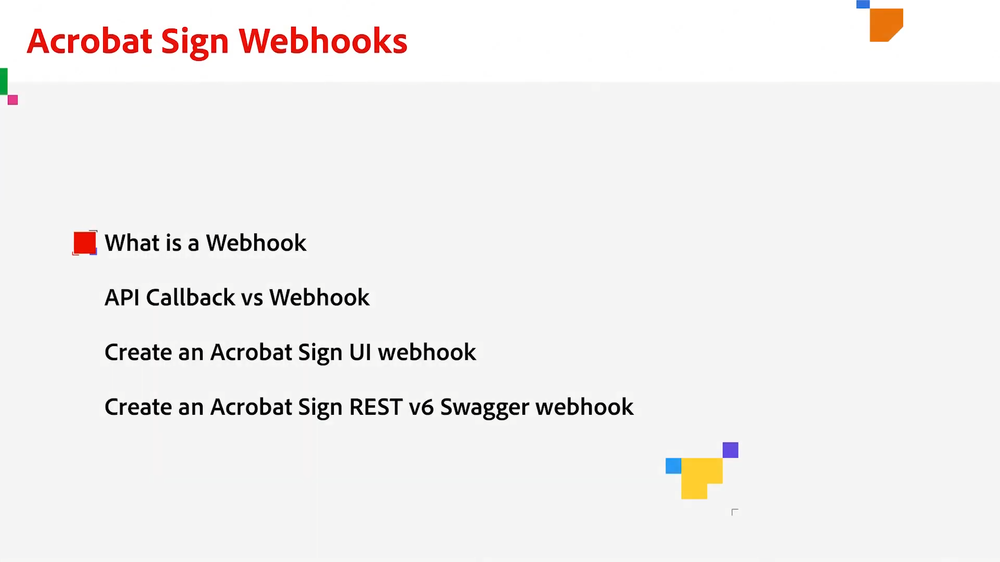

# Présentation du développement

40 % des accords dans Acrobat Sign sont créés à l’aide d’API. Utilisez les API pour créer des applications personnalisées pour vos équipes, partenaires et clients.

## Nouveautés

* [Configuration des webhooks](webhooks.md)
Découvrez comment créer un webhook pour automatiser des processus qui nécessitent normalement une intervention manuelle.

<table style="table-layout:fixed">
<tr>
  <td>
    
    

    <a href="https://www.adobe.io/apis/documentcloud/sign.html" target="_blank"><strong>Créer un compte développeur</strong></a>
    

    <em>Découvrez comment commencer à utiliser un compte développeur</em>
     
  </td>
  <td>
    
    

    <a href="https://www.adobe.io/apis/documentcloud/sign/docs.html" target="_blank"><strong>Découvrir les possibilités</strong></a>
    

    <em>Découvrez comment incorporer les fonctionnalités d’Acrobat Sign dans n’importe quelle application externe</em>
     
  </td>  
  <td>
    
    

    <a href="gigasign.md"><strong>Collecte de documents volumineux à l’aide de GigaSign</strong></a>
    

    <em>Envoyez, collectez et suivez des documents pour signature à des milliers de personnes en même temps</em>
     
  </td>
   <td>
    
    

    <a href="embeddedesignature.md"><strong>Création d’expériences de signature électronique et de document intégrées</strong></a>
    

    <em>Découvrez comment utiliser les API Acrobat Sign pour intégrer des expériences de signature électronique et de document dans vos plateformes web et systèmes de gestion de contenu et de document</em>
     
  </td>
</tr>
<tr>
  <td>
    
    

    <a href="webhooks.md"><strong>Configuration des webhooks</strong></a>
    

    <em>Découvrez comment créer un webhook pour automatiser des processus qui nécessitent normalement une intervention manuelle</em>
     
  </td>
  <td>
    
    

     
  </td>
  <td>
    
    

     
  </td>
  <td>
    
    

     
  </td>
</tr>
</table>
