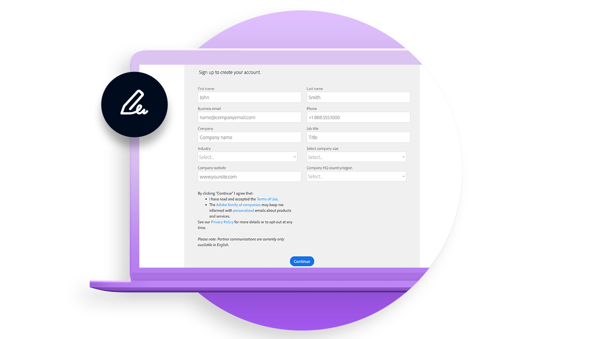

# Présentation du développement

40 % des accords dans Acrobat Sign sont créés à l’aide d’API. Utilisez les API pour créer des applications personnalisées pour vos équipes, partenaires et clients.

<table style="table-layout:fixed">
<tr>
  <td>
    
    

    <a href="https://www.adobe.io/apis/documentcloud/sign.html" target="_blank"><strong>Création d’un compte développeur</strong></a>
    

    <em>Découvrez comment commencer à utiliser un compte développeur</em>
     
  </td>
  <td>
    
    

    <a href="https://www.adobe.io/apis/documentcloud/sign/docs.html" target="_blank"><strong>Découvrir ce que vous pouvez faire</strong></a>
    

    <em>Découvrez comment intégrer les fonctionnalités d’Acrobat Sign dans n’importe quelle application externe</em>
     
  </td>  
  <td>
    
    

    <a href="gigasign.md"><strong>Collecte de documents volumineux à l’aide de GigaSign</strong></a>
    

    <em>Envoyer, collecter et suivre des documents pour signature à des milliers de personnes en même temps</em>
     
  </td>
   <td>
    
    

    <a href="embeddedesignature.md"><strong>Création d’expériences de signature électronique et de document intégrées</strong></a>
    

    <em>Découvrez comment utiliser les API Acrobat Sign pour intégrer des expériences de signature électronique et de document dans vos plateformes web et systèmes de gestion de contenu et de document</em>
     
  </td>
</tr>
</table>
