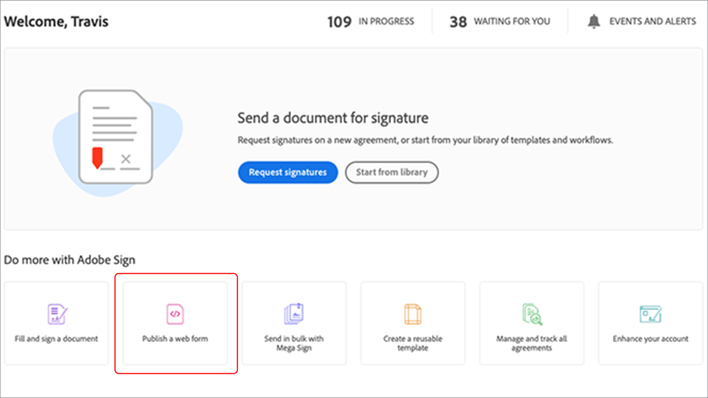

# Créer des expériences documentaires et de signature électronique intégrées

Découvrez comment utiliser les API Acrobat Sign pour incorporer la signature électronique et les expériences documentaires dans vos plateformes web et systèmes de gestion de contenu et de documents. Ce tutoriel pratique comporte quatre parties, décrites dans les liens ci-dessous :

<table style="table-layout:fixed">
<tr>
  <td>
    
    

    <a href="embeddedesignature.md#part1"><strong>Partie 1 : Ce dont vous aurez besoin</strong></a>
    

  </td>
  <td>
    
    

    <a href="embeddedesignature.md#part2"><strong>Partie 2 : Code faible/sans — la puissance des formulaires web</strong></a>
    

  </td>
  <td>
   
    

    <a href="embeddedesignature.md#part3"><strong>Partie 3 : Envoi d’un accord avec un formulaire et fusion des données</strong></a>
    

  </td>
  <td>
   
    

    <a href="embeddedesignature.md#part4"><strong>Partie 4 : Intégrer l’expérience de signature, les redirections, etc.</strong></a>
    

  </td>
</tr>
</table>

## Partie 1 : Ce dont vous aurez besoin {#part1}

Dans la première partie, vous apprendrez à utiliser tout ce dont vous avez besoin pour les parties 2 à 4. Commençons par obtenir les identifiants d’API.

* [Compte développeur Acrobat Sign](https://acrobat.adobe.com/fr/fr/sign/developer-form.html)
* [Code de démarrage](https://github.com/benvanderberg/adobe-sign-api-tutorial)
* [Code VS (ou éditeur de votre choix)](https://code.visualstudio.com)
* Python 3.x
   * Mac — Homebrew
   * Linux — Programme d&#39;installation intégré
   * Windows — Chocolatey
   * Tous — https://www.python.org/downloads/

## Partie 2 : Code faible/sans — la puissance des formulaires web {#part2}

Dans la deuxième partie, vous découvrirez l’option low/no-code lorsque vous utilisez des formulaires web. Il est toujours judicieux d’éviter d’écrire du code au début.

1. Accédez à Acrobat Sign avec votre compte développeur.
1. Cliquez **Publication d’un formulaire web** sur la page d’accueil.

   

1. Créez votre accord.

   

1. Incorporez votre accord dans une page de HTML plate.
1. Essayez d&#39;ajouter des paramètres de requête de manière dynamique.

   

## Partie 3 : Envoi d’un accord avec un formulaire et fusion des données {#part3}

Dans la troisième partie, vous allez créer des accords de manière dynamique.

Tout d&#39;abord, vous devez établir l&#39;accès. Avec Acrobat Sign, il existe deux façons de se connecter via l’API. Jetons OAuth et clés d’intégration. À moins que vous n’ayez une raison très spécifique d’utiliser OAuth avec votre application, vous devez d’abord explorer les clés d’intégration.

1. Sélectionner **Clé d’intégration** dans le **Informations API** sous le menu **Compte** dans Acrobat Sign.

   

Maintenant que vous avez accès à l’API et pouvez interagir avec celle-ci, découvrez ce que vous pouvez faire avec elle.

1. Accédez à l’onglet [Méthodes de l’API REST Acrobat Sign version 6](http://adobesign.com/public/docs/restapi/v6).

   

1. Utilisez le jeton en tant que valeur &quot;porteur&quot;.

   

Pour envoyer votre premier accord, il est préférable de comprendre comment utiliser l’API.

1. Créez un document temporaire et envoyez-le.

>[!NOTE]
>
>Les appels de requête basés sur JSON ont une option &quot;Modèle&quot; et &quot;Schéma de modèle minimal&quot;. Cela donne des spécifications et une charge utile minimale définie.

Après avoir envoyé un accord pour la première fois, vous êtes prêt à ajouter la logique. Il est toujours judicieux de créer des assistants pour limiter les répétitions. Voici quelques exemples :

**Validation**

**En-têtes/authentification**

**URI de base**

Soyez conscient de l’emplacement des documents transitoires dans le grand schéma de l’écosystème Sign.
Transitoire -> Accord temporaire -> Modèle -> Accord temporaire -> Widget -> Accord

Cet exemple utilise un modèle comme source de document. C’est généralement le meilleur itinéraire, sauf si vous avez une bonne raison de générer dynamiquement des documents pour signature (par exemple, génération de code hérité ou de documents).

Le code est assez simple ; il utilise un document de bibliothèque (modèle) pour la source du document. Les premier et second signataires sont assignés dynamiquement. La `IN_PROCESS` état signifie que le document est envoyé immédiatement. En outre, `mergeFieldInfo` permet de remplir les champs de manière dynamique.

## Partie 4 : Intégrer l’expérience de signature, les redirections, etc. {#part4}

Dans de nombreux scénarios, vous pouvez autoriser le participant déclencheur à signer immédiatement un accord. Cette fonction est utile pour les applications orientées client et les bornes interactives.

Si vous ne souhaitez pas que le premier e-mail d’envoi se déclenche, un moyen simple consiste à gérer le comportement en modifiant l’appel d’API.

Voici comment contrôler la redirection post-signature :

Après avoir mis à jour le processus de création de l’accord, l’étape finale consiste à générer l’URL de signature. Cet appel est également assez simple et génère une URL qu’un signataire peut utiliser pour accéder à sa partie du processus de signature.

>[!NOTE]
>
>Notez que l’appel de création d’accord est techniquement asynchrone. Cela signifie qu’un appel d’accord &quot;POST&quot; peut être effectué, mais que l’accord n’est pas encore prêt. La meilleure pratique consiste à établir une boucle de nouvelle tentative. Utilisez une nouvelle tentative ou n’importe quelle autre bonne pratique pour votre environnement.

Quand tout est mis en place, la solution est assez simple. Vous créez un accord, puis générez une URL de signature sur laquelle le signataire peut cliquer pour commencer le rituel de signature.

### Rubriques supplémentaires

* [Événements JS](https://www.adobe.io/apis/documentcloud/sign/docs.html#!adobedocs/adobe-sign/master/events.md)
* Événements Webhook
   * [API REST](https://sign-acs.na1.echosign.com/public/docs/restapi/v6#!/webhooks/createWebhook)
   * [Webhooks dans Acrobat Sign v6](https://www.adobe.io/apis/documentcloud/sign/docs.html#!adobedocs/adobe-sign/master/webhooks.md)
* [Réactiver les e-mails de demande (avec événements)](https://sign-acs.na1.echosign.com/public/docs/restapi/v6#!/agreements/updateAgreement)
* [Remplacer le délai d’expiration par une nouvelle tentative](https://stackoverflow.com/questions/23267409/how-to-implement-retry-mechanism-into-python-requests-library)

     
* Rappels personnalisés
   * Avec la création initiale

      

   * Ou ajoutez-en un [en vol](https://sign-acs.na1.echosign.com/public/docs/restapi/v6#!/agreements/createReminderOnParticipant)

## Ressources supplémentaires

http://bit.ly/Summit21-T126

Inclut :
* Compte développeur Acrobat Sign
* Documentation des API Acrobat Sign
* Exemple de code
* Code Visual Studio
* Python
