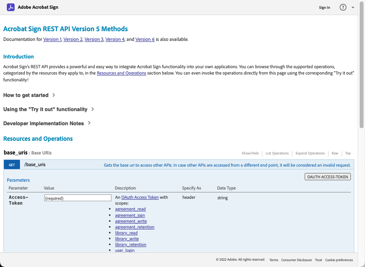
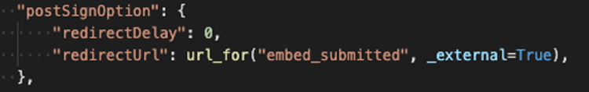

# Création d’expériences intégrées de signature électronique et de document

Découvrez comment utiliser les API Adobe Sign pour intégrer des expériences de signature électronique et de document dans vos plates-formes Web et vos systèmes de gestion de contenu et de documents. Ce tutoriel pratique décrit en quatre parties dans les liens ci-dessous :

<table style="table-layout:fixed">
<tr>
  <td>
    
    

    <a href="embeddedesignature.md#part1"><strong>Partie 1 : Ce dont vous aurez besoin</strong></a>
    

  </td>
  <td>
    
    

    <a href="embeddedesignature.md#part2"><strong>Partie 2 : Code faible/sans code : puissance des formulaires web</strong></a>
    

  </td>
  <td>
   
    

    <a href="embeddedesignature.md#part3"><strong>Partie 3 : Envoi d’un accord avec un formulaire et fusion de données</strong></a>
    

  </td>
  <td>
   
    

    <a href="embeddedesignature.md#part4"><strong>Partie 4 : Intégration de l’expérience de signature, des redirections, etc.</strong></a>
    

  </td>
</tr>
</table>

## Partie 1 : Ce dont vous aurez besoin {#part1}

Dans la première partie, vous apprendrez à utiliser tout ce dont vous avez besoin pour les deux-quatre parties. Commençons par obtenir les informations d’identification de l’API.

* [Compte développeur Adobe Sign](https://acrobat.adobe.com/fr/fr/sign/developer-form.html)
* [Code de démarrage](https://github.com/benvanderberg/adobe-sign-api-tutorial)
* [Code VS (ou éditeur de votre choix)](https://code.visualstudio.com)
* Python 3.x
   * Mac — Homebrew
   * Linux — Programme d&#39;installation intégré
   * Windows — Chocolatey
   * Tout — https://www.python.org/downloads/

## Partie 2 : Code faible/sans code : puissance des formulaires web {#part2}

Dans la deuxième partie, vous allez explorer l’option de code faible/sans code lors de l’utilisation de formulaires web. Il est toujours conseillé de savoir si vous pouvez éviter d’écrire du code au début.

1. Accédez à Adobe Sign avec votre compte de développeur.
1. Cliquez sur **Publier un formulaire Web** sur la page d’accueil.

   

1. Créez votre accord.

   

1. Incorporez votre accord sur une page HTML plate.
1. Testez l&#39;ajout dynamique de paramètres de requête.

   

## Partie 3 : Envoi d’un accord avec un formulaire et fusion de données {#part3}

Dans la troisième partie, vous allez créer des accords de manière dynamique.

Vous devez d&#39;abord établir l&#39;accès. Avec Adobe Sign, il existe deux façons de se connecter via l’API. Jetons OAuth et clés d’intégration. À moins que vous n’ayez une raison très spécifique d’utiliser OAuth avec votre application, vous voudrez d’abord explorer les clés d’intégration.

1. Sélectionnez **Clé d&#39;intégration** dans le menu **Informations sur l&#39;API** sous l&#39;onglet **Compte** dans Adobe Sign.

   

Maintenant que vous disposez d’un accès et que vous pouvez interagir avec l’API, consultez ce que vous pouvez faire avec l’API.

1. Accédez à [Adobe Sign REST API version 6 Methods](http://adobesign.com/public/docs/restapi/v6).

   

1. Utilisez le jeton comme valeur &quot;porteur&quot;.

   

Pour envoyer votre premier accord, il est préférable de comprendre comment utiliser l’API.

1. Créez un document temporaire et envoyez-le.

>[!NOTE]
>
>Les appels de demande basés sur JSON ont une option &quot;Modèle&quot; et &quot;Schéma de modèle minimal&quot;. Cela donne des spécifications et un jeu de charge minimum.

Après avoir envoyé un accord pour la première fois, vous êtes prêt à ajouter la logique. Il est toujours judicieux d’établir des assistants pour minimiser les répétitions. Voici quelques exemples :

**Validation**

**En-têtes/Auth**

**URI de base**

Soyez conscient de l’emplacement des documents transitoires dans le grand schéma de l’écosystème Sign.
Transitif -> Accord
Transitif -> Modèle -> Accord
Transitif -> Widget -> Accord

Cet exemple utilise un modèle comme source de document. Il s’agit généralement de la meilleure méthode, à moins que vous n’ayez une raison valable de générer dynamiquement des documents pour signature (par exemple, code hérité ou génération de documents).

Le code est assez simple ; il utilise un document de bibliothèque (modèle) pour la source du document. Les premier et deuxième signataires sont affectés de manière dynamique. L&#39;état `IN_PROCESS` signifie que le document est envoyé immédiatement. En outre, `mergeFieldInfo` est utilisé pour remplir dynamiquement les champs.

## Partie 4 : Intégration de l’expérience de signature, des redirections, etc. {#part4}

Dans de nombreux cas, vous pouvez autoriser le participant déclencheur à signer immédiatement un accord. Cela est utile pour les applications et les kiosques destinés aux clients.

Si vous ne souhaitez pas que le premier message d’envoi se déclenche, une méthode simple consiste à gérer le comportement en modifiant l’appel d’API.

Voici comment contrôler la redirection post-signature :

Après la mise à jour du processus de création de l’accord, l’étape finale consiste à générer l’URL de signature. Cet appel est également assez simple et génère une URL qu’un signataire peut utiliser pour accéder à sa partie du processus de signature.

>[!NOTE]
>
>Notez que l’appel de création d’accord est techniquement asynchrone. Cela signifie qu’un appel d’accord &quot;POST&quot; peut être effectué, mais l’accord n’est pas encore prêt. La meilleure pratique consiste à établir une boucle de nouvelle tentative. Utilisez une nouvelle tentative ou toute autre pratique recommandée pour votre environnement.

Lorsque tout est mis en place, la solution est assez simple. Vous créez un accord, puis générez une URL de signature sur laquelle le signataire peut cliquer et commencer le rituel de signature.

### Rubriques supplémentaires

* [Événements JS](https://www.adobe.io/apis/documentcloud/sign/docs.html#!adobedocs/adobe-sign/master/events.md)
* Événements Webhook
   * [API REST](https://sign-acs.na1.echosign.com/public/docs/restapi/v6#!/webhooks/createWebhook)
   * [Webhooks à Adobe Sign v6](https://www.adobe.io/apis/documentcloud/sign/docs.html#!adobedocs/adobe-sign/master/webhooks.md)
* [Réactiver les e-mails de demande (avec les événements)](https://sign-acs.na1.echosign.com/public/docs/restapi/v6#!/agreements/updateAgreement)
* [Remplacement du délai d’expiration par une nouvelle tentative](https://stackoverflow.com/questions/23267409/how-to-implement-retry-mechanism-into-python-requests-library)

     
* Rappels personnalisés
   * Avec la création initiale

      

   * Ou ajoutez un [en vol](https://sign-acs.na1.echosign.com/public/docs/restapi/v6#!/agreements/createReminderOnParticipant)

## Ressources supplémentaires

http://bit.ly/Summit21-T126

Comprend :
* Compte développeur Adobe Sign
* Documentation de l’API Adobe Sign
* Exemple de code
* Code Visual Studio
* Python
