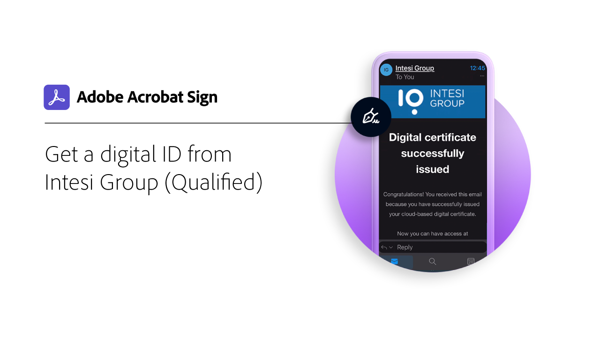

# Présentation des identifications numériques

Semblable à un passeport sous forme électronique, une identité numérique (ID numérique) vous permet de prouver en toute sécurité que vous êtes celui que vous prétendez être. De plus, en cas de signature électronique dans Acrobat Sign, l’utilisation d’une identification numérique offre une meilleure garantie que vous avez autorisé l’apposition de votre signature électronique sur ce document spécifique. Les tutoriels suivants vous montrent comment utiliser des identifications numériques du monde entier avec Acrobat Sign.

>[!NOTE]
>
>Avant de pouvoir utiliser un ID numérique avec une signature Cloud, vérifiez auprès de l’administrateur de votre organisation que la solution du fournisseur est activée dans Acrobat Sign.

## Nouveautés

* [Enregistrement et signature avec Digidentity](digidentity-sign.md)
Découvrez comment vous inscrire et utiliser votre [!DNL Digidentity] identification numérique avec Acrobat Sign
* [Enregistrement et signature avec D-Trust](d-trust.md)
Découvrez comment enregistrer votre identité avec [!DNL D-Trust], puis utilisez la commande [!DNL D-Trust] signature numérique sur un document dans Acrobat Sign

## [!DNL Aadhaar]

<table style="table-layout:fixed">
<tr>
 <td>
    
    

    <a href="aadhaar-sign.md"><strong>Signature avec [!DNL Aadhaar]</strong></a>
    

    <em>Apprenez à utiliser votre [!DNL Aadhaar] identification numérique avec Acrobat Sign</em>
     
  </td>
  <td>
    
    

     
  </td>
  <td>
    
    

     
  </td>
  <td>
    
    

     
  </td>
</tr>
</table>

## [!DNL Digidentity]

<table style="table-layout:fixed">
<tr>
  <td>
    
    

    <a href="digidentity-sign.md"><strong>S’inscrire et signer avec [!DNL Digidentity]</strong></a>
    

    <em>Découvrez comment vous inscrire et utiliser votre [!DNL Digidentity] identification numérique avec Acrobat Sign</em>
     
  </td>
  <td>
    
    

     
  </td>
  <td>
    
    

     
  </td>
  <td>
    
    

     
  </td>
</tr>
</table>

## [!DNL D-Trust]

<table style="table-layout:fixed">
<tr>
  <td>
    
    

    <a href="d-trust.md"><strong>Enregistrement et signature avec D-Trust</strong></a>
    

    <em>Découvrez comment enregistrer votre identité avec [!DNL D-Trust], puis utilisez la commande [!DNL D-Trust] signature numérique sur un document dans Acrobat Sign</em>
     
  </td>
  <td>
    
    

     
  </td>
  <td>
    
    

     
  </td>
  <td>
    
    

     
  </td>
  </tr>
  </table>

## [!DNL Intesi Group]

<table style="table-layout:fixed">
<tr>
  <td>
    
    

    <a href="intesi-advanced.md"><strong>Obtenir un ID numérique à partir de [!DNL Intesi Group] (Avancé)</strong></a>
    

    <em>Découvrez comment obtenir un certificat de signature numérique avancé de [!DNL Intesi Group]</em>
     
  </td>
  <td>
    
    

    <a href="intesi-qualified.md"><strong>Obtenir un ID numérique à partir de [!DNL Intesi Group] (Qualifié)</strong></a>
    

    <em>Découvrez comment obtenir un certificat de signature numérique qualifié auprès de [!DNL Intesi Group]</em>
     
  </td>
  <td>
    
    

    <a href="intesi-sign.md"><strong>Signature avec [!DNL Intesi Group]</strong></a>
    

    <em>Apprenez à utiliser votre [!DNL Intesi Group] identification numérique avec Acrobat Sign</em>
     
  </td>
  <td>
    
    

     
  </td>
</tr>
</table>
