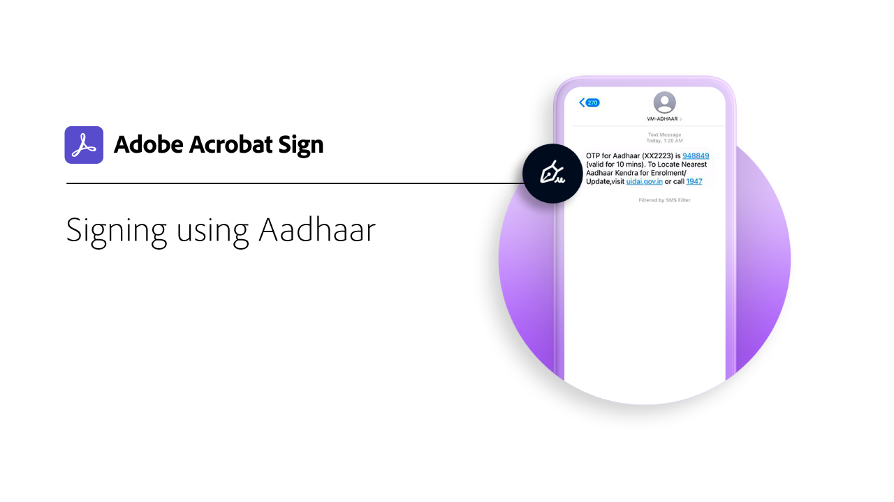

# Présentation de l’identification numérique

Comme un passeport sous forme électronique, une identité numérique (ID numérique) vous permet de prouver de manière sécurisée que vous êtes bien qui vous prétendez être. De plus, lors de la signature électronique dans Acrobat Sign, l’utilisation d’une ID numérique offre un niveau de garantie supérieur que vous avez autorisé votre signature électronique sur ce document spécifique. Les tutoriels suivants vous expliquent comment utiliser les identifications numériques du monde entier avec Acrobat Sign.

>[!NOTE]
>
>Avant de pouvoir utiliser une identification numérique avec une signature cloud, vérifiez auprès de l’administrateur de votre organisation que la solution du fournisseur est activée dans Acrobat Sign.

## Nouveautés

>[!BEGINTABS]

>[!TAB S&#39;inscrire et signer à l&#39;aide de Digidentity]

Découvrez comment enregistrer et utiliser votre ID numérique [[!DNL Digidentity]](digidentity-sign.md) avec Acrobat Sign.

>[!TAB S&#39;inscrire et signer à l&#39;aide de D-Trust]

Découvrez comment enregistrer votre identité avec [[!DNL D-Trust]](d-trust.md), puis utiliser la signature numérique [!DNL D-Trust] sur un document dans Acrobat Sign.

>[!ENDTABS]

## [!DNL Aadhaar]

<table style="table-layout:fixed">
<tr>
 <td>
    
    

    <a href="aadhaar-sign.md"><strong>Signature à l’aide de [!DNL Aadhaar]</strong></a>
    

    <em>Découvrez comment utiliser votre ID numérique [!DNL Aadhaar] avec Acrobat Sign</em>
     
  </td>
  <td>
    
    

     
  </td>
  <td>
    
    

     
  </td>
  <td>
    
    

     
  </td>
</tr>
</table>

## [!DNL Digidentity]

<table style="table-layout:fixed">
<tr>
  <td>
    
    

    <a href="digidentity-sign.md"><strong>S'inscrire et signer à l'aide de [!DNL Digidentity]</strong></a>
    

    <em>Découvrez comment enregistrer et utiliser votre ID numérique [!DNL Digidentity] avec Acrobat Sign</em>
     
  </td>
  <td>
    
    

     
  </td>
  <td>
    
    

     
  </td>
  <td>
    
    

     
  </td>
</tr>
</table>

## [!DNL D-Trust]

<table style="table-layout:fixed">
<tr>
  <td>
    
    

    <a href="d-trust.md"><strong>S'inscrire et signer à l'aide de D-Trust</strong></a>
    

    <em>Découvrez comment enregistrer votre identité avec [!DNL D-Trust], puis utiliser la signature numérique [!DNL D-Trust] sur un document dans Acrobat Sign</em>
     
  </td>
  <td>
    
    

     
  </td>
  <td>
    
    

     
  </td>
  <td>
    
    

     
  </td>
  </tr>
  </table>

## [!DNL Intesi Group]

<table style="table-layout:fixed">
<tr>
  <td>
    
    

    <a href="intesi-advanced.md"><strong>Obtenir une identification numérique à partir de [!DNL Intesi Group] (avancé)</strong></a>
    

    <em>Découvrez comment obtenir un certificat de signature numérique avancé auprès de [!DNL Intesi Group]</em>
     
  </td>
  <td>
    
    

    <a href="intesi-qualified.md"><strong>Obtenir un ID numérique auprès de [!DNL Intesi Group] (qualifié)</strong></a>
    

    <em>Découvrez comment obtenir un certificat de signature numérique qualifié auprès de [!DNL Intesi Group]</em>
     
  </td>
  <td>
    
    

    <a href="intesi-sign.md"><strong>Signature à l’aide de [!DNL Intesi Group]</strong></a>
    

    <em>Découvrez comment utiliser votre ID numérique [!DNL Intesi Group] avec Acrobat Sign</em>
     
  </td>
  <td>
    
    

     
  </td>
</tr>
</table>
