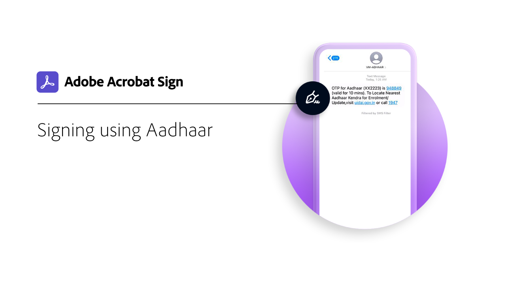

# Présentation de l’ID numérique

Tout comme un passeport sous forme électronique, une identité numérique (identification numérique) vous permet de prouver en toute sécurité que vous êtes celui que vous déclarez être. En outre, lors de la signature électronique dans Adobe Sign, l’utilisation d’une identification numérique offre un niveau plus élevé d’assurance que vous avez autorisé votre signature électronique sur ce document spécifique. Les tutoriels suivants vous expliquent comment utiliser des identifications numériques du monde entier avec Adobe Sign.

>[!NOTE]
>
>Avant de pouvoir utiliser une identification numérique avec une signature dans le cloud, contactez l’administrateur de votre entreprise pour vérifier que la solution du fournisseur est activée dans Adobe Sign.

## [!DNL Aadhaar]

<table style="table-layout:fixed">
<tr>
 <td>
    
    

    <a href="aadhaar-sign.md"><strong>Signature à l’aide de [!DNL Aadhaar]</strong></a>
    

    <em>Découvrez comment utiliser votre [!DNL Aadhaar] identification numérique avec Adobe Sign</em>
     
  </td>
  <td>
    
    

     
  </td>
  <td>
    
    

     
  </td>
</tr>
</table>

## [!DNL Digidentity]

<table style="table-layout:fixed">
<tr>
 <td>
    
    

    <a href="digidentity-reg.md"><strong>Obtenir une identification numérique à partir de [!DNL Digidentity]</strong></a>
    

    <em>Découvrez comment obtenir un certificat de signature numérique auprès de [!DNL Digidentity]</em>
     
  </td>
  <td>
    
    

    <a href="digidentity-sign.md"><strong>Signature à l’aide de [!DNL Digidentity]</strong></a>
    

    <em>Découvrez comment utiliser votre [!DNL Digidentity] identification numérique avec Adobe Sign</em>
     
  </td>
  <td>
    
    

     
  </td>
</tr>
</table>

## [!DNL Intesi Group]

<table style="table-layout:fixed">
<tr>
  <td>
    
    

    <a href="intesi-advanced.md"><strong>Obtenir une identification numérique à partir de [!DNL Intesi Group] (Avancé)</strong></a>
    

    <em>Découvrez comment obtenir un certificat de signature numérique avancé à partir de [!DNL Intesi Group]</em>
     
  </td>
  <td>
    
    

    <a href="intesi-qualified.md"><strong>Obtenir une identification numérique à partir de [!DNL Intesi Group] (Qualifié)</strong></a>
    

    <em>Découvrez comment obtenir un certificat de signature numérique qualifié auprès de [!DNL Intesi Group]</em>
     
  </td>
  <td>
    
    

    <a href="intesi-sign.md"><strong>Signature à l’aide de [!DNL Intesi Group]</strong></a>
    

    <em>Découvrez comment utiliser votre [!DNL Intesi Group] identification numérique avec Adobe Sign</em>
     
  </td>
</tr>
</table>
