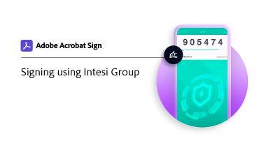

# Obtenir une identification numérique à partir de [!DNL Intesi Group] (Avancé)

Découvrez comment obtenir un certificat de signature numérique avancé auprès de [!DNL Intesi Group]. Une fois enregistré et que votre identité est vérifiée, [!DNL Intesi Group] vous émet un ID numérique utilisé pour appliquer une signature Adobe Sign Cloud.

>[!VIDEO](https://video.tv.adobe.com/v/337065?hidetitle=true)

  

**Sélectionnez l’image ci-dessous pour savoir comment utiliser votre ID  [!DNL Intesi Group] numérique avancée dans Adobe Sign.**

