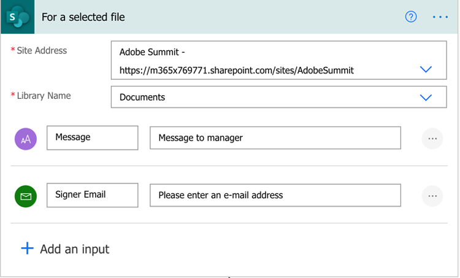
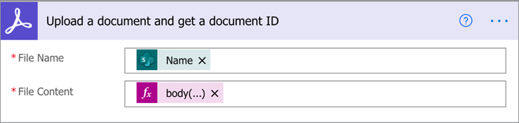
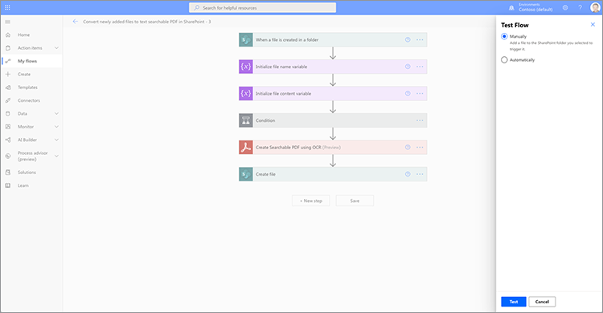
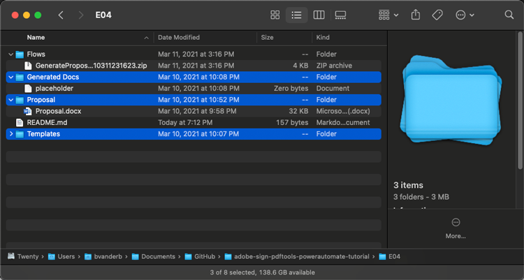
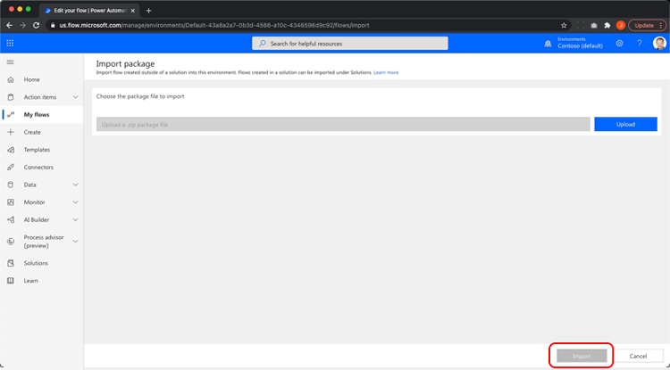
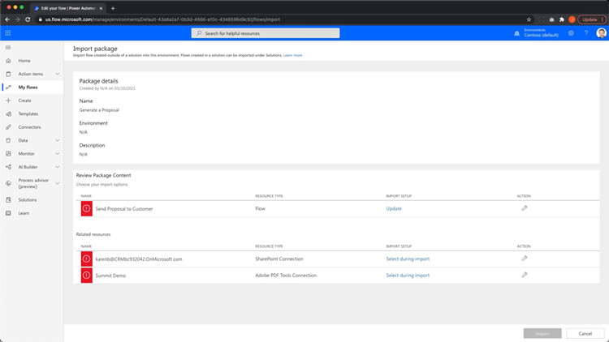

# Automatisation des documents avec Acrobat Sign pour Microsoft Power Platform

Découvrez comment activer et utiliser les connecteurs Acrobat Sign et Adobe PDF Tools pour Microsoft Power Apps. Créez des workflows qui automatisent les processus d’approbation et de signature de l’entreprise rapidement et en toute sécurité, sans aucun code. Ce tutoriel pratique est divisé en quatre parties, comme indiqué dans les liens ci-dessous :

<table style="table-layout:fixed">
<tr>
  <td>
    
    

    <a href="documentautomation.md#part1"><strong>Partie 1 : Stocker l’accord signé dans SharePoint avec Acrobat Sign</strong></a>
    

  </td>
  <td>
    
    

    <a href="documentautomation.md#part2"><strong>Partie 2 : processus d’approbation automatisé pour obtenir une signature électronique avec Acrobat Sign</strong></a>
    

  </td>
  <td>
   
    

    <a href="documentautomation.md#part3"><strong>Partie 3 : ROC de document automatisée avec les outils Adobe PDF</strong></a>
    

  </td>
  <td>
   
    

    <a href="documentautomation.md#part4"><strong>Partie 4 : Assemblage automatisé de documents avec Adobe PDF Tools</strong></a>
    

  </td>
</tr>
</table>

## Conditions préalables

* Familiarité avec Microsoft 365 et Power Automate
* Connaissances Acrobat Sign
* Compte Microsoft 365 avec accès à SharePoint et Power Automate (Basic pour Acrobat Sign, Premium pour Adobe PDF Tools)
* Compte de développeur Acrobat Sign abonnement Entreprise ou Acrobat Sign

**Exercices 1 et 2**

* Compte Acrobat Sign avec accès à l’API. Un compte Développeur ou un compte Entreprise.
* Site SharePoint accessible par Power Automate pour lequel vous disposez d’autorisations de modification. Un accès administrateur complet est recommandé.
* Exemple de document pour la demande d’approbation et la signature de la signature.

**Exercices 3 et 4**

Télécharger les matériaux [ici](https://github.com/benvanderberg/adobe-sign-pdftools-powerautomate-tutorial)

## Partie 1 : Stocker l’accord signé dans SharePoint avec Acrobat Sign {#part1}

Dans la première partie, vous utiliserez un modèle de flux Power Automate pour configurer un workflow automatisé qui enregistrera tous les accords signés sur votre site SharePoint.

1. Accédez à Power Automate.
1. Recherchez Acrobat Sign.

   

1. Sélectionnez **Enregistrer un accord Acrobat Sign terminé dans la bibliothèque SharePoint**.

   

1. Passez en revue l’écran et configurez les connexions nécessaires. Activez la connexion Acrobat Sign.
1. Cliquez sur le symbole bleu `+`.

   

1. Saisissez l’adresse e-mail de votre compte Acrobat Sign et cliquez sur le champ de mot de passe dans la nouvelle fenêtre.

   

   Attendez un instant que l’Adobe vérifie votre compte.

   >[!NOTE]
   >
   >Cette vérification vous dirigera vers la connexion appropriée si vous utilisez une authentification unique Adobe ID ou notre authentification unique d’entreprise.

1. Terminer la connexion.
1. Cliquez sur **Continuer** pour accéder à l&#39;écran de modification Flux.
1. Nommez le déclencheur.

   

1. Configurez vos paramètres SharePoint.

   

   **Adresse du site :** votre site SharePoint
   **Chemin du dossier :** chemin d&#39;accès aux documents partagés que vous souhaitez utiliser
   **Nom du fichier :** acceptez la valeur par défaut
   **Contenu du fichier :** acceptez la valeur par défaut

1. Enregistrez le flux.

   

1. Accédez à l’écran de présentation du flux avec la flèche bleue vers l’arrière. Vous allez tester ce flux dans la partie 2.

   

Vous testerez ce flux dans la partie suivante.

## Partie 2 : Processus d’approbation automatisé pour obtenir une signature électronique avec Acrobat Sign {#part2}

Dans la deuxième partie, nous construisons la première partie avec un flux plus robuste et testons les deux flux pour les voir en action.

1. Sélectionnez **Modèles** sur le côté gauche à partir de l’interface Power Automate.

   

1. Recherchez « approbation du responsable ».
1. Sélectionnez **Demander l&#39;approbation du responsable pour un fichier sélectionné**.

   

   Passez en revue les connexions et ajoutez celles qui vous manquent.

   >[!NOTE]
   >
   >S’il s’agit du premier flux que vous effectuez avec les approbations, elles seront entièrement configurées lors de l’exécution du flux.

1. Cliquez sur **Continuer** pour accéder à l&#39;écran de modification du flux.

   Ce flux comporte de nombreuses étapes préconfigurées, notamment la vérification des erreurs et les étapes conditionnelles imbriquées.

1. Configurez **pour un fichier sélectionné** comme suit :
   **Adresse du site :** votre site SharePoint
   **Nom de la bibliothèque :** votre référentiel Documents
1. Ajoutez une entrée comme suit :
   **Type** : E-mail
   **Nom** : Adresse E-Mail Du Signataire

   

1. Configurez les **propriétés du fichier Get:** comme suit :
   **Adresse du site :** votre site SharePoint
   **Nom de la bibliothèque :** votre référentiel Documents

1. Faites défiler vers le bas et recherchez **Si oui**.

   

1. Cliquez sur **Ajouter une action** dans la zone **Si oui** (pas la plus basse) pour ajouter les étapes à envoyer pour signature.

   

1. Recherchez **SharePoint obtenir le contenu du fichier** et choisissez **Obtenir le contenu du fichier**.

   

1. Configurez **Obtenir le contenu du fichier** comme suit :

   

   **Adresse du site :** votre site SharePoint.
   **Identificateur de fichier :** recherchez « identifiant » et choisissez Identificateur à l&#39;étape **Obtenir les propriétés du fichier**.
1. Recherchez « Adobe » et choisissez **Acrobat Sign** pour ajouter une autre action.

   

1. Entrez « upload » dans la zone de recherche pour Acrobat Sign et sélectionnez **Upload a document and get a document ID**.
1. Recherchez la variable dynamique **Nom** pour obtenir le nom de l&#39;élément/du document sélectionné dans le déclencheur sous **Nom de fichier**.
1. Cliquez sur **Expression** dans l&#39;assistant de variable sous **Contenu du fichier**.

   

1. Ajoutez une seule apostrophe, puis cliquez à nouveau sur **Contenu dynamique**, supprimez votre apostrophe, sélectionnez **Contenu du fichier**, puis cliquez sur **OK**.

   Assurez-vous qu’il n’y a pas d’apostrophes supplémentaires et qu’elles ressemblent à l’exemple ci-dessous.

   

1. Recherchez « créer » dans la zone de recherche d’Acrobat Sign pour ajouter une autre action Acrobat Sign.
1. Sélectionnez **Créer un accord à partir d’un document chargé et l’envoyer pour signature**.

   

1. Configurez les informations requises :
Choisissez **Nom** dans l’assistant de variable dynamique dans **Nom de l’accord**.
Choisissez **Document ID** dans l&#39;assistant de variable dynamique dans **Document ID**.
Choisissez **E-mail du signataire** dans l’assistant de variable dynamique dans **E-mail du participant**.
Saisissez « 1 » dans **Ordre des participants**.
Choisissez **Signataire** dans le menu déroulant dans **Rôle de participant**.

   

1. **Économisez** le flux.

### Test de l’écoulement

Accédez au référentiel de documents de votre site SharePoint pour le tester.

1. Sélectionnez le document et choisissez **Automatiser** et le **Flux** que vous venez de créer.

   

1. Démarrez le flux pour valider les connexions (première exécution du flux uniquement).
1. Entrez un message positif à l&#39;approbateur dans **Message**.
1. Saisissez l’adresse électronique du signataire du document dans **E-mail du signataire**.
1. Cliquez sur **Exécuter le flux**.

L’approbateur configuré pour l’utilisateur démarrant le flux reçoit une demande d’approbation. Vous pouvez approuver par e-mail ou via le menu Actions Power Automate.
Une fois l’approbation obtenue, signez le document. Selon votre utilisateur et s’il est connecté à Sign, vous devrez peut-être ouvrir les fenêtres de signature dans une fenêtre de navigateur privé.

Terminez la signature, puis revenez dans votre dossier SharePoint.

## Partie 3 : ROC automatisée des documents avec les outils Adobe PDF {#part3}

Dans la troisième partie, vous apprendrez à automatiser la reconnaissance optique des caractères dans PDF lorsqu’ils sont importés dans Microsoft SharePoint. Cela résout un problème qui se produit avec les documents de PDF numérisés qui ne peuvent pas être recherchés dans SharePoint.

### Configuration d’un dossier dans SharePoint

Accédez à Microsoft SharePoint où vous souhaitez stocker des documents.

1. Cliquez sur **+ Nouveau** pour créer un dossier appelé « Contrats traités ».
1. Cliquez sur **+ Nouveau** pour créer un dossier appelé « Anciens contrats ».

   

Ces dossiers sont désormais référencés dans le cadre de votre flux Power Automate.

### Création d’un enchaînement à partir d’un modèle

1. Connectez-vous à l’adresse https://flow.microsoft.com.
1. Cliquez sur **Modèles** dans la barre latérale.

   

1. Sélectionnez **Convertir les fichiers nouvellement ajoutés en PDF textuel dans SharePoint**.
1. Cliquez sur le symbole **+** en regard des outils Adobe PDF.

   

1. Accédez à https://www.adobe.com/go/powerautomate_getstarted_fr dans un nouvel onglet.
1. Cliquez sur **Démarrer**.

   

1. Connectez-vous au moyen de votre ID Adobe.

   

1. Saisissez le nom et la description des informations d&#39;identification et cliquez sur **Créer des informations d&#39;identification**.

   

   Laissez la fenêtre ouverte avec les informations d’identification. Vous devrez les saisir dans Microsoft Power Automate.

   

1. Saisissez les informations d&#39;identification et cliquez sur **Créer dans Microsoft Power Automate**.

   

1. Cliquez sur **Continuer**.

   

   Vous pouvez maintenant voir une vue du workflow et vous devrez la configurer pour votre environnement.

1. Sélectionnez le champ Adresse du site et choisissez le site SharePoint que vous utilisez sous le déclencheur **Lorsqu&#39;un fichier est créé dans un dossier**.

   

1. Cliquez sur l’icône de dossier pour accéder au dossier Anciens contrats situé sous ID de dossier.

   

1. Modifiez l&#39;action **Créer un fichier** en bas de l&#39;enchaînement :

   Remplacez **Adresse du site** par votre adresse de site.
Spécifiez l’emplacement du dossier Contrats traités dans le chemin d’accès au dossier.

1. Cliquez sur **Enregistrer** dans le coin supérieur droit.
1. Cliquez sur **Tester**.
1. Sélectionnez **Manuellement**.
1. Cliquez sur **Tester**.

   

### Essayer votre nouveau flux

1. Accédez au dossier Anciens contrats dans SharePoint.
1. Accédez à E03/Anciens contrats dans les fichiers d’exercice que vous avez téléchargés.
1. Copiez les fichiers ReleaseFormXX.pdf dans le dossier Old Contracts dans SharePoint.

   

Désormais, si vous accédez au dossier Contrats traités, vous pouvez voir vos PDF disponibles après que le flux a eu quelques instants pour s’exécuter. Si vous ouvrez les PDF, vous constatez que le texte peut être sélectionné.
En outre, SharePoint indexe le document, ce qui vous permet d’effectuer des recherches dans le contenu de vos documents à partir de la barre de recherche de SharePoint.

## Partie 4 : Assemblage automatisé de documents avec Adobe PDF Tools {#part4}

Dans la quatrième partie, vous apprendrez à fusionner de nombreux documents en fonction des informations fournies lors de la sélection et du démarrage d’un flux à partir de Microsoft SharePoint. Dans ce scénario, le flux :

* Demandez des informations pour choisir les éléments à inclure dans un pack pour un client.
* En fonction des informations fournies, il fusionne de nombreux documents. Ces documents comprennent une page de couverture et des livres blancs facultatifs.
* Le document fusionné est enregistré dans SharePoint.

### Importation de fichiers d’exercice dans SharePoint

1. Ouvrez le dossier E04 dans les fichiers Exercice.
1. Importez les dossiers Devis, Modèles et Documents générés dans SharePoint.

   

Ces dossiers seront utilisés à titre de référence. En particulier, vous utiliserez le fichier Proposal.docx pour votre devis.

Dans le dossier Templates, il existe un dossier Covers qui comprend des designs de page de garde pour différentes villes. Il existe également un dossier de livres blancs contenant des livres blancs supplémentaires facultatifs qui seront joints à la fin s’ils sont sélectionnés.

### Importation du flux dans Microsoft Power Automate

1. Connexion à Microsoft Power Automate (https://flow.microsoft.com).
1. Cliquez sur **Mes flux**.

   

1. Cliquez sur **Importer**.

   

1. Cliquez sur **Télécharger** et choisissez le dossier GenerateProposal_20210311231623.zip dans E04/Flows/.

   

1. Cliquez sur **Importer**.

1. Cliquez sur l&#39;icône en forme de clé sous Action en regard de **Envoyer la proposition au client**.

   

1. Sélectionnez **Créer en tant que nouveau** sous Configuration.
1. Définissez le nom du flux sous Nom de la ressource.
1. Cliquez sur **Enregistrer**.

   Répétez cette opération pour les autres ressources associées et sélectionnez votre connexion.

   

1. Cliquez sur **Importer** après avoir établi toutes vos connexions.

### Définir pour un fichier sélectionné

Une fois l’enchaînement créé, procédez comme suit :

1. Cliquez sur **Modifier**.

   

1. Sélectionnez le déclencheur **Pour un fichier sélectionné**.

   Ajoutez votre site SharePoint à l’adresse du site.
Ajoutez votre bibliothèque dans la bibliothèque.

   

### Set templateFolderPath

1. Cliquez sur la variable templateFolderPath.
1. Définissez le chemin d’accès du dossier Modèles situé dans le site SharePoint que vous avez importé.

### Définir le contenu du fichier de récupération de couverture

1. Cliquez sur l&#39;action **Couvrir**, ce qui étend la portée.
1. Développer **Couverture : Obtenir le contenu du fichier**.

   Définissez l’adresse du site sur votre site SharePoint.

   

### Définir le fichier sélectionné

1. Développez l&#39;action de portée **Fichier sélectionné**.

   Remplacez l&#39;adresse du site et le nom de la bibliothèque par votre site et votre bibliothèque SharePoint respectivement sous **Obtenir les propriétés du fichier**.
Remplacez l&#39;adresse du site par votre site SharePoint sous **Obtenir le contenu du fichier**.

   

### Définition de livres blancs

1. Cliquez sur **Livres blancs**.
1. Développer la **condition : ajoutez un livre blanc**.

   

1. Développez **Livre blanc 1 : obtenir le contenu du fichier à l&#39;aide du chemin**.
Modifiez l&#39;adresse du site SharePoint spécifié.

Répétez les mêmes étapes pour la **condition : ajouter un livre blanc 2**.

### Définir Créer un fichier

1. Développez **Créer un fichier**.

   Modifiez l’adresse du site et le chemin du dossier vers le site SharePoint et le chemin du dossier Documents générés.

1. Cliquez sur **Enregistrer**.

### Testez votre flux

1. Accédez au dossier Devis dans SharePoint.
1. Sélectionnez le dossier Devis.docx.

   

1. Sélectionnez votre flux dans le menu **Automatiser**.

   

1. Cliquez sur **Continuer** pour commencer le flux.

   

1. Choisissez votre couverture et les livres blancs que vous souhaitez ajouter.
1. Cliquez sur **Exécuter le flux**.

   

Accédez au dossier Générer des documents. Votre fichier de PDF généré devrait maintenant s’afficher.

### Ajout de Protect et d’autres actions au flux

Maintenant que vous avez réussi à créer un flux, vous allez modifier votre flux pour chiffrer le document de mot de PDF avec un mot de passe. Cette section explique également comment utiliser d’autres actions.

1. Revenez à la fin de votre flux.
1. Cliquez sur le symbole **+** entre **Fusionner les PDF** et **Créer un fichier**.

   

1. Sélectionnez **Ajouter une action**.
1. Recherchez « Outils Adobe PDF ».

   

1. Sélectionnez **Protect PDF dans Affichage**.
1. Utilisez le contenu dynamique pour définir le champ Nom de fichier sur **Nom de fichier du PDF à partir du PDF de fusion**.

   

   Dans le déclencheur, un champ Mot de passe fait partie du formulaire d’initiation. Nous pouvons l&#39;utiliser ici.

1. Recherchez le **champ Mot de passe** à l&#39;aide du contenu dynamique, puis placez-le dans le champ Mot de passe.

   

1. Utilisez le contenu dynamique pour le définir sur **Contenu du fichier de PDF à partir de Fusionner les PDF** dans le champ Contenu du fichier.
1. Modifiez **Créer un fichier** pour obtenir le contenu du fichier à partir du PDF Protect plutôt que de Fusionner les PDF.
1. Développez **Créer un fichier**.
1. Effacez le champ Contenu du fichier.
1. Utilisez le contenu dynamique pour importer le **contenu du fichier PDF** à partir du **PDF Protect à partir de l&#39;affichage**.

### Testez votre flux

1. Accédez au dossier Devis dans SharePoint.
1. Sélectionnez Devis.docx.

   

1. Sélectionnez **Automatiser** pour choisir votre flux.

   

1. Cliquez sur **Continuer** pour commencer le flux.

   

1. Choisissez la couverture et les livres blancs que vous souhaitez ajouter.
1. Définissez le champ Mot de passe sur le mot de passe que vous souhaitez définir.
1. Cliquez sur **Exécuter le flux**.

   

1. Accédez au dossier Générer des documents.
Votre fichier de PDF généré devrait s’afficher. Ouvrez le fichier de mot de PDF qui vous invite à saisir votre mot de PDF.

   
