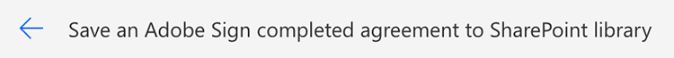
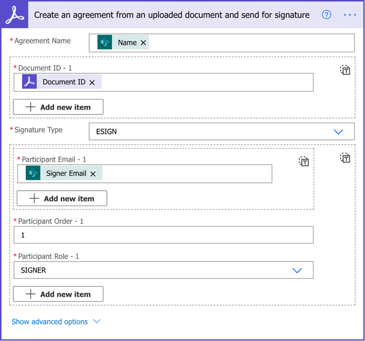

# Automatisation des documents avec Acrobat Sign pour Microsoft Power Platform

Découvrez comment activer et utiliser les connecteurs Acrobat Sign et Adobe PDF Tools pour Microsoft Power Apps. Créez des workflows qui automatisent rapidement et en toute sécurité les processus de validation et de signature, sans la moindre programmation. Ce tutoriel pratique comporte quatre parties, décrites dans les liens ci-dessous :

<table style="table-layout:fixed">
<tr>
  <td>
    
    

    <a href="documentautomation.md#part1"><strong>Partie 1 : Stockage des accords signés dans SharePoint avec Acrobat Sign</strong></a>
    

  </td>
  <td>
    
    

    <a href="documentautomation.md#part2"><strong>Partie 2 : Processus de validation automatisé pour l'obtention de signatures électroniques avec Acrobat Sign</strong></a>
    

  </td>
  <td>
   
    

    <a href="documentautomation.md#part3"><strong>Partie 3 : Technologie OCR automatisée avec Adobe PDF Tools</strong></a>
    

  </td>
  <td>
   
    

    <a href="documentautomation.md#part4"><strong>Partie 4 : Assemblage automatisé de documents avec Adobe PDF Tools</strong></a>
    

  </td>
</tr>
</table>

## Conditions préalables

* Familiarité avec Microsoft 365 et Power Automate
* Connaissances d’Acrobat Sign
* Compte Microsoft 365 avec accès à SharePoint et Power Automate (de base pour Acrobat Sign, Premium pour Adobe PDF Tools)
* Compte développeur Acrobat Sign abonnement Entreprise ou Acrobat Sign

**Exercices 1 et 2**

* Compte Acrobat Sign avec accès à l’API. Un compte développeur ou un compte Enterprise.
* Site SharePoint accessible par Power Automate et pour lequel vous disposez d’autorisations de modification. L’accès administrateur complet est recommandé.
* Exemple de document pour la demande d’approbation et la signature.

**Exercices 3 et 4**

Télécharger les matériaux [ici](https://github.com/benvanderberg/adobe-sign-pdftools-powerautomate-tutorial)

## Partie 1 : Stockage des accords signés dans SharePoint avec Acrobat Sign {#part1}

Dans la première partie, vous utiliserez un modèle Power Automate Flow pour configurer un workflow automatisé qui enregistrera tous les accords signés sur votre site SharePoint.

1. Accédez à Power Automate.
1. Recherchez Acrobat Sign.

   

1. Choisissez **Enregistrer un accord Acrobat Sign finalisé dans la bibliothèque SharePoint**.

   

1. Passez en revue l’écran et configurez les connexions nécessaires. Activez la connexion Acrobat Sign.
1. Cliquez sur le bleu `+` apparaît.

   

1. Saisissez l’adresse électronique de votre compte Acrobat Sign et cliquez sur le champ du mot de passe dans la nouvelle fenêtre.

   

   Attendez un moment que l&#39;Adobe vérifie votre compte.

   >[!NOTE]
   >
   >Cette vérification vous conduit à la connexion appropriée si vous utilisez un Adobe ID ou notre authentification unique (SSO) d’entreprise.

1. Connexion terminée.
1. Cliquez **Continuer** pour accéder à l’écran de modification de flux.
1. Nommez le déclencheur.

   

1. Configurez vos paramètres SharePoint.

   

   **Adresse du site :** Votre site SharePoint
   **Chemin du dossier :** Chemin d’accès aux documents partagés que vous souhaitez utiliser
   **Nom du fichier :** Accepter la valeur par défaut
   **Contenu du fichier :** Accepter la valeur par défaut

1. Enregistrement du flux.

   

1. Accédez à l’écran de présentation des flux avec la flèche bleue de retour. Vous allez tester ce flux dans la partie 2.

   

Vous allez tester ce flux dans la partie suivante.

## Partie 2 : Processus de validation automatisé pour l&#39;obtention de signatures électroniques avec Acrobat Sign {#part2}

Dans la deuxième partie, nous construisons la première partie avec un flux plus robuste et testons les deux flux pour les voir en action.

1. Sélectionner **Modèles** sur le côté gauche de l’interface Power Automate.

   

1. Recherchez &quot;approbation du responsable&quot;.
1. Sélectionner **Demander l&#39;approbation du gestionnaire pour un fichier sélectionné**.

   

   Vérifiez les connexions et ajoutez celles qui vous manquent.

   >[!NOTE]
   >
   >S’il s’agit du premier flux que vous effectuez avec des approbations, elles seront entièrement configurées lors de l’exécution du flux.

1. Cliquez **Continuer** pour accéder à l’écran de modification du flux.

   Ce flux comporte de nombreuses étapes préconfigurées, y compris la vérification des erreurs et les étapes conditionnelles imbriquées.

1. Configurer **Pour un fichier sélectionné** comme suit :
   **Adresse du site :** Votre site SharePoint
   **Nom de la bibliothèque :** Votre référentiel Documents
1. Ajoutez une entrée comme suit :
   **Type**: Email
   **Nom**: E-mail du signataire

   

1. Configurer **Obtenir les propriétés du fichier :** comme suit :
   **Adresse du site :** Votre site SharePoint
   **Nom de la bibliothèque :** Votre référentiel Documents

1. Faites défiler vers le bas et recherchez **Si oui**.

   

1. Cliquez **Ajout d’une action** dans le **Si oui** (pas la plus basse) pour ajouter les étapes à envoyer pour signature.

   

1. Recherche de **SharePoint obtenir le contenu du fichier** et choisissez **Obtenir le contenu du fichier**.

   

1. Configurez le fichier **Obtenir le contenu du fichier** comme suit :

   

   **Adresse du site :** Votre site SharePoint.
   **Identificateur de fichier :** Recherchez &quot;identifier&quot;, puis choisissez Identifiant dans la liste déroulante **Obtenir les propriétés du fichier** étape.
1. Recherchez &quot;Adobe&quot; et choisissez **Acrobat Sign** pour ajouter une autre action.

   

1. Saisissez &quot;upload&quot; dans la zone de recherche pour Acrobat Sign et sélectionnez **Télécharger un document et obtenir un ID de document**.
1. Recherche de la variable dynamique **Nom** pour obtenir le nom de l’élément/du document sélectionné dans le déclencheur sous **Nom du fichier**.
1. Cliquez **Expression** dans l&#39;assistant variable sous **Contenu du fichier**.

   

1. Ajoutez une seule apostrophe, puis cliquez sur Précédent pour **Contenu dynamique**, supprimez votre apostrophe, sélectionnez **Contenu du fichier** puis cliquez sur **OK**.

   Assurez-vous qu’il n’y a pas d’apostrophes supplémentaires et qu’il ressemble à l’exemple ci-dessous.

   

1. Recherchez &quot;création&quot; dans la zone de recherche d’Acrobat Sign pour ajouter une autre action Acrobat Sign.
1. Sélectionner **Créer un accord à partir d’un document chargé et l’envoyer pour signature**.

   

1. Configurez les informations requises : Choisissez **Nom** à partir de l’assistant variable dynamique dans **Nom de contrat**.
Choisissez **ID du document** à partir de l’assistant variable dynamique dans **ID du document**.
Choisissez **E-mail du signataire** à partir de l’assistant variable dynamique dans **Courrier électronique du participant**.
Entrez &quot;1&quot; dans **Ordre du participant**.
Choisissez **Signataire** de la liste déroulante dans **Rôle de participant**.

   

1. **Enregistrer** le flux.

### Test du flux

Accédez au référentiel de documents de votre site SharePoint pour le tester.

1. Sélectionnez le document et choisissez **Automatisation** et le **Flux** vous venez de créer.

   

1. Démarrer le flux pour valider les connexions (première exécution du flux uniquement).
1. Entrez un message pour l&#39;approbateur dans **Message**.
1. Saisissez l’adresse électronique du signataire du document dans **E-mail du signataire**.
1. Cliquez **Exécuter le flux**.

L&#39;approbateur configuré pour l&#39;utilisateur démarrant le flux reçoit une demande d&#39;approbation. Vous pouvez approuver par courrier électronique ou via le menu Actions de Power Automate.
Une fois approuvé, signez votre document. Selon votre utilisateur et s’il est connecté à Sign, vous devrez peut-être ouvrir les fenêtres de signature dans une fenêtre de navigateur privée.

Apposez votre signature, puis revenez dans votre dossier SharePoint.

## Partie 3 : Technologie OCR automatisée avec Adobe PDF Tools {#part3}

Dans la troisième partie, vous apprendrez à automatiser la reconnaissance optique des caractères dans les PDF lorsqu’ils sont importés dans Microsoft SharePoint. Cela résout un problème qui se produit avec les documents de PDF numérisés qui ne peuvent pas être recherchés dans SharePoint.

### Configuration d’un dossier dans SharePoint

Accédez à Microsoft SharePoint où vous souhaitez stocker des documents.

1. Cliquez **+ Nouveau** pour créer un dossier nommé &quot;Contrats traités&quot;.
1. Cliquez **+ Nouveau** pour créer un dossier intitulé &quot;Anciens contrats&quot;.

   

Ces dossiers sont désormais référencés dans le cadre de votre flux Power Automate.

### Création d’un enchaînement à partir d’un modèle

1. Connectez-vous à https://flow.microsoft.com.
1. Cliquez **Modèles** dans la barre latérale.

   

1. Sélectionner **Convertir les fichiers nouvellement ajoutés en PDF indexable dans SharePoint**.
1. Cliquez sur le bouton **+** en regard d’Outils Adobe PDF.

   

1. Accédez à https://www.adobe.com/go/powerautomate_getstarted dans un nouvel onglet.
1. Cliquez sur **Commencer**.

   

1. Connectez-vous au moyen de votre ID Adobe.

   

1. Entrez le nom et la description des informations d’identification et cliquez sur **Créer des identifiants**.

   

   Gardez la fenêtre avec les informations d’identification ouvertes. Vous devez les saisir dans Microsoft Power Automate.

   

1. Saisissez les informations de connexion et cliquez sur **Création dans Microsoft Power Automate**.

   

1. Cliquez sur **Continuer**.

   

   Vous pouvez maintenant voir une vue du flux de travaux et vous devrez le configurer pour votre environnement.

1. Sélectionnez le champ Adresse du site et choisissez le site SharePoint que vous utilisez sous le déclencheur appelé **Lorsqu’un fichier est créé dans un dossier**.

   

1. Cliquez sur l&#39;icône de dossier pour accéder au dossier Anciens contrats situé sous ID de dossier.

   

1. Modifiez le fichier **Créer un fichier** action au bas du flux :

   Modifier **Adresse du site** à l’adresse de votre site.
Spécifiez l&#39;emplacement du dossier Contrats traités dans le chemin d&#39;accès au dossier.

1. Cliquez **Enregistrer** dans le coin supérieur droit.
1. Cliquez **Test**.
1. Sélectionner **Manuellement**.
1. Cliquez **Test**.

   

### Essayez votre nouveau flux

1. Accédez au dossier Anciens contrats dans SharePoint.
1. Accédez à E03/Anciens contrats dans les fichiers d&#39;exercice que vous avez téléchargés.
1. Copiez les fichiers ReleaseFormXX.pdf dans le dossier Anciens contrats dans SharePoint.

   

Désormais, si vous accédez au dossier Contrats traités, vos PDF sont disponibles une fois que le flux a quelques instants pour s&#39;exécuter. Si vous ouvrez les PDF, vous pouvez voir que le texte peut être sélectionné.
En outre, SharePoint indexe le document, ce qui vous permet de rechercher le contenu de vos documents à partir de la barre de recherche dans SharePoint.

## Partie 4 : Assemblage automatisé de documents avec Adobe PDF Tools {#part4}

Dans la quatrième partie, vous apprendrez à fusionner de nombreux documents à partir des informations fournies lors de la sélection et du démarrage d’un enchaînement à partir de Microsoft SharePoint. Dans ce scénario, le flux :

* Demandez des informations pour choisir les éléments à inclure dans un pack pour un client.
* En fonction des informations fournies, il fusionne de nombreux documents. Ces documents incluent une page de couverture et des articles techniques en option.
* Le document fusionné est enregistré dans SharePoint.

### Importation de fichiers d’exercice dans SharePoint

1. Ouvrez le dossier E04 dans les fichiers Exercice.
1. Importez les dossiers Devis, Modèles et Documents générés dans SharePoint.

   

Ces dossiers seront utilisés pour référence. En particulier, vous utiliserez le fichier Devis.docx pour votre proposition.

Le dossier Templates contient un dossier Couvertures qui inclut des designs de page de couverture pour différentes villes. Il existe également un dossier Articles techniques qui contient des articles techniques supplémentaires facultatifs qui seront joints à la fin si cette option est sélectionnée.

### Importez le flux dans Microsoft Power Automate

1. Connectez-vous à Microsoft Power Automate (https://flow.microsoft.com).
1. Cliquez **Mes flux**.

   

1. Cliquez sur **Importer**.

   

1. Cliquez **Télécharger** et sélectionnez le dossier GenerateDevis_20210311231623.zip dans E04/Flows/.

   

1. Cliquez sur **Importer**.

1. Cliquez sur l’icône Clé à molette sous Action en regard de **Envoyer la proposition au client**.

   

1. Sélectionner **Créer comme nouveau** sous Configuration.
1. Définissez le nom du flux sous Nom de la ressource.
1. Cliquez sur **Enregistrer**.

   Répétez cette procédure pour les autres ressources associées et sélectionnez votre connexion.

   

1. Cliquez **Importer** après avoir établi toutes vos relations.

### Définir pour un fichier sélectionné

Maintenant que l’enchaînement est créé, procédez comme suit :

1. Cliquez sur **Modifier**.

   

1. Sélectionner le déclencheur **Pour un fichier sélectionné**.

   Ajoutez votre site SharePoint dans l’adresse du site.
Ajoutez votre bibliothèque dans la bibliothèque.

   

### Définir templateFolderPath

1. Cliquez sur la variable templateFolderPath.
1. Définissez le chemin d’accès au dossier Modèles dans le site SharePoint que vous avez importé.

### Définir la couverture Obtenir le contenu du fichier

1. Cliquez **Couverture** , qui développe l’étendue.
1. Développer **Couverture : Obtenir le contenu du fichier**.

   Définissez l’adresse du site sur votre site SharePoint.

   

### Définir le fichier sélectionné

1. Développez la **Fichier sélectionné** action de portée.

   Remplacez l’adresse du site et le nom de la bibliothèque par votre site SharePoint et votre bibliothèque respectivement sous **Obtenir les propriétés du fichier**.
Remplacez l’adresse du site par votre site SharePoint sous **Obtenir le contenu du fichier**.

   

### Définir des articles techniques

1. Cliquez **Articles techniques** action.
1. Développer **Condition : Ajouter un article technique**.

   

1. Développer **Article technique 1 : Obtenir le contenu du fichier avec path**.
Modifiez l’adresse du site sur le site SharePoint indiqué.

Répétez les mêmes étapes pour **Condition : Ajouter un article technique 2**.

### Définir Créer un fichier

1. Développer **Créer un fichier**.

   Modifiez l’adresse du site et le chemin d’accès du dossier sur le site SharePoint et le chemin d’accès au dossier Documents générés.

1. Cliquez sur **Enregistrer**.

### Test du flux

1. Accédez au dossier Devis dans SharePoint.
1. Sélectionnez le dossier Devis.docx.

   

1. Sélectionnez votre enchaînement sous le **Automatisation** s&#39;affiche.

   

1. Cliquez **Continuer** pour commencer l’enchaînement.

   

1. Choisissez votre couverture et les articles techniques que vous souhaitez ajouter.
1. Cliquez **Exécuter le flux**.

   

Accédez au dossier Générer des documents. Vous devriez maintenant voir votre fichier de PDF généré.

### Ajout de Protect et d’autres actions au flux

Maintenant que vous avez créé un flux, vous allez le modifier pour chiffrer le document avec mot de PDF. Cela vous explique également comment utiliser d’autres actions.

1. Revenez à la fin du flux.
1. Cliquez sur le bouton **+** symbole entre **Fusionner les PDF** et **Créer un fichier**.

   

1. Sélectionner **Ajout d’une action**.
1. Recherchez &quot;Adobe PDF Tools&quot; (Outils).

   

1. Sélectionner **Protect PDF - Vue**.
1. Utilisez le contenu dynamique pour définir le champ Nom de fichier sur **Nom du fichier de PDF du PDF de fusion**.

   

   Dans le déclencheur, un champ Mot de passe fait partie du formulaire d’initiation. On peut utiliser ça ici.

1. Recherche de **Champ Mot de passe** à l’aide du contenu dynamique et placez-le dans le champ Mot de passe .

   

1. Utilisez le contenu dynamique pour le définir sur **Contenu du fichier PDF depuis les PDF de fusion** dans le champ Contenu du fichier.
1. Modifiez le fichier **Créer un fichier** pour obtenir le contenu du fichier à partir de Protect PDF plutôt que de Fusionner les PDF.
1. Développer **Créer un fichier**.
1. Désactivez le champ Contenu du fichier.
1. Utilisation de contenu dynamique pour importer **Contenu du fichier PDF** de **Protect PDF - Vue**.

### Test du flux

1. Accédez au dossier Devis dans SharePoint.
1. Sélectionnez Devis.docx.

   

1. Sélectionner **Automatisation** pour choisir votre flux.

   

1. Cliquez **Continuer** pour commencer l’enchaînement.

   

1. Choisissez la couverture et les articles techniques que vous souhaitez ajouter.
1. Définissez le champ Mot de passe sur le Mot de passe que vous souhaitez définir.
1. Cliquez **Exécuter le flux**.

   

1. Accédez au dossier Générer des documents.
Vous devriez voir votre fichier de PDF généré. Ouvrez le fichier de mot de PDF et vous invite à saisir votre mot de PDF.

   
