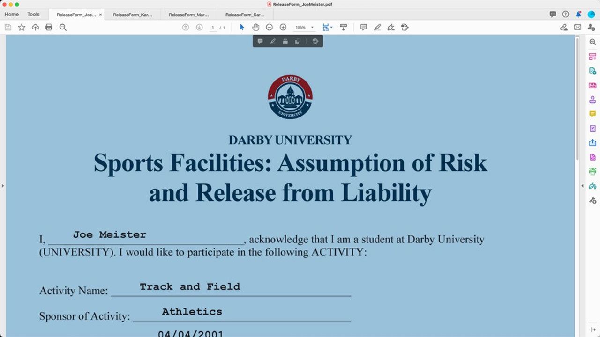
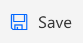
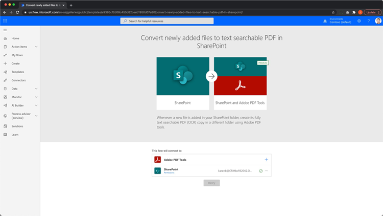
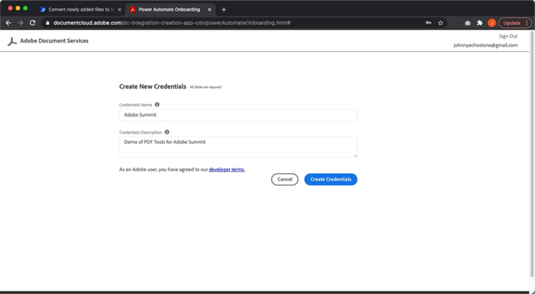

# Automatisation des documents avec Adobe Sign pour Microsoft Power Platform

Découvrez comment activer et utiliser les connecteurs Adobe Sign et Adobe PDF Tools pour Microsoft Power Apps. Créez des flux de travaux qui automatisent les processus d’approbation et de signature métier rapidement et en toute sécurité, sans aucun code. Ce tutoriel pratique décrit en quatre parties dans les liens ci-dessous :

<table style="table-layout:fixed">
<tr>
  <td>
    
    

    <a href="documentautomation.md#part1"><strong>Partie 1 : Stockage de l’accord signé dans SharePoint avec Adobe Sign</strong></a>
    

  </td>
  <td>
    
    

    <a href="documentautomation.md#part2"><strong>Partie 2 : Processus d’approbation automatisé pour obtenir une signature électronique avec Adobe Sign</strong></a>
    

  </td>
  <td>
   
    

    <a href="documentautomation.md#part3"><strong>Partie 3 : ROC de document automatisée avec les outils Adobe PDF</strong></a>
    

  </td>
  <td>
   
    

    <a href="documentautomation.md#part4"><strong>Partie 4 : Assemblage automatisé de documents avec Adobe PDF Tools</strong></a>
    

  </td>
</tr>
</table>

## Conditions préalables

* Connaissance de Microsoft 365 et de Power Automate
* Connaissances Adobe Sign
* Compte Microsoft 365 avec accès à SharePoint et Power Automate (Basic pour Adobe Sign, Premium pour Adobe PDF Tools)
* Compte de développeur Adobe Sign for enterprise ou Adobe Sign

**Exercices 1 et 2**

* compte Adobe Sign avec accès à l’API. Un compte de développeur ou un compte d’entreprise.
* Site SharePoint accessible par Power Automate auquel vous disposez des autorisations de modification. L’accès administrateur complet est recommandé.
* Exemple de document pour la demande d’approbation de signature et la signature.

**Exercices 3 et 4**

Télécharger les documents [ici](https://github.com/benvanderberg/adobe-sign-pdftools-powerautomate-tutorial)

## Partie 1 : Stockage de l’accord signé dans SharePoint avec Adobe Sign {#part1}

Dans la première partie, vous utiliserez un modèle Power Automate Flow pour configurer un flux de travaux automatisé qui enregistrera tous les accords signés sur votre site SharePoint.

1. Accédez à Power Automate.
1. Search for Adobe Sign.

   

1. Sélectionnez **Enregistrer un accord Adobe Sign terminé dans la bibliothèque SharePoint**.

   

1. Passez en revue l’écran et configurez les connexions nécessaires. Activez la connexion Adobe Sign.
1. Cliquez sur le symbole bleu `+`.

   

1. Saisissez l’adresse e-mail de votre compte Adobe Sign et cliquez sur le champ Mot de passe dans la nouvelle fenêtre.

   

   Attendez un instant que l’Adobe vérifie votre compte.

   >[!NOTE]
   >
   >Cette vérification vous mènera à la connexion appropriée si vous utilisez une Adobe ID ou notre SSO d&#39;entreprise.

1. Terminer la connexion.
1. Cliquez sur **Continuer** pour accéder à l’écran de modification Flux.
1. Nommez le déclencheur.

   

1. Configurez vos paramètres SharePoint.

   

   **Adresse du site :** votre site SharePoint
   **Chemin d’accès du dossier :** chemin d’accès aux documents partagés que vous souhaitez utiliser
   **Nom de fichier :** Accepter la valeur par défaut
   **Contenu du fichier :** Accepter la valeur par défaut

1. Enregistrement du flux.

   

1. Accédez à l’écran d’aperçu de l’enchaînement à l’aide de la flèche de retour bleue. Vous allez tester ce flux dans la deuxième partie.

   

Vous allez tester ce flux dans la partie suivante.

## Partie 2 : Processus d’approbation automatisé pour obtenir une signature électronique avec Adobe Sign {#part2}

Dans la deuxième partie, nous construisons la première partie avec un flux plus robuste et testons les deux flux pour les voir en action.

1. Sélectionnez **Modèles** sur le côté gauche de l&#39;interface d&#39;automatisation de l&#39;alimentation.

   

1. Recherchez &quot;approbation du gestionnaire&quot;.
1. Sélectionnez **Demander l&#39;approbation du Gestionnaire de requêtes pour un fichier sélectionné**.

   

   Vérifiez les connexions et ajoutez celles qui vous manquent.

   >[!NOTE]
   >
   >S’il s’agit du premier flux que vous effectuez avec les approbations, elles seront entièrement configurées lors de l’exécution du flux.

1. Cliquez sur **Continuer** pour accéder à l’écran d’édition de flux.

   Ce flux comporte de nombreuses étapes préconfigurées, notamment la vérification des erreurs et les étapes conditionnelles imbriquées.

1. Configurez **Pour un fichier sélectionné** comme suit :
   **Adresse du site :** votre site SharePoint
   **Nom de bibliothèque :** votre référentiel de documents
1. Ajoutez une entrée comme suit :
   **Type** : E-mail
   **Nom** : Adresse électronique du signataire

   

1. Configurez **Obtenir les propriétés du fichier :** comme suit :
   **Adresse du site :** votre site SharePoint
   **Nom de bibliothèque :** votre référentiel de documents

1. Faites défiler la liste vers le bas et recherchez **Si oui**.

   

1. Cliquez sur **Ajouter une action** dans la zone **Si oui** (et non dans la partie inférieure) pour ajouter les étapes à envoyer pour signature.

   

1. Recherchez **SharePoint get file content** et choisissez **Get file content**.

   

1. Configurez **Obtenir le contenu du fichier** comme suit :

   

   **Adresse du site :** votre site SharePoint.
   **Identificateur de fichier :** recherchez &quot;identificateur&quot;, puis choisissez Identificateur dans l’étape  **Obtenir les** propriétés du fichier.
1. Recherchez &quot;Adobe&quot; et choisissez **Adobe Sign** pour ajouter une autre action.

   

1. Saisissez &quot;upload&quot; dans la zone de recherche d&#39;Adobe Sign, puis sélectionnez **Charger un document et obtenir un ID de document**.
1. Recherchez la variable dynamique **Nom** pour obtenir le nom de l’élément/document sélectionné dans le déclencheur sous **Nom du fichier**.
1. Cliquez sur **Expression** dans l&#39;assistant de variable sous **Contenu du fichier**.

   

1. Ajoutez une seule apostrophe, puis cliquez sur **Contenu dynamique**, supprimez votre apostrophe, sélectionnez **Contenu du fichier**, puis cliquez sur **OK**.

   Assurez-vous qu’il n’y a pas d’apostrophes supplémentaires et qu’elles ressemblent à l’exemple ci-dessous.

   

1. Recherchez &quot;créer&quot; dans la zone de recherche Adobe Sign pour ajouter une autre action Adobe Sign.
1. Sélectionnez **Créer un accord à partir d’un document chargé et l’envoyer pour signature**.

   

1. Configurez les informations requises :
Sélectionnez **Nom** dans l’assistant de variable dynamique dans **Nom de l’accord**.
Sélectionnez **ID de document** dans l&#39;assistant de variable dynamique dans **ID de document**.
Sélectionnez **Adresse électronique du signataire** dans l&#39;assistant de variable dynamique dans **Adresse électronique du participant**.
Entrez &quot;1&quot; dans **Ordre des participants**.
Sélectionnez **Signataire** dans la liste déroulante **Rôle de participant**.

   

1. **** Enregistrez Le Flux.

### Test du flux

Accédez au référentiel de documents de votre site SharePoint pour le tester.

1. Sélectionnez le document et choisissez **Automatiser** et **Flux** que vous venez de créer.

   

1. Démarrez le flux pour valider les connexions (première exécution du flux uniquement).
1. Entrez un message de bienvenue à l&#39;approbateur dans **Message**.
1. Saisissez l’adresse électronique du signataire du document dans **Adresse électronique du signataire**.
1. Cliquez sur **Exécuter enchaînement**.

L’approbateur configuré pour l’utilisateur démarrant le flux recevra une demande d’approbation. Vous pouvez approuver par courrier électronique ou via le menu Élément d&#39;action Power Automate.
Une fois approuvé, signez votre document. Selon votre utilisateur et s’il est connecté à Sign, vous devrez peut-être ouvrir les fenêtres de signature dans une fenêtre de navigateur privée.

Terminez la signature, puis revenez dans votre dossier SharePoint.

## Partie 3 : ROC de document automatisée avec les outils Adobe PDF {#part3}

Dans la troisième partie, vous apprendrez à automatiser la reconnaissance optique des caractères dans les fichiers PDF lorsqu’ils sont importés dans Microsoft SharePoint. Cela résout un problème qui se produit avec les documents PDF numérisés qui ne peuvent pas faire l’objet d’une recherche dans SharePoint.

### Configuration d’un dossier dans SharePoint

Accédez à Microsoft SharePoint où vous souhaitez stocker des documents.

1. Cliquez sur **+ Nouveau** pour créer un nouveau dossier nommé &quot;Contrats traités&quot;.
1. Cliquez sur **+ Nouveau** pour créer un dossier nommé &quot;Anciens contrats&quot;.

   

Ces dossiers sont désormais référencés dans le cadre de votre flux Power Automate.

### Création d’un enchaînement à partir d’un modèle

1. Connectez-vous à https://flow.microsoft.com.
1. Cliquez sur **Modèles** dans la barre latérale.

   

1. Sélectionnez **Convertir les fichiers nouvellement ajoutés en PDF indexable en texte dans SharePoint**.
1. Cliquez sur le symbole **+** en regard de Adobe PDF Tools.

   

1. Accédez à https://www.adobe.com/go/powerautomate_getstarted dans un nouvel onglet.
1. Cliquez sur **Prise en main**.

   

1. Connectez-vous avec votre Adobe ID.

   

1. Entrez le nom des informations d&#39;identification et la description des informations d&#39;identification, puis cliquez sur **Créer des informations d&#39;identification**.

   

   Gardez la fenêtre ouverte avec les informations d’identification. Vous devez les entrer dans Microsoft Power Automate.

   

1. Entrez les informations d&#39;identification et cliquez sur **Créer dans Microsoft Power Automate**.

   

1. Cliquez sur **Continuer**.

   

   Vous pouvez maintenant voir une vue du flux de travaux et vous devrez le configurer pour votre environnement.

1. Sélectionnez le champ Adresse du site et choisissez le site SharePoint que vous utilisez sous le déclencheur **Lorsqu&#39;un fichier est créé dans un dossier**.

   

1. Cliquez sur l’icône de dossier pour accéder au dossier Old Contracts situé sous ID de dossier.

   

1. Modifiez l’action **Créer un fichier** au bas de l’enchaînement :

   Remplacez **Adresse du site** par l&#39;adresse de votre site.
Spécifiez l&#39;emplacement du dossier Contrats traités dans le chemin du dossier.

1. Cliquez sur **Enregistrer** dans le coin supérieur droit.
1. Cliquez sur **Tester**.
1. Sélectionnez **Manuellement**.
1. Cliquez sur **Tester**.

   

### Testez le nouveau flux

1. Accédez au dossier Old Contracts dans SharePoint.
1. Accédez à E03/Old Contracts dans les fichiers d&#39;exercice que vous avez téléchargés.
1. Copiez les fichiers ReleaseFormXX.pdf dans le dossier Old Contracts de SharePoint.

   

Si vous accédez au dossier Contrats traités, vous pouvez voir vos fichiers PDF disponibles après avoir donné quelques instants à l’exécution du flux. Si vous ouvrez les fichiers PDF, vous pouvez voir que le texte est sélectionnable.
En outre, SharePoint indexe le document, ce qui vous permet de rechercher le contenu de vos documents à partir de la barre de recherche dans SharePoint.

## Partie 4 : Assemblage automatisé de documents avec Adobe PDF Tools {#part4}

Dans la quatrième partie, vous allez apprendre à fusionner de nombreux documents en fonction des informations fournies lors de la sélection et du démarrage d&#39;un flux à partir de Microsoft SharePoint. Dans ce scénario, le flux :

* Demandez des informations pour choisir ce que vous souhaitez inclure dans un pack pour un client.
* En fonction des informations fournies, il fusionne de nombreux documents. Ces documents comprennent une page de couverture et des livres blancs facultatifs.
* Le document fusionné est enregistré dans SharePoint.

### Importation de fichiers d’exercice dans SharePoint

1. Ouvrez le dossier E04 dans les fichiers Exercise.
1. Importez les dossiers Devis, Modèles et Documents générés dans SharePoint.

   

Ces dossiers seront utilisés à titre de référence. En particulier, vous utiliserez le fichier Devis.docx pour votre proposition.

Dans le dossier Modèles, un dossier Couvertures contient des pages de couverture conçues pour différentes villes. Il existe également un dossier Whitepapers qui contient des livres blancs supplémentaires facultatifs qui seront joints à la fin si cette option est sélectionnée.

### Importation de l’enchaînement dans Microsoft Power Automate

1. Connectez-vous à Microsoft Power Automate (https://flow.microsoft.com).
1. Cliquez sur **Mes flux**.

   

1. Cliquez sur **Importer**.

   

1. Cliquez sur **Télécharger** et sélectionnez le dossier GenerateDevis_20210311231623.zip dans E04/Flows/.

   

1. Cliquez sur **Importer**.

1. Cliquez sur l’icône de clé à molette sous Action en regard de **Envoyer la proposition au client**.

   

1. Sélectionnez **Créer en tant que nouveau** sous Configuration.
1. Définissez le nom de l&#39;enchaînement sous Nom de la ressource.
1. Cliquez sur **Enregistrer**.

   Répétez cette opération pour les autres ressources associées et sélectionnez votre connexion.

   

1. Cliquez sur **Importer** après avoir effectué toutes vos connexions.

### Définir pour un fichier sélectionné

Une fois l’enchaînement créé, procédez comme suit :

1. Cliquez sur **Modifier**.

   

1. Sélectionnez le déclencheur **Pour un fichier sélectionné**.

   Ajoutez votre site SharePoint à l’adresse du site.
Ajoutez votre bibliothèque dans la bibliothèque.

   

### Définir templateFolderPath

1. Cliquez sur la variable templateFolderPath.
1. Définissez le chemin d’accès à l’emplacement du dossier Templates dans le site SharePoint que vous avez importé.

### Définir la couverture Obtenir le contenu du fichier

1. Cliquez sur l’action **Couvrir**, qui développe l’étendue.
1. Développez **Couverture : Obtenir le contenu du fichier**.

   Définissez l’adresse du site sur votre site SharePoint.

   

### Définir le fichier sélectionné

1. Développez l&#39;action d&#39;étendue **Fichier sélectionné**.

   Modifiez l’adresse du site et le nom de la bibliothèque respectivement dans votre site SharePoint et votre bibliothèque sous **Propriétés du fichier**.
Modifiez l’adresse du site sur votre site SharePoint sous **Obtenir le contenu du fichier**.

   

### Définition de livres blancs

1. Cliquez sur l’action **Whitepapers**.
1. Développer **Condition : Ajouter un livre blanc**.

   

1. Développer **Livre blanc 1 : Obtenir le contenu du fichier à l’aide du chemin d’accès**.
Modifiez l’adresse du site sur votre site SharePoint spécifié.

Répétez les mêmes étapes pour **Condition : Ajoutez le livre blanc 2**.

### Définir un fichier

1. Développez **Créer un fichier**.

   Modifier l’adresse du site et le chemin d’accès du dossier au site SharePoint et au chemin d’accès où se trouve le dossier Generated Docs.

1. Cliquez sur **Enregistrer**.

### Test de votre flux

1. Accédez au dossier Devis dans SharePoint.
1. Sélectionnez le dossier Devis.docx.

   

1. Sélectionnez votre enchaînement dans le menu **Automatiser**.

   

1. Cliquez sur **Continuer** pour commencer le flux.

   

1. Sélectionnez votre couverture et les livres blancs que vous souhaitez ajouter.
1. Cliquez sur **Exécuter enchaînement**.

   

Accédez au dossier Générer des documents. Vous devriez maintenant voir votre fichier PDF généré.

### Ajout de Protect et d’autres actions à enchaîner

Maintenant que vous avez créé un enchaînement, vous allez le modifier pour chiffrer le document PDF avec un mot de passe. Cela vous explique également comment utiliser d’autres actions.

1. Revenez à la fin de votre enchaînement.
1. Cliquez sur le symbole **+** entre **Fusionner les fichiers PDF** et **Créer un fichier**.

   

1. Sélectionnez **Ajouter une action**.
1. Recherchez &quot;Adobe PDF Tools&quot;.

   

1. Sélectionnez **Protect PDF dans Affichage**.
1. Utilisez le contenu dynamique pour définir le champ Nom de fichier sur **Nom de fichier PDF à partir de Fusionner le fichier PDF**.

   

   Dans le déclencheur, un champ Mot de passe fait partie du formulaire d&#39;initiation. Nous pouvons l&#39;utiliser ici.

1. Recherchez le **champ Mot de passe** à l’aide du contenu dynamique et placez-le dans le champ Mot de passe.

   

1. Utilisez le contenu dynamique pour le définir sur **Contenu du fichier PDF à partir de la fusion de fichiers PDF** dans le champ Contenu du fichier.
1. Modifiez **Créer un fichier** pour obtenir le contenu du fichier à partir du fichier PDF Protect plutôt que de fusionner des fichiers PDF.
1. Développez **Créer un fichier**.
1. Effacez le champ Contenu du fichier.
1. Utilisez le contenu dynamique pour importer le **contenu du fichier PDF** à partir du **fichier PDF Protect à partir de l’affichage**.

### Test de votre flux

1. Accédez au dossier Devis dans SharePoint.
1. Sélectionnez Devis.docx.

   

1. Sélectionnez **Automatiser** pour choisir votre enchaînement.

   

1. Cliquez sur **Continuer** pour commencer le flux.

   

1. Sélectionnez la couverture et les livres blancs à ajouter.
1. Définissez le champ Mot de passe sur le mot de passe que vous souhaitez définir.
1. Cliquez sur **Exécuter enchaînement**.

   

1. Accédez au dossier Générer des documents.
Le fichier PDF généré doit s’afficher. Ouvrez le fichier PDF et vous êtes invité à saisir votre mot de passe PDF.

   
