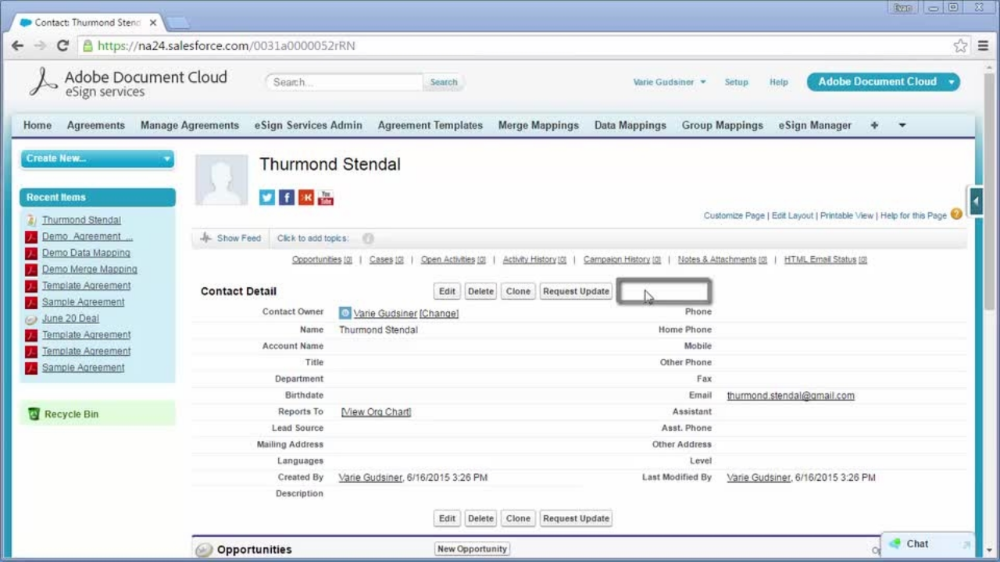
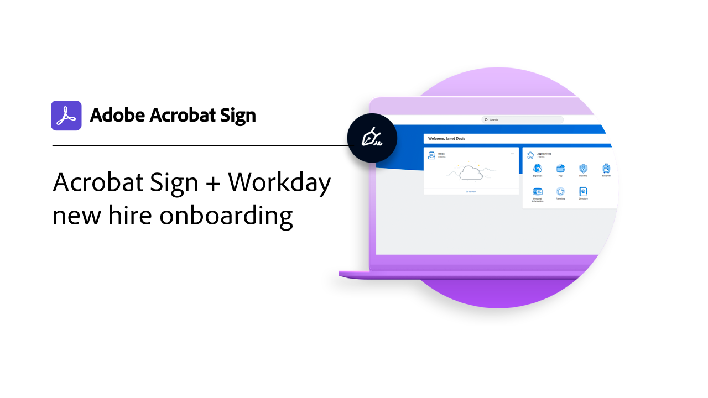
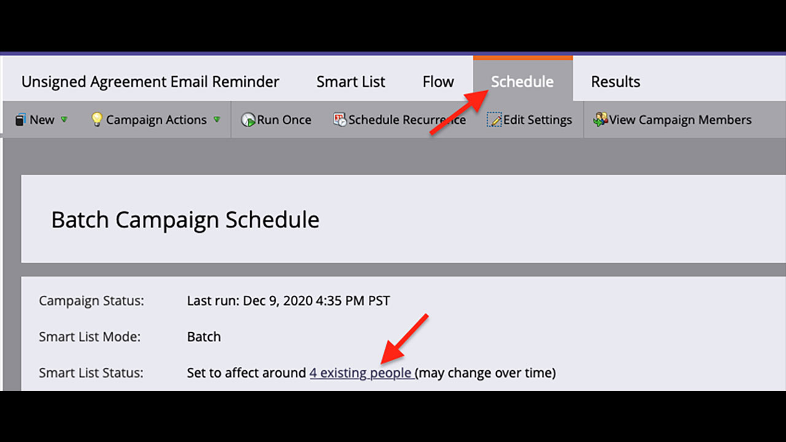

# Présentation des intégrations

Vous pouvez utiliser Acrobat Sign dans d’autres applications déjà utilisées par votre entreprise, telles que Microsoft, Salesforce, Workday et Marketo, pour n’en citer que quelques-unes. Découvrez comment simplifier vos workflows de signature électronique dans ces guides et tutoriels d’intégration.

>[!NOTE]
> Si vous rencontrez des difficultés pour accéder à l’une de ces fonctionnalités, contactez l’administrateur de votre organisation pour vous assurer que l’intégration est activée.

## Nouveautés

* [Microsoft Dynamics 365 for Field Service](dynamics-field-service.md)
Découvrez Acrobat Sign, [!DNL Power Automate], et [!DNL Microsoft Dynamics 365] pour le Service sur site sont utilisés pour rationaliser les engagements sur site des clients
* [Microsoft Dynamics 365 for Customer Service](dynamics-customer-service.md)
Découvrez Acrobat Sign et [!DNL Microsoft Dynamics 365] pour le service client sont utilisés pour améliorer la satisfaction des clients sur un portail Web client en libre-service
* [Intégration d’un formulaire web à [!DNL SharePoint] En ligne](integrate-web-form-sharepoint-online.md)
Découvrez comment mapper les données collectées à partir d’un formulaire web dans un [!DNL SharePoint] liste

## Tutoriels sur les intégrations Microsoft

<table style="table-layout:fixed">
<tr>
  <td>
    
    

    <a href="fill-and-sign-doc-microsoft-outlook.md"><strong>Remplissage et signature dans Microsoft Outlook</strong></a>
    

    <em>Remplir et signer un formulaire directement dans Microsoft Outlook</em>
     
  </td>
  <td>
    
    

    <a href="send-for-signature-with-outlook.md"><strong>Envoyer pour signature dans Outlook</strong></a>
    

    <em>Envoi d’un document pour signature directement dans Microsoft Outlook</em>
     
  </td>
  <td>
    
    

    <a href="send-for-signature-with-sharepoint-online.md"><strong>Envoyer pour signature dans SharePoint Online</strong></a>
    

    <em>Envoi d’un document pour signature directement dans SharePoint Online</em>
     
  </td>
   <td>
    
    

    <a href="track-an-agreement-with-sharepoint-online.md"><strong>Suivi dans SharePoint Online</strong></a>
    

    <em>Suivi de la progression d’un accord directement dans Microsoft Sharepoint</em>
     
  </td>
</tr>
<tr>
  <td>
    
    

    <a href="integrate-web-form-sharepoint-online.md"><strong>Intégration d’un formulaire web à [!DNL SharePoint Online]</strong></a>
    

    <em>Découvrez comment mapper les données collectées à partir d’un formulaire web dans un [!DNL SharePoint] liste</em>
     
  </td>
  <td>
    
    

    <a href="auto-archive-sharepoint-power-automate.md"><strong>Archiver automatiquement les fichiers dans [!DNL SharePoint] avec [!DNL Power Automate]</strong></a>
    

    <em>Découvrez comment archiver automatiquement les documents signés dans un [!DNL SharePoint] bibliothèque utilisation [!DNL Power Automate]</em>
     
  </td>
  <td>
    
    

    <a href="documentautomation.md"><strong>Automatisation des documents avec [!DNL Acrobat Sign for Microsoft Power Platform]</strong></a>
    

    <em>Découvrez comment activer et utiliser la fonctionnalité [!DNL Acrobat Sign] et [!DNL Adobe PDF Tools] connecteurs [!DNL Microsoft Power] applications</em>
     
  </td>
   <td>
    
    

    <a href="adobe-sign-teams-mortgage.md"><strong>Envoyer pour signature dans [!DNL Microsoft Teams]</strong></a>
    

    <em>Envoyer des documents pour signature directement dans [!DNL Microsoft Teams]</em>
     
  </td>
</tr>
<tr>
  <td>
    
    

    <a href="dynamics-customer-service.md"><strong>Microsoft Dynamics 365 for Customer Service</strong></a>
    

    <em>Découvrez Acrobat Sign et [!DNL Microsoft Dynamics 365] pour le service client sont utilisés pour améliorer la satisfaction des clients sur un portail Web client en libre-service</em>
     
  </td>
  <td>
    
    

    <a href="dynamics-field-service.md"><strong>Microsoft Dynamics 365 for Field Service</strong></a>
    

    <em>Découvrez Acrobat Sign, [!DNL Power Automate], et [!DNL Microsoft Dynamics 365] pour le Service sur site sont utilisés pour rationaliser les engagements sur site des clients</em>
     
  </td>
  <td>
    
    

     
  </td>
  <td>
    
    

     
  </td>
</tr>
</table>

## [!DNL Notarize] tutoriels d’intégration

<table style="table-layout:fixed">
<tr>
  <td>
    
    

    <a href="send-document-notarize.md"><strong>Envoi de documents pour authentification notariale</strong></a>
    

    <em>Découvrez comment envoyer un document pour authentification notariale</em>
     
  </td>
  <td>
    
    

     
  </td>
  <td>
    
    

     
  </td>
  <td>
    
    

     
  </td>
</tr>
</table>

## Tutoriels d’intégrations Salesforce

<table style="table-layout:fixed">
<tr>
  <td>
    
    

    <a href="create-an-agreement-template.md"><strong>Document Builder pour [!DNL Salesforce]</strong></a>
    

    <em>Découvrez comment créer un modèle de document réutilisable à l’aide de Document Builder pour [!DNL Salesforce]</em>
     
  </td>
  <td>
    
    

    <a href="set-up-data-mapping.md"><strong>Configuration du mappage de données</strong></a>
    

    <em>Réextraction des données dans Salesforce après la signature d’un accord</em>
     
  </td>
  <td>
    
    

    <a href="set-up-merging-map.md"><strong>Configuration du mappage de fusion dans Salesforce</strong></a>
    

    <em>Découvrez comment fusionner des données de Salesforce directement dans un document Acrobat Sign</em>
     
  </td>
  <td>
    
    

    <a href="create-a-custom-button.md"><strong>Création d’un bouton personnalisé</strong></a>
    

    <em>Création d’un bouton personnalisé qui démarre le processus d’envoi et renseigne automatiquement un accord dans Salesforce</em>
     
  </td>
</tr>
</table>

## Tutoriels d’intégration Workday

<table style="table-layout:fixed">
<tr>
 <td>
    
    

    <a href="acrobat-sign-workday-onboarding.md"><strong>Intégration d’Acrobat Sign + Workday pour les nouveaux employés</strong></a>
    

    <em>Découvrez comment rationaliser les workflows d’intégration avec Acrobat Sign + Workday</em>
     
  </td>
 <td>
    
    

     
  </td>
  <td>
    
    

     
  </td>
  <td>
    
    

     
  </td>
</tr>
</table>

## Tutoriels d’intégration et guides de configuration de Marketo

<table style="table-layout:fixed">
<tr>
  <td>
    
    

    <a href="marketo-salesforce-sms.md"><strong>Envoi de notifications à l’aide d’Acrobat Sign pour Salesforce et Marketo</strong></a>
    

    <em>Découvrez comment envoyer un SMS, un e-mail ou une notification push pour informer le signataire qu’un accord est en cours d’envoi.</em>
     
  </td>
  <td>
    
    

    <a href="marketo-salesforce-reminder.md"><strong>Envoi de rappels à l’aide du tutoriel vidéo Adobe Sign pour Salesforce et Marketo</strong></a>
    

    <em>Découvrez comment envoyer un rappel par e-mail depuis Marketo lorsqu’un accord n’est pas signé après un certain temps</em>
     
  </td>
  <td>
    
    

    <a href="marketo-salesforce-reminder.md"><strong>Envoyer des rappels à l’aide du guide de configuration d’Acrobat Sign pour Salesforce et Marketo</strong></a>
    

    <em>Découvrez comment envoyer un rappel par e-mail depuis Marketo lorsqu’un accord n’est pas signé après un certain temps</em>
     
  </td>
   <td>
    
    

    <a href="marketo-dynamics-reminder.md"><strong>Envoi de rappels à l’aide d’Acrobat Sign pour Microsoft Dynamics et Marketo</strong></a>
    

    <em>Découvrez comment envoyer un rappel par e-mail lorsqu’un accord n’est pas signé après un certain temps</em>
     
  </td>
</tr>
<tr>
  <td>
    
    

    <a href="marketo-dynamics-sms.md"><strong>Envoi de notifications à l’aide d’Acrobat Sign pour Microsoft Dynamics et Marketo</strong></a>
    

    <em>Découvrez comment envoyer un SMS, un e-mail ou une notification push pour informer le signataire qu’un accord est en cours d’envoi.</em>
     
  </td>
  <td>
    
    

     
  </td>
  <td>
    
    

     
  </td>
  <td>
    
    

     
  </td>
</tr>
</table>
