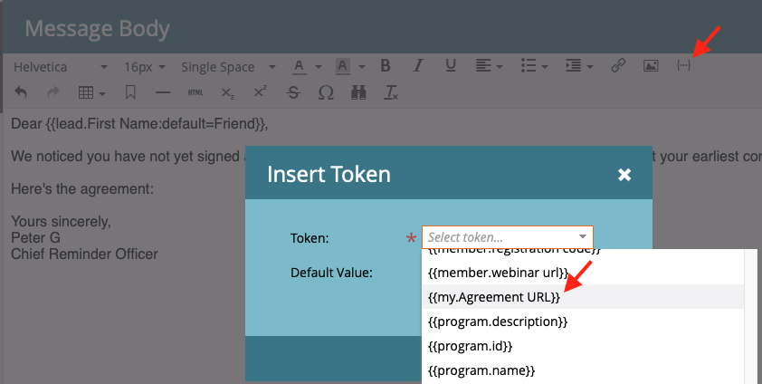

# Envoi de rappels à l’aide d’Acrobat Sign pour Microsoft Dynamics 365 et Marketo

Découvrez comment envoyer un rappel par e-mail lorsqu’un accord n’est pas signé après un certain temps. Cette intégration utilise Acrobat Sign, Acrobat Sign pour Microsoft Dynamics, Marketo et Marketo Microsoft Dynamics Sync.

## Conditions préalables

1. Installez Marketo Microsoft Dynamics Sync.

   Des informations et le dernier plug-in pour Microsoft Dynamics Sync sont disponibles [ici](https://experienceleague.adobe.com/docs/marketo/using/product-docs/crm-sync/microsoft-dynamics/marketo-plugin-releases-for-microsoft-dynamics.html).

1. Installez [Acrobat Sign pour Microsoft Dynamics](https://appsource.microsoft.com/fr-fr/product/dynamics-365/adobesign.f3b856fc-a427-4d47-ad4b-d5d1baba6f86).

   Des informations sur ce plug-in sont disponibles [ici](https://helpx.adobe.com/ca/sign/using/microsoft-dynamics-integration-installation-guide.html).

## Recherche de l’objet personnalisé

Une fois les configurations Marketo Microsoft Dynamics Sync et Acrobat Sign pour Dynamics terminées, deux nouvelles options apparaissent dans le terminal d’administration Marketo.


1. Cliquez sur **[!UICONTROL Synchronisation des entités Dynamics]**.

   La synchronisation doit être désactivée avant de synchroniser les entités personnalisées. Cliquez sur **Synchroniser le schéma** si c&#39;est votre première fois. Sinon, cliquez sur **Actualiser le schéma**.

   

## Synchronisation de l’objet personnalisé

1. Sur le côté droit, recherchez les objets personnalisés basés sur [!UICONTROL Lead], [!UICONTROL Contact] et [!UICONTROL Compte].

   * **Activez la synchronisation** pour les objets sous **[!UICONTROL Prospect]** si vous souhaitez envoyer un rappel lorsqu&#39;un [!UICONTROL Prospect] n&#39;a pas signé d&#39;accord dans Dynamics.

   * **Activez la synchronisation** pour les objets sous **[!UICONTROL Contact]** si vous souhaitez envoyer un rappel lorsqu&#39;un [!UICONTROL Contact] n&#39;a pas signé d&#39;accord dans Dynamics.

   * **Activez la synchronisation** pour les objets sous **[!UICONTROL Compte]** si vous souhaitez envoyer un rappel lorsqu&#39;un [!UICONTROL Compte] n&#39;a pas signé d&#39;accord dans Dynamics.

   * **Activez la synchronisation** pour l’objet accord sous le **[!UICONTROL parent]** souhaité ([!UICONTROL prospect], [!UICONTROL contact] ou [!UICONTROL compte]).

   

1. Dans la nouvelle fenêtre, sélectionnez les propriétés que vous souhaitez sous Accord, puis activez les cases sous **Contrainte** et **Déclencheur** pour les exposer à vos activités marketing.

   

   

1. Réactivez la synchronisation après avoir activé la synchronisation sur les objets personnalisés.

   Retournez dans Admin Terminal, cliquez sur **Microsoft Dynamics**, puis cliquez sur **Activer la synchronisation**.

   

   

## Créer le programme et le jeton

1. Dans la section Activités marketing de Marketo, cliquez avec le bouton droit sur **Activités marketing** dans la barre de gauche.

   Sélectionnez **Nouveau dossier de campagne** et donnez-lui un nom.

   

1. Cliquez avec le bouton droit de la souris sur le dossier créé, sélectionnez **Nouveau programme** et donnez-lui un nom.

   Laissez tout le reste comme défaut, puis cliquez sur **Créer**.

   

   

1. Cliquez sur **Mes jetons**, puis faites glisser **Script de messagerie** sur la zone de travail.

   

1. Donnez-lui un nom, puis cliquez sur **Cliquer pour modifier**.

   

1. Développez **[!UICONTROL Objets personnalisés]** sur le côté droit, puis développez l&#39;**[!UICONTROL objet Accord]**.

   Recherchez et faites glisser [!UICONTROL Nom], Statut de l’accord, Envoyé le et Url du signataire actuel sur le canevas.

1. Rédigez un script Velocity à l’aide de ces jetons pour afficher l’URL d’un accord non signé pendant une semaine. Voici un exemple qui compare la date actuelle à la date du jour :

   ```
   #foreach($agreement in $adobe_agreementList)
       #if($agreement.adobe_esagreementstatus == "Out for Signature")
           #set($todayCalObj = $date.toCalendar($date.toDate("yyyy-MM-dd",$date.get('yyyy-MM-dd'))) )
           #set($dateSentCalObj = $date.toCalendar($date.toDate("yyyy-MM-dd",$agreement.adobe_datesent)) )
           #set($dateDiff = ($todayCalObj.getTimeInMillis() - $dateSentCalObj.getTimeInMillis()) / 86400000 )
   
           #if($dateDiff >= 7)
               #set($agreementName = $agreement.adobe_name)
               #set($agreementURL = $agreement.adobe_currentsignerurl.substring(8))
               #break
           #else
           #end
       #else
       #end
   #end
   
   #if(${agreementName})
       <a href="https://${agreementURL}">${agreementName}</a>
   #else
       Please contact us. 
   #end
   ```

1. Cliquez sur **[!UICONTROL Enregistrer]**.

## Créer le rappel et ajouter une personnalisation

Exemples de personnalisation : nom du signataire, nom de l’accord, lien vers l’accord, etc.

1. Cliquez avec le bouton droit sur le programme que vous avez créé, cliquez sur **[!UICONTROL Nouvelle ressource locale]**, puis sélectionnez **[!UICONTROL Courrier électronique]**.

   

1. Dans le nouvel onglet, saisissez un **[!UICONTROL nom]** et une **[!UICONTROL description]** pour l’e-mail, puis sélectionnez un modèle dans le sélecteur de modèles.

   

1. Cliquez sur **[!UICONTROL Créer]**.

1. Définissez **[!UICONTROL Nom de l&#39;expéditeur]** et **[!UICONTROL Adresse de l&#39;expéditeur]**.

   

1. Cliquez sur le corps du message pour activer l’éditeur.

   Cliquez sur le bouton **[!UICONTROL Insérer un jeton]**, recherchez le jeton d’URL d’accord personnalisé que vous avez créé, puis cliquez sur **[!UICONTROL Insérer]**. Terminez la personnalisation de votre adresse e-mail, puis cliquez sur **[!UICONTROL Enregistrer]**.

   

1. Affichez un aperçu à l’aide d’un profil auquel un accord est affecté.

   Un lien vers l’URL doit s’afficher, avec le nom de l’accord comme libellé.

   

## Configuration du filtre Campagne intelligente

1. Cliquez avec le bouton droit sur le programme que vous avez créé, puis cliquez sur **[!UICONTROL Nouvelle campagne intelligente]**.

   

1. Donnez-lui un nom de votre choix, puis cliquez sur **[!UICONTROL Créer]**.

   

1. Recherchez, puis cliquez sur **[!UICONTROL Contient un accord]** et faites-le glisser vers la liste dynamique.

   

   Les champs exposés au déclencheur doivent être disponibles dans **[!UICONTROL Ajouter une contrainte]**.

1. Sélectionnez **[!UICONTROL État de l’accord]** et tout autre champ par lequel vous souhaitez filtrer.

   Pour chaque champ ajouté, définissez les valeurs par lesquelles filtrer. Dans ce cas, il se déclenche uniquement lorsque l&#39;**[!UICONTROL état de l&#39;accord]** est *Émis pour signature* et que l&#39;**[!UICONTROL Envoyé le]** est *au cours des semaines antérieures à 1 semaine*.

   

   >[!NOTE]
   >
   > Ajoutez un identificateur unique aux contraintes, comme **Nom**, si vous souhaitez que cette campagne s&#39;exécute uniquement pour certains accords.

1. Confirmez l&#39;audience de la campagne et voyez qui sera éligible dans l&#39;onglet Calendrier.

   

## Configuration du flux de campagne intelligent

Le filtre de campagne **Jours avant l&#39;expiration** ayant été utilisé, vous pouvez utiliser une périodicité planifiée pour la campagne.

1. Cliquez sur l&#39;onglet **[!UICONTROL Flux]** dans la [!UICONTROL Campagne intelligente].

   Recherchez et faites glisser le flux **Envoyer un e-mail** sur la zone de travail et sélectionnez l&#39;e-mail de rappel que vous avez créé dans la section précédente.

   

1. Cliquez sur l&#39;onglet **[!UICONTROL Planification]** dans la campagne intelligente. Assurez-vous que le flux de campagne est limité à une seule exécution par personne dans les **paramètres de campagne intelligents**. Cliquez ensuite sur l&#39;onglet **Planifier la périodicité**.

   

1. Définissez la **planification** sur _quotidienne_. Si nécessaire, choisissez un jour et une heure de début et une date de fin pour la campagne.

   

>[!TIP]
>
>Ce tutoriel fait partie du cours [Accélérer les cycles de vente avec Acrobat Sign pour Microsoft Dynamics et Marketo](https://experienceleague.adobe.com/?recommended=Sign-U-1-2021.1), disponible gratuitement sur Experience League !