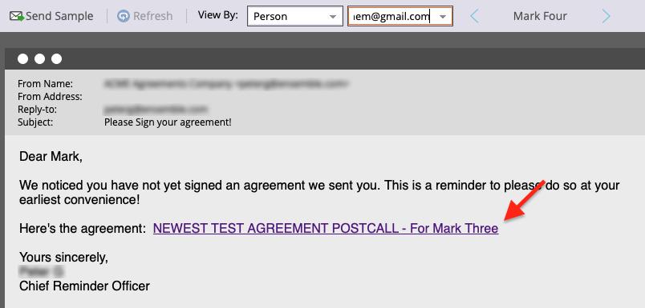

# Envoi de rappels à l’aide d’Adobe Sign pour Microsoft Dynamics 365 et Marketo

Découvrez comment envoyer un rappel par e-mail lorsqu’un accord n’est pas signé après un certain temps. Cette intégration utilise Adobe Sign, Adobe Sign pour Microsoft Dynamics, Marketo et Marketo Microsoft Dynamics Sync.

## Conditions préalables

1. Installez Marketo Microsoft Dynamics Sync.

   Des informations et le dernier plug-in pour Microsoft Dynamics Sync sont disponibles [ici.](https://experienceleague.adobe.com/docs/marketo/using/product-docs/crm-sync/microsoft-dynamics/marketo-plugin-releases-for-microsoft-dynamics.html)

1. Installer [Adobe Sign pour Microsoft Dynamics](https://appsource.microsoft.com/fr-fr/product/dynamics-365/adobesign.f3b856fc-a427-4d47-ad4b-d5d1baba6f86).

   Des informations sur ce plugin sont disponibles [ici.](https://helpx.adobe.com/ca/sign/using/microsoft-dynamics-integration-installation-guide.html)

## Recherche de l’objet personnalisé

Une fois les configurations Marketo Microsoft Dynamics Sync et Adobe Sign pour Dynamics terminées, deux nouvelles options s’affichent dans le terminal d’administration de Marketo.


1. Cliquez **[!UICONTROL Synchronisation des entités Dynamics]**.

   La synchronisation doit être désactivée avant de synchroniser les entités personnalisées. Cliquez **Synchroniser le schéma** si c&#39;est votre première fois. Sinon, cliquez sur **Actualiser le schéma**.

   

## Synchronisation de l’objet personnalisé

1. Sur le côté droit, localisez [!UICONTROL Prospect], [!UICONTROL Contact], et [!UICONTROL Compte]Objets personnalisés basés sur des balises.

   * **Activer la synchronisation** pour les objets sous **[!UICONTROL Prospect]** si vous souhaitez envoyer un rappel lorsqu’un [!UICONTROL Prospect] n’a pas signé d’accord dans Dynamics.

   * **Activer la synchronisation** pour les objets sous **[!UICONTROL Contact]** si vous souhaitez envoyer un rappel lorsqu’un [!UICONTROL Contact] n’a pas signé d’accord dans Dynamics.

   * **Activer la synchronisation** pour les objets sous **[!UICONTROL Compte]** si vous souhaitez envoyer un rappel lorsqu’un [!UICONTROL Compte] n’a pas signé d’accord dans Dynamics.

   * **Activer la synchronisation** pour l’objet d’accord sous la **[!UICONTROL Parent]** ([!UICONTROL Prospect], [!UICONTROL Contact], ou [!UICONTROL Compte]).

   

1. Dans la nouvelle fenêtre, sélectionnez les propriétés souhaitées sous Accord, puis activez les cases à cocher sous **Contrainte** et **Déclencheur** pour les exposer à vos activités marketing.

   

   

1. Réactivez la synchronisation après avoir activé la synchronisation sur les objets personnalisés.

   Revenez dans Admin Terminal, puis cliquez sur **Microsoft Dynamics**, puis cliquez sur **Activer la synchronisation**.

   

   

## Création du programme et du jeton

1. Dans la section Activités marketing de Marketo, cliquez avec le bouton droit de la souris sur **Activités marketing** dans la barre de gauche.

   Sélectionner **Nouveau dossier de campagne** et donnez-lui un nom.

   

1. Cliquez avec le bouton droit de la souris sur le dossier créé, sélectionnez **Nouveau programme** et donnez-lui un nom.

   Laissez le reste par défaut, puis cliquez sur **Créer**.

   

   

1. Cliquez sur **Mes jetons**, puis faites glisser **Email Script** sur la zone de travail.

   

1. Donnez-lui un nom, puis cliquez sur **Cliquer pour modifier**.

   

1. Développer **[!UICONTROL Objets personnalisés]** sur le côté droit, puis développez la **[!UICONTROL Accord]** objet.

   Recherche et déplacement [!UICONTROL Nom], État de l’accord, Envoyé le et URL du signataire actuel sur la zone de travail.

1. Rédigez un script Velocity à l’aide de ces jetons pour afficher l’URL d’un accord non signé pendant une semaine. Voici un exemple qui compare la date du jour à Envoyer le :

   ```
   #foreach($agreement in $adobe_agreementList)
       #if($agreement.adobe_esagreementstatus == "Out for Signature")
           #set($todayCalObj = $date.toCalendar($date.toDate("yyyy-MM-dd",$date.get('yyyy-MM-dd'))) )
           #set($dateSentCalObj = $date.toCalendar($date.toDate("yyyy-MM-dd",$agreement.adobe_datesent)) )
           #set($dateDiff = ($todayCalObj.getTimeInMillis() - $dateSentCalObj.getTimeInMillis()) / 86400000 )
   
           #if($dateDiff >= 7)
               #set($agreementName = $agreement.adobe_name)
               #set($agreementURL = $agreement.adobe_currentsignerurl.substring(8))
               #break
           #else
           #end
       #else
       #end
   #end
   
   #if(${agreementName})
       <a href="https://${agreementURL}">${agreementName}</a>
   #else
       Please contact us. 
   #end
   ```

1. Cliquez sur **[!UICONTROL Enregistrer]**.

## Création du rappel et personnalisation

Voici quelques exemples de personnalisation : le nom du signataire, le nom de l’accord, un lien vers l’accord, etc.

1. Cliquez avec le bouton droit de la souris sur le programme que vous avez créé, puis cliquez sur **[!UICONTROL Nouvelle ressource locale]**, puis sélectionnez **[!UICONTROL Email]**.

   

1. Dans le nouvel onglet, entrez un **[!UICONTROL Nom]** et **[!UICONTROL Description]** pour l’e-mail et sélectionnez un modèle dans le sélecteur de modèles.

   

1. Cliquez sur **[!UICONTROL Créer]**.

1. Définissez la **[!UICONTROL Nom de départ]** et **[!UICONTROL Adresse source]**.

   

1. Cliquez sur le corps du message pour activer l&#39;éditeur.

   Cliquez sur le bouton **[!UICONTROL Insérer un jeton]** , recherchez le jeton d’URL d’accord personnalisé que vous avez créé, puis cliquez sur **[!UICONTROL Insérer]**. Terminez la personnalisation de votre courrier électronique, puis cliquez sur **[!UICONTROL Enregistrer]**.

   

1. Prévisualisez à l’aide d’un profil auquel un accord est affecté.

   Vous devriez voir un lien vers l’URL avec le nom de l’accord comme libellé.

   

## Configuration du filtre de campagne dynamique

1. Cliquez avec le bouton droit sur le programme que vous avez créé, puis cliquez sur **[!UICONTROL Nouvelle campagne intelligente]**.

   

1. Donnez-lui le nom de votre choix, puis cliquez sur **[!UICONTROL Créer]**.

   

1. Rechercher, puis cliquer et faire glisser **[!UICONTROL A un accord]** à la liste dynamique.

   

   Les champs que vous avez exposés au déclencheur doivent être disponibles dans **[!UICONTROL Ajouter une contrainte]**.

1. Sélectionner **[!UICONTROL Statut des accords]** et tout autre champ par lequel vous souhaitez filtrer.

   Pour chaque champ ajouté, définissez les valeurs de filtrage. Dans ce cas, il se déclenche uniquement lorsque l’attribut **[!UICONTROL Statut des accords]** est *Émis pour signature* et **[!UICONTROL Envoyé le]** est *dans le passé avant 1 semaine*.

   

   >[!NOTE]
   >
   > Ajouter un identificateur unique aux contraintes, comme **Nom**, si vous souhaitez que cette campagne s’exécute uniquement pour certains accords.

1. Confirmez le public de la campagne et voyez qui sera éligible dans l&#39;onglet Programme.

   

## Configuration du flux de campagnes intelligentes

Parce que le filtre de campagne **Jours avant expiration** a été utilisé, vous pouvez utiliser une périodicité planifiée pour la campagne.

1. Cliquez sur le bouton **[!UICONTROL Flux]** dans la boîte de dialogue [!UICONTROL Smart Campaign].

   Recherchez et faites glisser le **Envoyer un courrier électronique** dans la zone de travail et sélectionnez l’e-mail de rappel que vous avez créé dans la section précédente.

   

1. Cliquez sur le bouton **[!UICONTROL Planification]** dans la fenêtre Smart Campaign. Assurez-vous que le flux de campagne est limité à une seule exécution par personne dans le **Paramètres Smart Campaign**. Cliquez ensuite sur l’icône **Planifier la périodicité** .

   

1. Définissez la **Planification** à _Quotidien_. Choisissez un jour et une heure de début et une date de fin pour la campagne, si nécessaire.

   

>[!TIP]
>
>Ce tutoriel fait partie du cours [Accélérez les cycles de vente avec Adobe Sign pour Microsoft Dynamics et Marketo](https://experienceleague.adobe.com/?recommended=Sign-U-1-2021.1) qui est disponible gratuitement sur Experience League !