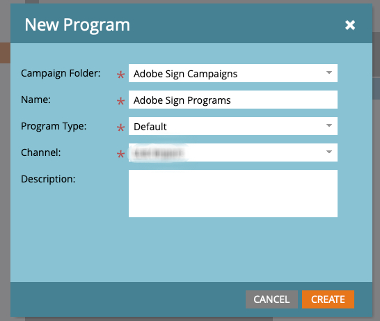
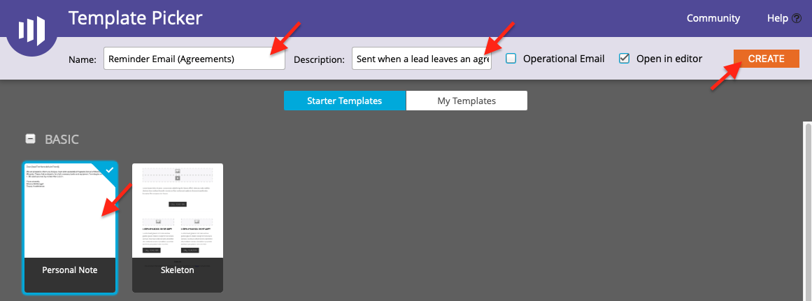

# Envoyer des rappels à l’aide du guide de configuration Adobe Sign pour Salesforce et Marketo

Découvrez comment envoyer un rappel par e-mail depuis Marketo lorsqu’un accord n’est pas signé au bout d’un certain temps. Cette intégration utilise Adobe Sign, Adobe Sign pour Salesforce, Marketo et Marketo et Salesforce Sync.

## Conditions préalables

1. Installez Marketo Salesforce Sync.

   Les informations et le dernier module externe pour la synchronisation Salesforce sont disponibles [ici.](https://experienceleague.adobe.com/docs/marketo/using/product-docs/crm-sync/salesforce-sync/understanding-the-salesforce-sync.html)

1. Installez Adobe Sign pour Salesforce.

   Des informations sur ce module externe sont disponibles [ici.](https://helpx.adobe.com/ca/sign/using/salesforce-integration-installation-guide.html)

## Recherche de l’objet personnalisé

Lorsque les configurations Marketo Salesforce Sync et Adobe Sign for Salesforce sont terminées, plusieurs nouvelles options apparaissent dans le terminal d’administration Marketo.


1. Si c&#39;est votre première fois, cliquez sur **Synchroniser le schéma**. Sinon, cliquez sur **Actualiser le schéma**.

   

1. Si la synchronisation globale est en cours d’exécution, désactivez-la en cliquant sur **Désactiver la synchronisation globale**.

   

1. Cliquez sur **Actualiser le schéma**.

   

## Synchronisation de l’objet personnalisé

Sur le côté droit, voir Objets personnalisés basés sur une piste, un contact et un compte.

**Activez** Synchroniser les objets sous Piste si vous souhaitez envoyer un rappel lorsqu’une Piste n’a pas signé d’accord dans Salesforce.

**Activez** Synchroniser pour les objets sous Contact si vous souhaitez envoyer un rappel lorsqu’un Contact n’a pas signé d’accord dans Salesforce.

**Activez** Synchroniser pour les objets situés sous Compte si vous souhaitez envoyer un rappel lorsqu’un compte n’a pas signé d’accord dans Salesforce.

1. **Activez** Synchroniser pour l’objet  **** Accord affiché sous le parent souhaité (Piste, Contact ou Compte). Procédez ainsi pour tous les autres objets personnalisés que vous souhaitez synchroniser.

   

1. Les actifs suivants montrent comment activer la **synchronisation**.

   

   

## Exposer les champs d’objet personnalisés aux déclencheurs

1. Lorsque la synchronisation globale est désactivée, sélectionnez l’objet personnalisé d’accord pour lequel vous avez activé la synchronisation, puis **Modifier les champs visibles**.

1. Cochez le champ &quot;Nom de l’accord&quot; dans la colonne Déclencheur pour l’exposer à vos Déclencheurs d’action de campagne. Vérifiez les autres champs par lesquels vous souhaitez filtrer, puis **Enregistrer**.

   

   

1. Lorsque vous avez terminé d’activer la synchronisation sur les objets personnalisés et d’exposer les valeurs de déclencheurs, n’oubliez pas de réactiver la synchronisation :

   

## Création du programme et du jeton

1. Dans la section Activités marketing de Marketo, cliquez avec le bouton droit de la souris sur **Activités marketing** dans la barre de gauche, sélectionnez **Nouveau dossier de campagne** et donnez-lui un nom.

   

1. Cliquez avec le bouton droit de la souris sur le dossier créé, sélectionnez **Nouveau programme**, puis donnez-lui un nom. Conservez tous les autres paramètres par défaut, puis cliquez sur **Créer**.

   

   

1. Cliquez sur **Mes jetons**, puis faites glisser **Script d&#39;e-mail** vers la zone de travail.

   

1. Donnez-lui un nom, puis cliquez sur **Cliquez sur Modifier**.

   

1. Développez **Objets personnalisés** sur le côté droit, puis développez l’objet **Accord**. Recherchez et faites glisser le nom de l’accord, l’état de l’accord, la date de signature et l’URL de signature sur la zone de travail.

1. Écrivez un script Velocity à l’aide de ces marques pour afficher l’URL de l’accord d’un accord qui n’est pas signé pendant une semaine. Voici un exemple qui compare la date actuelle à la date d’envoi :

   ```
   #foreach($agreement in $echosign_dev1__SIGN_Agreement__cList)
       #if($agreement.echosign_dev1__Status__c == "Out for Signature")
           #set($todayCalObj = $date.toCalendar($date.toDate("yyyy-MM-dd",$date.get('yyyy-MM-dd'))) )
           #set($dateSentCalObj = $date.toCalendar($date.toDate("yyyy-MM-dd",$agreement.echosign_dev1__DateSent__c)) )
           #set($dateDiff = ($todayCalObj.getTimeInMillis() - $dateSentCalObj.getTimeInMillis()) / 86400000 )
   
           #if($dateDiff >= 7)
               #set($agreementName = $agreement.Name)
               #set($agreementURL = $agreement.echosign_dev1__Signing_URL__c.substring(8))
               #break
           #else
           #end
       #else
       #end
   #end
   
   #if(${agreementName})
       <a href="https://${agreementURL}">${agreementName}</a>
   #else
       Please contact us. 
   #end
   ```

1. Cliquez sur **Enregistrer**.

## Création du rappel et ajout d’une personnalisation

Voici quelques exemples de personnalisation : le nom du signataire, le nom de l’accord, un lien vers l’accord, etc.

1. Cliquez avec le bouton droit de la souris sur le programme que vous avez créé et cliquez sur **Nouvel actif local**, puis sélectionnez **E-mail**.

   

1. Dans le nouvel onglet, entrez **Nom** et **Description** pour l’e-mail et sélectionnez un modèle dans le sélecteur de modèles. Cliquez sur **Créer**.

   

1. Définissez les options **De nom** et **De l&#39;adresse**.

   

1. Cliquez sur le corps du message pour activer l’éditeur. Cliquez sur le bouton **Insérer un jeton**, recherchez le jeton d’URL d’accord personnalisé que vous avez créé, puis cliquez sur **Insérer**. Terminez la personnalisation de votre adresse électronique, puis cliquez sur **Enregistrer**.

   

1. Affichez un aperçu à l’aide d’un profil auquel un accord est affecté. Vous devriez voir apparaître un lien vers l’URL avec le nom de l’accord comme étiquette.

   

## Configuration du filtre de campagne dynamique

1. Cliquez avec le bouton droit de la souris sur le programme que vous avez créé, puis cliquez sur **Nouvelle campagne dynamique**.

   

1. Donnez-lui le nom de votre choix, puis cliquez sur **Créer**.

   

1. Recherchez, puis cliquez sur **Contient un accord** et faites-le glisser vers la liste dynamique.

   

1. Les champs que vous avez exposés au déclencheur doivent maintenant être disponibles dans **Ajouter une contrainte**. Sélectionnez **État de l’accord** et tous les autres champs par lesquels vous souhaitez filtrer. Pour chaque champ ajouté, définissez les valeurs par lesquelles filtrer. Dans ce cas, il se déclenchera uniquement lorsque l’état **de l’accord** est Émis pour signature et que **la date d’envoi** est passée avant 7 jours.

   

   >[!NOTE]
   >
   > d un identifiant unique aux contraintes, tel que **Nom de l&#39;accord**, si vous souhaitez que cette campagne s&#39;exécute uniquement pour certains accords.

1. Confirmez le public de la campagne et voyez qui sera éligible dans l&#39;onglet Calendrier.

   

## Configuration du flux de campagne dynamique

Comme le filtre de campagne **Jours non signés** a été utilisé, vous pouvez utiliser une périodicité planifiée pour la campagne.

1. Cliquez sur l&#39;onglet **Flux** dans la campagne dynamique. Recherchez et faites glisser l’enchaînement **Envoyer un e-mail** sur la zone de travail, puis sélectionnez l’e-mail de rappel que vous avez créé dans la section précédente.

   

1. Cliquez sur l&#39;onglet **Planifier** dans la campagne dynamique. Assurez-vous que le flux de campagne est limité à une seule exécution par personne dans les **paramètres de campagne dynamique**. Cliquez ensuite sur l&#39;onglet **Planifier la récurrence**.

   

1. Définissez **Planifier** sur Quotidien, choisissez un jour et une heure de début, ainsi qu&#39;une date de fin pour la campagne si nécessaire.

   

>[!TIP]
>
>Ce tutoriel fait partie du cours [Accélération des cycles de vente avec Adobe Sign pour Salesforce et Marketo](https://experienceleague.adobe.com/?recommended=Sign-U-1-2021.1) disponible gratuitement sur Experience League !
