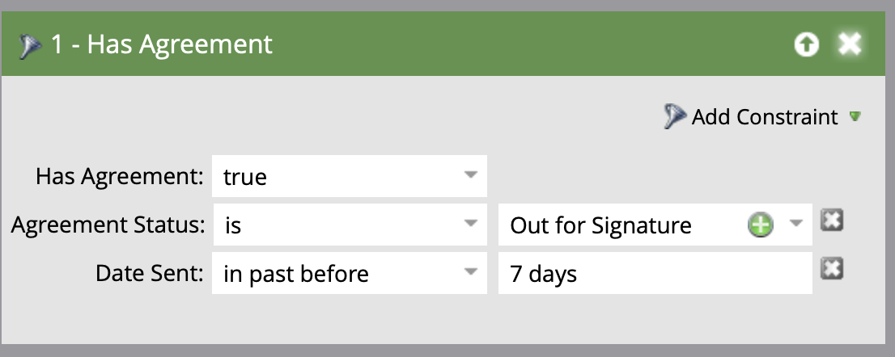

# Envoyer des rappels à l’aide du Guide de configuration d’Acrobat Sign pour Salesforce et Marketo

Découvrez comment envoyer un rappel par e-mail depuis Marketo lorsqu’un accord n’est pas signé après un certain temps. Cette intégration utilise Acrobat Sign, Acrobat Sign pour Salesforce, Marketo, ainsi que Marketo et Salesforce Sync.

## Conditions préalables

1. Installez Marketo Salesforce Sync.

   Des informations et le dernier plug-in pour Salesforce Sync sont disponibles [ici](https://experienceleague.adobe.com/docs/marketo/using/product-docs/crm-sync/salesforce-sync/understanding-the-salesforce-sync.html?lang=fr).

1. Installez Acrobat Sign pour Salesforce.

   Des informations sur ce plug-in sont disponibles [ici](https://helpx.adobe.com/ca/sign/using/salesforce-integration-installation-guide.html).

## Recherche de l’objet personnalisé

Lorsque les configurations Marketo Salesforce Sync et Acrobat Sign pour Salesforce sont terminées, plusieurs nouvelles options apparaissent dans le terminal d’administration Marketo.


1. Cliquez sur **Synchroniser le schéma** si c&#39;est votre première fois. Sinon, cliquez sur **Actualiser le schéma**.

   

1. Si la synchronisation globale est en cours d&#39;exécution, désactivez-la en cliquant sur **Désactiver la synchronisation globale**.

   

1. Cliquez sur **Actualiser le schéma**.

   

## Synchronisation de l’objet personnalisé

Sur le côté droit, voir Objets personnalisés Prospect, Contact et Compte.

**Activez la synchronisation** pour les objets sous Prospect si vous souhaitez envoyer un rappel lorsqu’un prospect n’a pas signé d’accord dans Salesforce.

**Activez la synchronisation** pour les objets sous Contact si vous souhaitez envoyer un rappel lorsqu&#39;un contact n&#39;a pas signé d&#39;accord dans Salesforce.

**Activez la synchronisation** pour les objets sous Compte si vous souhaitez envoyer un rappel lorsqu’un compte n’a pas signé d’accord dans Salesforce.

1. **Activez la synchronisation** pour l’objet **Accord** affiché sous le parent souhaité (prospect, contact ou compte). Procédez de la même manière pour tous les autres objets personnalisés que vous souhaitez synchroniser.

   

1. Les actifs suivants indiquent comment **activer la synchronisation**.

   

   

## Exposer les champs d’objet personnalisés aux déclencheurs

1. Lorsque la synchronisation globale est désactivée, sélectionnez l’objet personnalisé Accord pour lequel vous avez activé la synchronisation, puis **Modifier les champs visibles**.

1. Cochez le champ Nom de l’accord dans la colonne de déclenchement pour l’exposer à vos déclencheurs d’action de campagne. Vérifiez tous les autres champs par lesquels vous souhaitez filtrer, puis **Enregistrer**.

   

   

1. Lorsque vous avez terminé d’activer la synchronisation sur les objets personnalisés et d’afficher les valeurs de déclenchement, n’oubliez pas de réactiver la synchronisation :

   

## Créer le programme et le jeton

1. Dans la section Activités marketing de Marketo, cliquez avec le bouton droit de la souris sur **Activités marketing** dans la barre de gauche, sélectionnez **Nouveau dossier de campagne** et donnez-lui un nom.

   

1. Cliquez avec le bouton droit de la souris sur le dossier créé, sélectionnez **Nouveau programme** et donnez-lui un nom. Laissez tout le reste comme défaut, puis cliquez sur **Créer**.

   

   

1. Cliquez sur **Mes jetons**, puis faites glisser **Script de messagerie** sur la zone de travail.

   

1. Donnez-lui un nom, puis cliquez sur **Cliquer pour modifier**.

   

1. Développez **Objets personnalisés** sur le côté droit, puis développez l&#39;**objet Accord**. Recherchez et faites glisser le nom de l’accord, le statut de l’accord, la date de signature et l’URL de signature sur le canevas.

1. Rédigez un script Velocity à l’aide de ces jetons pour afficher l’URL d’un accord non signé pendant une semaine. Voici un exemple qui compare la date actuelle à la date d’envoi :

   ```
   #foreach($agreement in $echosign_dev1__SIGN_Agreement__cList)
       #if($agreement.echosign_dev1__Status__c == "Out for Signature")
           #set($todayCalObj = $date.toCalendar($date.toDate("yyyy-MM-dd",$date.get('yyyy-MM-dd'))) )
           #set($dateSentCalObj = $date.toCalendar($date.toDate("yyyy-MM-dd",$agreement.echosign_dev1__DateSent__c)) )
           #set($dateDiff = ($todayCalObj.getTimeInMillis() - $dateSentCalObj.getTimeInMillis()) / 86400000 )
   
           #if($dateDiff >= 7)
               #set($agreementName = $agreement.Name)
               #set($agreementURL = $agreement.echosign_dev1__Signing_URL__c.substring(8))
               #break
           #else
           #end
       #else
       #end
   #end
   
   #if(${agreementName})
       <a href="https://${agreementURL}">${agreementName}</a>
   #else
       Please contact us. 
   #end
   ```

1. Cliquez sur **Enregistrer**.

## Créer le rappel et ajouter une personnalisation

Exemples de personnalisation : nom du signataire, nom de l’accord, lien vers l’accord, etc.

1. Cliquez avec le bouton droit sur le programme que vous avez créé, cliquez sur **Nouvelle ressource locale**, puis sélectionnez **Courrier électronique**.

   

1. Dans le nouvel onglet, saisissez un **nom** et une **description** pour l’e-mail, puis sélectionnez un modèle dans le sélecteur de modèles. Cliquez sur **Créer**.

   

1. Définissez **Nom de l&#39;expéditeur** et **Adresse de l&#39;expéditeur**.

   

1. Cliquez sur le corps du message pour activer l’éditeur. Cliquez sur le bouton **Insérer un jeton**, recherchez le jeton d’URL d’accord personnalisé que vous avez créé, puis cliquez sur **Insérer**. Terminez la personnalisation de votre adresse e-mail, puis cliquez sur **Enregistrer**.

   

1. Affichez un aperçu à l’aide d’un profil auquel un accord est affecté. Un lien vers l’URL doit s’afficher, avec le nom de l’accord comme libellé.

   

## Configuration du filtre Campagne intelligente

1. Cliquez avec le bouton droit sur le programme que vous avez créé, puis cliquez sur **Nouvelle campagne intelligente**.

   

1. Donnez-lui un nom de votre choix, puis cliquez sur **Créer**.

   

1. Recherchez, puis cliquez sur **Contient un accord** et faites-le glisser vers la liste dynamique.

   

1. Les champs que vous avez exposés au déclencheur doivent maintenant être disponibles dans **Ajouter une contrainte**. Sélectionnez **État de l’accord** et tout autre champ par lequel vous souhaitez filtrer. Pour chaque champ ajouté, définissez les valeurs par lesquelles filtrer. Dans ce cas, il se déclenchera uniquement lorsque l’**état de l’accord** est Émis pour signature et que la **date d’envoi** est passée avant 7 jours.

   

   >[!NOTE]
   >
   > d un identifiant unique pour les contraintes, comme **Nom de l’accord**, si vous souhaitez que cette campagne s’exécute uniquement pour certains accords.

1. Confirmez l&#39;audience de la campagne et voyez qui sera éligible dans l&#39;onglet Calendrier.

   

## Configuration du flux de campagne intelligent

Le filtre de campagne **Jours sans signature** ayant été utilisé, vous pouvez utiliser une périodicité planifiée pour la campagne.

1. Cliquez sur l&#39;onglet **Flux** dans la campagne intelligente. Recherchez et faites glisser le flux **Envoyer un e-mail** sur la zone de travail et sélectionnez l&#39;e-mail de rappel que vous avez créé dans la section précédente.

   

1. Cliquez sur l&#39;onglet **Planification** dans la campagne intelligente. Assurez-vous que le flux de campagne est limité à une seule exécution par personne dans les **paramètres de campagne intelligents**. Cliquez ensuite sur l&#39;onglet **Planifier la périodicité**.

   

1. Définissez la **Planification** sur Quotidienne, choisissez un jour et une heure de début, ainsi qu&#39;une date de fin pour la campagne si nécessaire.

   

