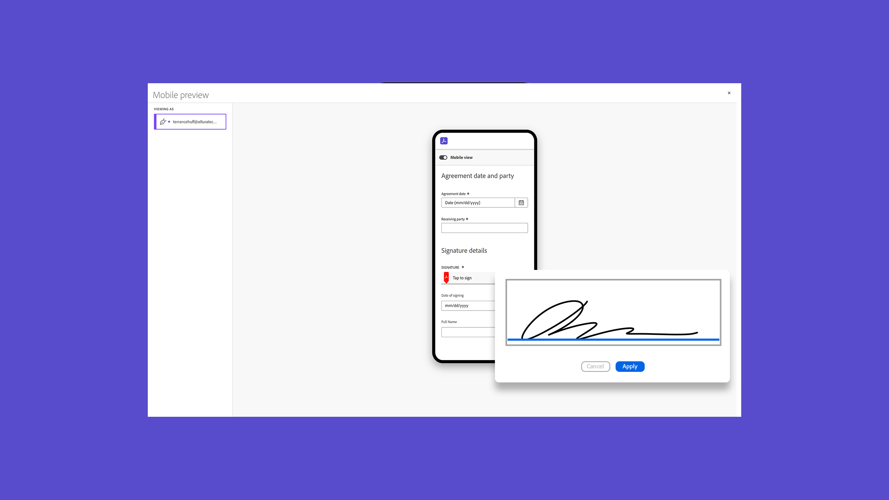

# Présentation mobile

Envoyez des documents pour signature, suivez la progression de la signature électronique et recevez des mises à jour en temps réel sur votre appareil mobile.

## Nouveautés

>[!BEGINTABS]

>[!TAB Vue mobile]

Découvrez comment utiliser la [vue mobile](mobile-friendly.md) pour remplir des formulaires sur votre appareil mobile.

>[!TAB Créer une vue adaptée aux mobiles]

Découvrez comment générer un document [adapté aux mobiles](create-mobile-friendly.md) de manière transparente, sans aucune assistance de la part des développeurs.

>[!ENDTABS]

<table style="table-layout:fixed">
<tr>
  <td>
    
    

    <a href="sign-mobile.md"><strong>Signer des documents où que vous soyez</strong></a>
    

    <em>Apprenez à signer des documents à l'aide de l'application mobile Acrobat Sign</em>
     
  </td>
  <td>
    
    

    <a href="mobile-friendly.md"><strong>Vue mobile</strong></a>
    

    <em>Découvrez comment utiliser l’affichage adapté aux appareils mobiles pour remplir des formulaires sur votre appareil mobile</em>
     
  </td>  
  <td>
    
    

    <a href="create-mobile-friendly.md"><strong>Créer une vue adaptée aux mobiles</strong></a>
    

    <em>Découvrez comment générer un document adapté aux appareils mobiles de manière transparente, sans aucune assistance de la part des développeurs</em>
     
  </td>
   <td>
    
    

    <a href="liquidmode.md"><strong>Liquid Mode dans Acrobat Sign</strong></a>
    

    <em>Découvrez comment Liquid Mode améliore l’expérience de signature mobile</em>
     
  </td>
</tr>
<tr>
  <td>
    
    

    <a href="https://apps.apple.com/us/app/adobe-acrobat-sign/id481082197_blank"><strong>Téléchargement de l’application mobile Acrobat Sign pour iOS</strong></a>
    

    <em>Télécharger l'application mobile Acrobat Sign à partir d'App Store</em>
     
  </td>
  <td>
    
    

    <a href="https://play.google.com/store/apps/details?id=com.adobe.echosign&amp;hl=en&amp;pli=1_blank"><strong>Téléchargement de l’application mobile Acrobat Sign pour Android</strong></a>
    

    <em>Téléchargez l’application mobile Acrobat Sign depuis Google Play</em>
     
  </td>
  <td>
    
    

     
  </td>
  <td>
    
    

     
  </td>
</tr>
</table>
