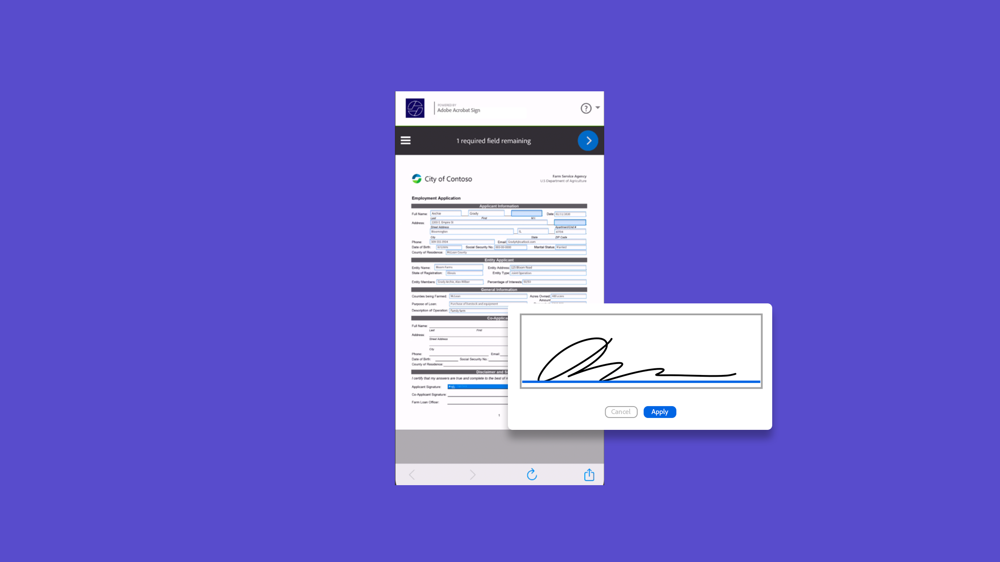

# Tutoriels Acrobat Sign

Acrobat Sign, une solution Adobe Document Cloud, évolue pour répondre aux besoins de votre organisation avec des intégrations, des API, une authentification avancée, des fonctionnalités d’administration supplémentaires, etc. Vous trouverez ici un large éventail d’expériences d’apprentissage conçues pour rapidement mettre à jour les connaissances des débutants et des administrateurs sur Acrobat Sign.

## Parcours d’apprentissage

<table style="table-layout:fixed">
<tr>
  <td>
    
    

    <a href="sign-beginner-tutorials/beginner-users-overview.md"><strong>Prise en main</strong></a>
    

    Découvrez comment envoyer, signer et suivre des documents
     
  </td>
  <td>
    
    

    <a href="sign-advanced-users/advanced-users-overview.md"><strong>Tâches avancées</strong></a>
    

    Allez au-delà des bases avec des tâches spécifiques et l'automatisation
     
  </td>
   <td>
    
    

    <a href="admin/intro-admin-overview.md"><strong>Administrateurs</strong></a> 
    

    Conseils de configuration de base à avancés pour votre organisation
     
  </td>
   <td>
    
    

    <a href="digitalid/digitalid-overview.md"><strong>ID numérique</strong></a>
    

    Découvrez comment utiliser les identifications numériques du monde entier dans Acrobat Sign
     
  </td>
</tr>
<tr>
    <td>
    
    

    <a href="integrations/integrations-overview.md"><strong>Intégrations</strong></a>
    

    Ajout d’Acrobat Sign directement dans une autre application
     
    </td>
  <td>
    
    

    <a href="sign-usecase/expand-inspire-overview.md"><strong>Secteurs et services</strong></a>
    

    Exploration des cas d’utilisation réels dans l’industrie et les services
     
  </td>
  <td>
    
    

    <a href="develop/develop-overview.md"><strong>Développement</strong></a>
    

    Obtenir des ressources de développement sur Acrobat Sign I/O
     
  </td>
  <td>
    
    

    <a href="deploy-overview.md"><strong>Déployer</strong></a>
    

    Informations et bonnes pratiques pour le déploiement d’Acrobat Sign au sein de votre organisation
     
  </td>
</tr>
<tr>
  <td>
    
    

    <a href="mobile/mobile-overview.md"><strong>Application mobile</strong></a>
    

    Envoyez, signez et obtenez des mises à jour en temps réel sur votre appareil mobile
     
  </td>
</tr>
</table>