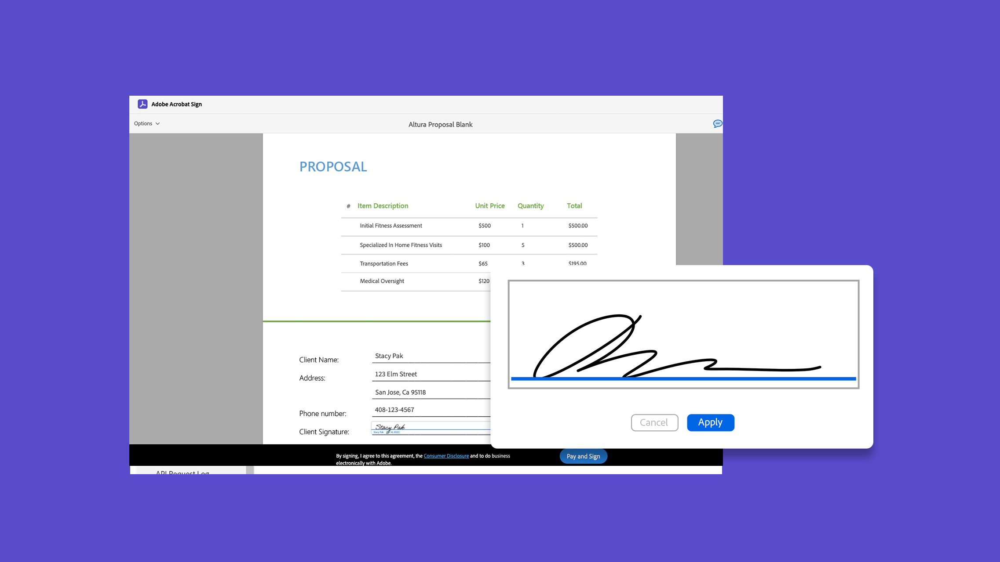

# Tutoriels Acrobat Sign

Acrobat Sign, une solution Adobe Document Cloud, évolue pour répondre aux besoins de votre organisation avec des intégrations, des API, une authentification avancée, des fonctionnalités d’administration supplémentaires, etc. Vous trouverez ici un large éventail d’expériences d’apprentissage conçues pour rapidement mettre à jour les connaissances des débutants et des administrateurs sur Acrobat Sign.

## Parcours d’apprentissage

<table style="table-layout:fixed">
<tr>
  <td>
    
    

      <a href="sign-beginner-tutorials/beginner-users-overview.md"><strong>Prise en main</strong></a>
      

      <em>Découvrez comment envoyer, signer et suivre des documents</em>
       
  </td>
  <td>
    
    

      <a href="sign-advanced-users/advanced-users-overview.md"><strong>Tâches avancées</strong></a>
      

      <em>Allez au-delà des bases avec des tâches spécifiques et l'automatisation</em>
       
  </td>  
  <td>
    
    

      <a href="admin/intro-admin-overview.md"><strong>Administrer</strong></a>
      

      <em>Conseils de configuration de base à avancés pour votre organisation</em>
       
  </td>
  <td>
    
     

      <a href="digitalid/digitalid-overview.md"><strong>ID numérique</strong></a>
      

      <em>Découvrez comment utiliser des identifications numériques du monde entier dans Acrobat Sign</em>
       
  </td>
</tr>
<tr>
  <td>
    
    

      <a href="integrations/integrations-overview.md"><strong>Intégrations</strong></a>
      

      <em>Ajoutez Acrobat Sign directement dans d'autres applications que votre organisation utilise déjà</em>
       
  </td>
  <td>
    
    

      <a href="sign-usecase/expand-inspire-overview.md"><strong>Secteurs et services</strong></a>
      

      <em>Explorez des cas d’utilisation réels du secteur et des services</em>
       
  </td>
  <td>
    
    

      <a href="develop/develop-overview.md"><strong>Développement</strong></a>
      

      <em>Obtenir des ressources de développement sur Acrobat Sign I/O</em>
       
  </td>
   <td>
    
    

      <a href="deploy-overview.md"><strong>Déployer</strong></a>
      

      <em>Informations et bonnes pratiques pour le déploiement d’Acrobat Sign au sein de votre organisation</em>
       
  </td>
</tr>
<tr>
  <td>
    
    

      <a href="mobile/mobile-overview.md"><strong>Application mobile</strong></a>
      

      <em>Envoyez, signez et recevez des mises à jour en temps réel sur votre appareil mobile</em>
       
  </td>  
</tr>
</table>
