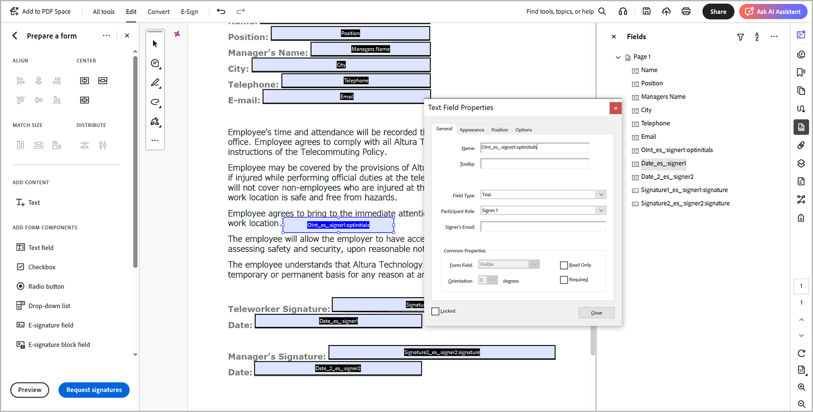
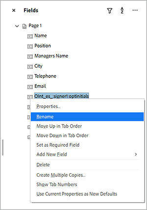

# Balisage de texte Acrobat Sign

Apprenez à créer des champs de formulaire Acrobat Sign avec balisage de texte. Les balises de texte peuvent être ajoutées directement aux outils de création tels que Microsoft Word, Adobe InDesign ou, si vous disposez d’un PDF, dans Acrobat. Ils peuvent réduire considérablement l’effort de préparation des documents utilisés dans Acrobat Sign. Après avoir chargé un document balisé dans Acrobat Sign, vous pouvez le configurer comme modèle, ce qui évite à quiconque d’ajouter des champs à ses documents.

## Prise en main

Les balises de texte sont des parties de texte au formatage unique, placées n’importe où dans un document et automatiquement reconnues comme champs lors du téléchargement vers Acrobat Sign.

Les balises de texte peuvent être ajoutées directement aux outils de création tels que Microsoft Word, Adobe InDesign ou, si vous disposez d’un PDF, Acrobat. Les balises de texte simplifient considérablement la préparation des documents utilisés dans Acrobat Sign.

### Ajout de balises dans Microsoft Word

Pour ajouter des balises de texte à un document Microsoft Word, consultez ce [tutoriel vidéo](text-tagging-word.md).

### Ajout de balises dans Acrobat

Adobe Acrobat dispose d’un environnement de création de formulaires robuste par glisser-déposer. L’application de balises de texte dans Acrobat vous permet d’exploiter d’autres fonctionnalités disponibles dans Acrobat Sign.

1. Ouvrez votre formulaire dans Acrobat.

1. Sélectionnez **[!UICONTROL Préparer un formulaire]** dans le panneau **[!UICONTROL Tous les outils]**.

1. Sélectionnez **[!UICONTROL Créer un formulaire]**.

1. Sélectionnez **[!UICONTROL Préparer le formulaire pour la signature électronique]** dans la liste déroulante du panneau **[!UICONTROL Options]**.

   

1. Sélectionnez **[!UICONTROL Suivant]** pour confirmer.

   

1. Double-cliquez sur un champ pour afficher la boîte de dialogue **[!UICONTROL Propriétés]**.

   Utilisez la syntaxe détaillée dans le [Guide des balises de texte d&#39;Acrobat Sign](https://helpx.adobe.com/fr/sign/using/text-tag.html) pour modifier le nom du champ de formulaire.

1. Par exemple, vous pouvez saisir *OInt_es_:signer1:optinitials* dans le nom du champ pour rendre un champ initial facultatif.

   

   Les balises de texte sont ajoutées au nom du champ de formulaire et, contrairement à la syntaxe que vous utiliseriez dans Microsoft Word (ou d’autres outils de création), les accolades ne sont pas incluses.

   Les balises de texte peuvent également être ajoutées dans le panneau Champs en renommant simplement le champ de formulaire.

   

1. Enregistrez et fermez le fichier.

1. Chargez le fichier dans Acrobat Sign et créez un modèle réutilisable, comme indiqué dans la section suivante.

### Créer un modèle réutilisable

Après avoir créé un document balisé, configurez-le en tant que modèle réutilisable, ce qui évite à quiconque d’ajouter des champs à ses documents.

Pour créer un modèle réutilisable, consultez ce [tutoriel vidéo](../sign-advanced-users/create-a-template.md).
