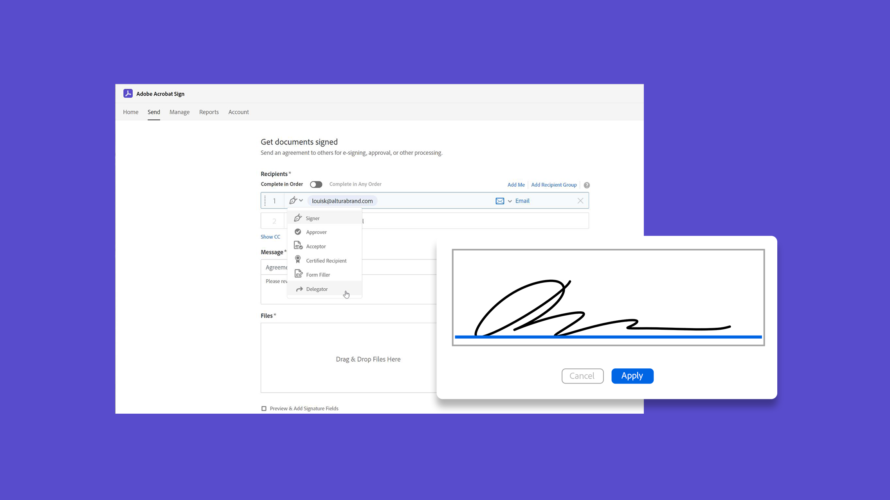
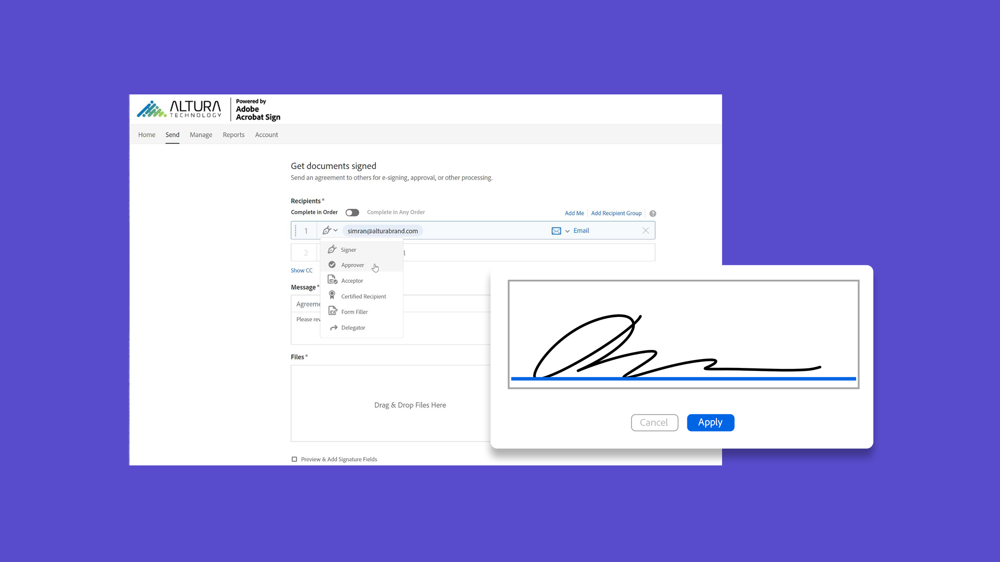
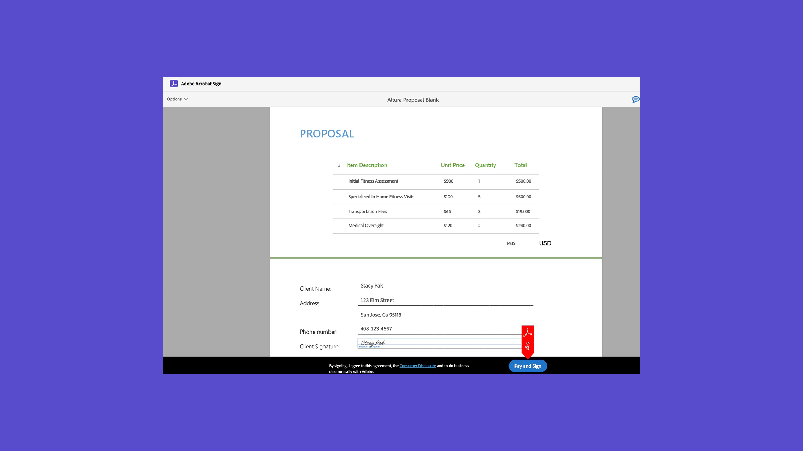
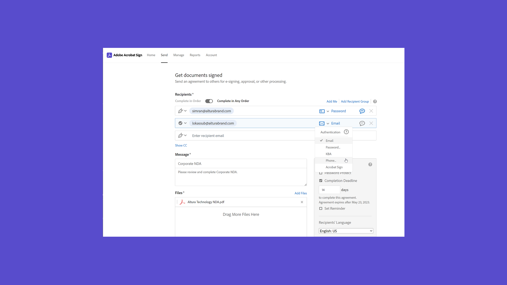
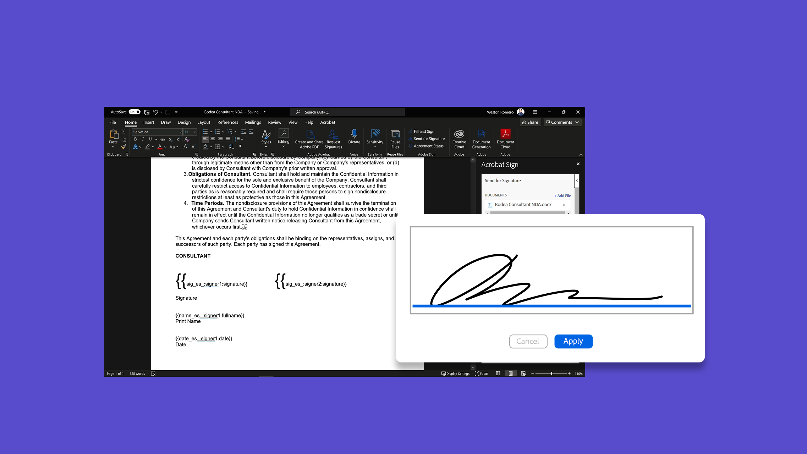
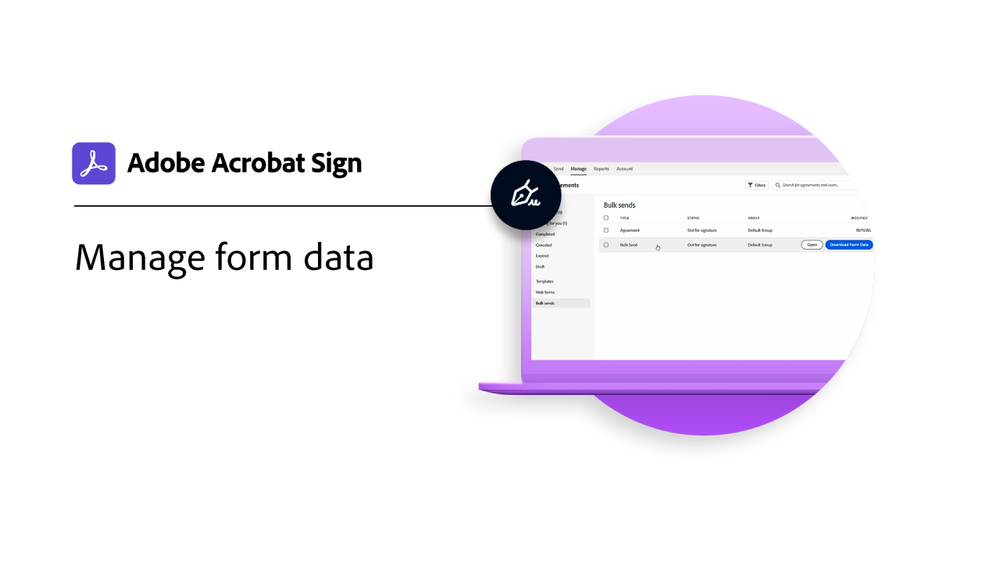

# Présentation des tâches avancées

Découvrez comment envoyer un document pour signature à des centaines de destinataires à la fois, configurer un document prêt à signer pour votre site web, gérer les transactions de signature, et créer et gérer des modèles de document. Ces tutoriels sont destinés à toute personne qui connaît déjà les bases de l’envoi et de la demande de signatures et souhaite en savoir plus sur la façon dont Acrobat Sign peut les utiliser.

## Nouveautés

>[!BEGINTABS]

>[!TAB Créer un workflow personnalisé]

Découvrez comment créer et utiliser des [workflows personnalisés](../admin/building-a-custom-workflow.md) pour accélérer le processus de création et d’envoi d’un accord.

>[!TAB Envoyer en masse]

Découvrez comment [recueillir des milliers](megasign.md) de signatures à la fois pour n’importe quel document en quelques étapes simples.

>[!TAB Méthodes d’authentification dans Acrobat Sign]

Découvrez toute la gamme de méthodes disponibles dans Acrobat Sign pour [authentifier](authentication-methods.md) l&#39;identité d&#39;une personne signataire d&#39;un document.

>[!ENDTABS]

## Send

<table style="table-layout:fixed">
<tr>
  <td>
    
    

    <a href="setting-up-routing.md"><strong>Configuration de l’ordre de signature</strong></a>
    

    <em>Configuration de l’ordre de signature pour plusieurs signataires</em>
     
  </td>
  <td>
      
    

    <a href="delegate-signature.md"><strong>Utilisation du rôle de délégant</strong></a>
    

    <em>Utilisez le rôle de délégant pour envoyer un document à un intermédiaire qui peut ensuite acheminer le document pour signature</em>
     
  </td>
  <td>
    
    

    <a href="add-an-approver.md"><strong>Utilisation du rôle d'approbateur</strong></a>
    

    <em>Ajouter un rôle d'approbateur à votre processus d'approbation de contrat</em>
     
  </td>
  <td>
      
      

      <a href="megasign.md"><strong>Envoyer en masse</strong></a>
      

      <em>Recueillez des centaines de signatures à la fois pour n’importe quel document en quelques étapes simples</em>
       
  </td>
</tr>
<tr>
  <td>
      
      

      <a href="webform.md"><strong>Création d’un formulaire web</strong></a>
      

      <em>Découvrez comment créer un document pouvant être signé électroniquement directement sur votre site web</em>
       
  </td>
  <td>
      
      

      <a href="../admin/building-a-custom-workflow.md"><strong>Créer un workflow personnalisé</strong></a>
      

      <em>Découvrez comment créer et utiliser des workflows personnalisés pour accélérer le processus de création et d’envoi d’un accord</em>
       
  </td>
  <td>
      
      

      <a href="set-up-online-payments.md"><strong>Configurer les paiements en ligne</strong></a>
      

      <em>Découvrez comment configurer et accepter les paiements en ligne dans vos documents</em>
       
  </td>
  <td>
      
      

      <a href="authentication-methods.md"><strong>Méthodes d’authentification dans Acrobat Sign</strong></a>
      

      <em>Découvrez la gamme de méthodes d’authentification d’identité disponibles dans Acrobat Sign</em>
       
  </td>
</tr>
<tr>
  <td>
      
      

      <a href="adobe-sign-text-tagging.md"><strong>Balisage de texte Acrobat Sign</strong></a>
      

      <em>Création de champs de formulaire Acrobat Sign à l’aide de balises de texte dans Adobe Acrobat</em>
       
    </td>
  <td>
    
    

    <a href="text-tagging-word.md"><strong>Utilisation du balisage de texte dans [!DNL Microsoft Word]</strong></a>
    

    <em>Découvrez comment créer un modèle de document réutilisable en ajoutant des balises de texte Acrobat Sign dans [!DNL Microsoft Word]</em>
     
  </td>
  <td>
    
    

     
  </td>
  <td>
    
    

     
  </td>
</tr>
</table>

## Gérer

<table style="table-layout:fixed">
<tr>
<td>
    
    

    <a href="creating-a-report.md"><strong>Utilisation des rapports et des transactions</strong></a>
    

    <em>Découvrez comment générer des rapports et suivre l'utilisation des transactions</em>
     
  </td>
  <td>
    
    

    <a href="edit-a-template.md"><strong>Gérer les modèles de document</strong></a>
    

    <em>Modifier ou supprimer un modèle de votre bibliothèque</em>
     
  </td>
  <td>
    
    

    <a href="modify-webform.md"><strong>Modifier un formulaire web existant</strong></a>
    

    <em>Découvrez comment désactiver, modifier et réactiver un formulaire web existant</em>
     
  </td>  
  <td>
    
    

    <a href="manage-webform-data.md"><strong>Gestion des données de formulaire web</strong></a>
    

    <em>Découvrez comment suivre, gérer et exporter des données à partir d’un formulaire web</em>
     
  </td>  
</tr>
<tr>
  <td>
      
      

      <a href="manage-form-data.md"><strong>Gérer les données de formulaire</strong></a>
      

      <em>Découvrez comment consolider les données de formulaire à partir de vos documents</em>
       
    </td>
    <td>
    
    

     
  </td>
  <td>
    
    

     
  </td>
  <td>
    
    

     
  </td>
</tr>
</table>