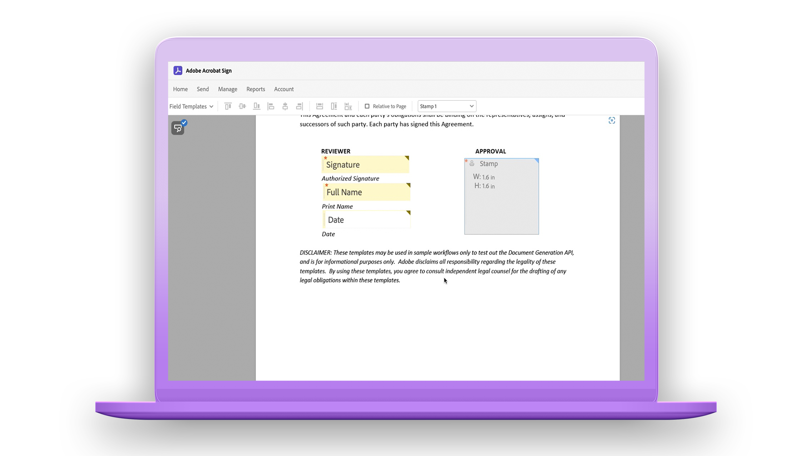

# Présentation de la prise en main

Ces brefs tutoriels détaillés vous expliquent comment envoyer, signer et suivre des documents en un clin d’oeil. Suivez la visite guidée d&#39;Acrobat Sign, puis lancez-vous dans l&#39;envoi d&#39;un document à une ou plusieurs personnes. Ce contenu est conçu pour faciliter les workflows de signature électronique.

## Nouveautés

* [Prise en main d’Acrobat Sign](new-sender.md)
Vous débutez dans l’utilisation d’Acrobat Sign ? Ce tutoriel est un excellent point de départ.
* [Définition des échéances et rappels](set-deadlines-reminders.md)
Découvrez comment envoyer régulièrement des rappels par e-mail et fixer des échéances pour faire signer rapidement vos documents

## Envoi

<table style="table-layout:fixed">
<tr>
 <td>
    
    

    <a href="quick-tour.md"><strong>Espace de travail – Principes de base</strong></a>
    

    <em>Visitez rapidement l’espace de travail d’Acrobat Sign pour prendre en main votre logiciel</em>
     
  </td>
  <td>
    
    

    <a href="new-sender.md"><strong>Prise en main d’Acrobat Sign</strong></a>
    

    <em>Ce tutoriel complet est un excellent point de départ pour les nouveaux expéditeurs dans Acrobat Sign</em>
     
  </td>
  <td>
    
    

    <a href="send-to-single-recipient.md"><strong>Envoi à un destinataire unique</strong></a>
    

    <em>Découvrez à quel point il est facile d’envoyer un document pour signature</em>
     
  </td>
  <td>
    
    

    <a href="send-to-multiple-recipients.md"><strong>Envoi à plusieurs destinataires</strong></a>
    

    <em>Envoyez un document pour signature électronique à plusieurs personnes dans l'ordre souhaité</em>
     
  </td>
</tr>
<tr>
  <td>
    
    

    <a href="sending-options.md"><strong>Configuration des options d’envoi</strong></a>
    

    <em>Découvrez comment configurer différentes options lors de l’envoi d’un document pour signature</em>
     
  </td>
  <td>
    
    

    <a href="adding-fields.md"><strong>Ajout de champs à vos documents</strong></a>
    

    <em>Découvrez comment ajouter différents types de champs à vos documents</em>
     
  </td>
  <td>
    
    

    <a href="modify-in-flight.md"><strong>Modification d’un document après envoi</strong></a>
    

    <em>Modifier un document déjà en cours</em>
     
  </td>
  <td>
    
    

    <a href="replace-signer.md"><strong>Remplacement d’un signataire</strong></a>
    

    <em>Découvrez comment modifier le signataire d’un document déjà en cours.</em>
      
  </td>
</tr>
<tr>
  <td>
      
      

      <a href="set-deadlines-reminders.md"><strong>Définition d’échéances et de rappels</strong></a>
      

      <em>Découvrez comment envoyer régulièrement des rappels par e-mail et fixer des échéances pour faire signer rapidement vos documents</em>
       
    </td> 
  <td>
      
      

       
    </td>
    <td>
      
      

       
    </td>
    <td>
      
      

       
    </td>
</tr>
</table>

## Signature

<table style="table-layout:fixed">
<tr>
  <td>
    
    

    <a href="electronically-sign-a-document.md"><strong>Signature électronique d’un document</strong></a>
    

    <em>Découvrez à quel point il est facile de signer un document qui vous est envoyé avec Acrobat Sign</em>
     
  </td>
  <td>
    
    

    <a href="fill-and-sign.md"><strong>Remplissage et signature d’un document</strong></a>
    

    <em>Remplissage de formulaires et apposition de votre signature électronique sur les documents</em>
     
  </td>
  <td>
    
    

    <a href="sign-in-person.md"><strong>Obtention d’une signature en personne</strong></a>
    

    <em>Obtenir la signature d’une autre personne en personne à l’aide de l’application mobile Acrobat Sign</em>
     
  </td>
  <td>
    
    

    <a href="delegate-signing.md"><strong>Déléguer la signature à un autre utilisateur</strong></a>
    

    <em>Découvrez comment déléguer la signature d’un document à une autre personne</em>
     
  </td>
</tr>
<tr>
  <td>
    
    

    <a href="sign-with-a-digital-signature.md"><strong>Qu’est-ce qu’une signature numérique ?</strong></a>
    

    <em>En savoir plus sur les signatures numériques à base de certificat</em>
     
  </td>
  <td>
    
    

    <a href="sign-with-a-stamp.md"><strong>Signature avec un tampon</strong></a>
    

    <em>Utiliser des tampons pour marquer un document approuvé ou complété</em>
      
  </td> 
 <td>
    
    

     
  </td>
  <td>
    
    

     
  </td>
</tr>  
</table>

## Gestion

<table style="table-layout:fixed">
<tr>
  <td>
    
    

    <a href="manage-and-track.md"><strong>Gestion et suivi de vos accords</strong></a>
    

    <em>Découvrez comment gérer et suivre les accords envoyés pour signature</em>
     
  </td>
  <td>
    
    

    <a href="../sign-advanced-users/create-a-template.md"><strong>Création d’un modèle de document</strong></a>
    

    <em>Créez un modèle de document réutilisable pour offrir rapidité et cohérence à votre entreprise</em>
     
  </td>
  <td>
    
    

     
  </td>
  <td>
    
    

     
  </td>
</tr>
</table>
